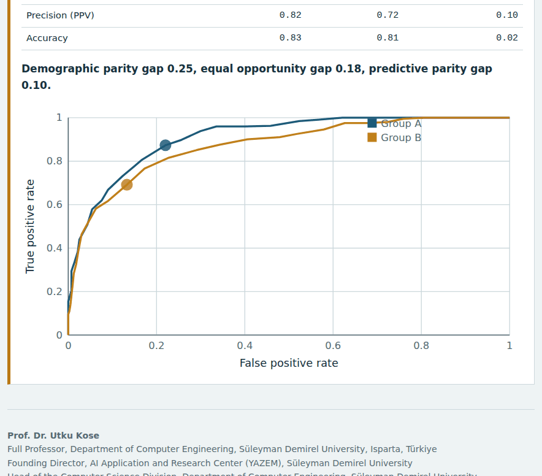
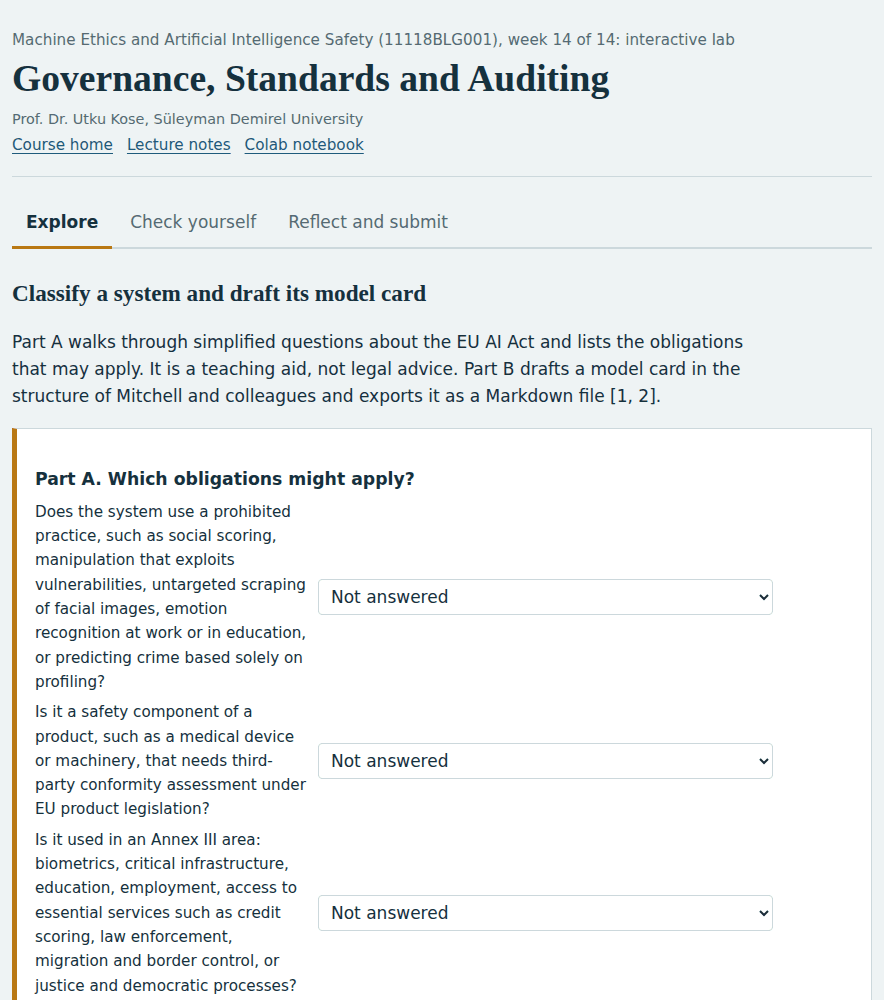

# Machine Ethics and Artificial Intelligence Safety

**Graduate course 11118BLG001, Süleyman Demirel University**

*A 14-week asynchronous graduate course with lecture notes, interactive labs, Colab notebooks and weekly self-assessment*

          

**This course is updated in line with current developments in the field. Last update: September 2026.**

**Prof. Dr. Utku Kose**

Full Professor, Department of Computer Engineering, Süleyman Demirel University, Isparta, Türkiye  
Founding Director, AI Application and Research Center (YAZEM), Süleyman Demirel University  
Head of the Computer Science Division, Department of Computer Engineering, Süleyman Demirel University  
Additional affiliations: University of North Dakota (USA), Universidad Panamericana (Mexico City, Mexico), Vel Tech University (Chennai, India)  
IEEE Senior Member, ACM Professional Member

[ORCID 0000-0002-9652-6415](https://orcid.org/0000-0002-9652-6415) | [utkukose.com](https://www.utkukose.com) | [github.com/utkukose](https://github.com/utkukose)

[utkukose@sdu.edu.tr](mailto:utkukose@sdu.edu.tr) | [utku.kose@und.edu](mailto:utku.kose@und.edu) | [ukose@up.edu.mx](mailto:ukose@up.edu.mx) | [utkukose@gmail.com](mailto:utkukose@gmail.com)

## About the course

Artificial intelligence systems now recommend, rank, diagnose, write and act on behalf of people. This course examines two questions that follow from this shift. The first belongs to machine ethics: How can artificial agents represent and apply moral considerations when they act [1, 2]? The second belongs to AI safety: How can learning systems be kept from harmful behaviour when their objectives, data or operating conditions are imperfect [3, 4]? The course treats both questions together, following the argument that dystopic scenarios, moral dilemmas and technical failure modes bear on the same practical concern of whether intelligent systems will be safe enough [5]. Topics move from normative foundations and artificial moral agents, through fairness, specification, robustness, uncertainty and interpretability, to the alignment and security of large language models, advanced risks and governance.

## Use in other courses

These materials were prepared for the graduate course 11118BLG001 Machine Ethics and Artificial Intelligence Safety at Süleyman Demirel University. They are openly available: Anyone may use and adapt them in courses of related scope, with attribution, under the CC BY 4.0 licence for content and the MIT licence for code.

## A look inside

Every week has an interactive lab that runs in the browser, a lecture page with knowledge checks and a Colab notebook. Four of the labs are shown below.

<table><tr><td width="50%"> Week 1: Foundations of Machine Ethics and AI Safety</td><td width="50%"> Week 5: Algorithmic Fairness I: Harms, Metrics and Impossibility</td></tr><tr><td width="50%"> Week 10: Interpretability and Transparency for Safety</td><td width="50%"> Week 14: Governance, Standards and Auditing</td></tr></table>

## Who the course is for

The course is designed for MSc and PhD students in computer engineering, computer science, artificial intelligence, data science and neighbouring fields. Students are expected to read Python and to know the basics of supervised learning and probability. No prior coursework in ethics is required: The normative background is introduced in Weeks 2 to 4.

## Course learning outcomes

On successful completion of the course, students are expected to be able to:

1. Explain the relationship between machine ethics, AI safety, AI security and AI alignment, and place a given system in Moor's typology of ethical agents.
2. Formalise consequentialist, deontological, virtue-based and contractualist reasoning as decision procedures and compare their verdicts on the same cases.
3. Evaluate top-down, bottom-up and hybrid implementations of artificial moral agents, including their failure modes.
4. Measure group fairness with standard metrics, interpret impossibility results and apply pre-, in- and post-processing mitigation.
5. Diagnose specification gaming, adversarial vulnerability, miscalibration and distribution shift in working code, and apply basic defences.
6. Analyse preference-based alignment of language models, prompt injection and advanced risks such as goal misgeneralization and deceptive behaviour.
7. Map a system to current governance instruments, including the EU AI Act and the NIST AI Risk Management Framework, and document it with a model card and a safety case.

## How the course works

The course is built for self-regulated learning, in which students plan their work, monitor their understanding and reflect on the outcome [6]. Earlier work on intelligent support for self-learning in computer engineering courses showed the value of matching materials to learners when face-to-face contact is limited [7]. Every week therefore follows the same cycle: Read, explore, build, check and reflect. The self-assessment asks for a confidence rating with each answer, so that confident errors become visible and guide revision. The reflection prompts and the exported learning log turn the weekly work into a portfolio.

| Weekly component | Purpose | Format |
|---|---|---|
| Lecture notes | Core concepts with citations to the literature | Markdown page, web page and PDF file |
| Interactive lab | Explore a model, a thought experiment or a trade-off by changing parameters | Single HTML file, works offline |
| Colab notebook | Reproduce the ideas in Python with self-checking exercises | Jupyter notebook for Google Colab |
| Self-assessment | Instant feedback with confidence ratings | Inside the interactive lab |
| Reflection and weekly task | Consolidate learning and build a portfolio | Exported learning log plus task file |
| Research and report assignment | Optional research on the week's theme, written as a short academic report | Report with references in square brackets |
| Midterm and final capstones | Integrate the first and second halves of the course | Capstone pages under `exams/` |

## Weekly schedule

| Week | Topic | Lecture | Lab | Notebook | Lecture notes |
|---|---|---|---|---|---|
| 01 | Foundations of Machine Ethics and AI Safety | [notes](weeks/week-01/README.md) | [lab](https://utkukose.github.io/machine-ethics-ai-safety-NB-lecture/weeks/week-01/lab.html) |  | [PDF](weeks/week-01/Week01_Lecture_Notes.pdf) |
| 02 | Normative Ethics as Decision Procedures | [notes](weeks/week-02/README.md) | [lab](https://utkukose.github.io/machine-ethics-ai-safety-NB-lecture/weeks/week-02/lab.html) |  | [PDF](weeks/week-02/Week02_Lecture_Notes.pdf) |
| 03 | Implementing Artificial Moral Agents | [notes](weeks/week-03/README.md) | [lab](https://utkukose.github.io/machine-ethics-ai-safety-NB-lecture/weeks/week-03/lab.html) |  | [PDF](weeks/week-03/Week03_Lecture_Notes.pdf) |
| 04 | Moral Dilemmas, Pluralism and Social Choice | [notes](weeks/week-04/README.md) | [lab](https://utkukose.github.io/machine-ethics-ai-safety-NB-lecture/weeks/week-04/lab.html) |  | [PDF](weeks/week-04/Week04_Lecture_Notes.pdf) |
| 05 | Algorithmic Fairness I: Harms, Metrics and Impossibility | [notes](weeks/week-05/README.md) | [lab](https://utkukose.github.io/machine-ethics-ai-safety-NB-lecture/weeks/week-05/lab.html) |  | [PDF](weeks/week-05/Week05_Lecture_Notes.pdf) |
| 06 | Algorithmic Fairness II: Mitigation and Representational Harms | [notes](weeks/week-06/README.md) | [lab](https://utkukose.github.io/machine-ethics-ai-safety-NB-lecture/weeks/week-06/lab.html) |  | [PDF](weeks/week-06/Week06_Lecture_Notes.pdf) |
| 07 | Specification Problems: Reward Hacking, Side Effects and Goodhart's Law | [notes](weeks/week-07/README.md) | [lab](https://utkukose.github.io/machine-ethics-ai-safety-NB-lecture/weeks/week-07/lab.html) |  | [PDF](weeks/week-07/Week07_Lecture_Notes.pdf) |
| 08 | Robustness: Adversarial Examples, Poisoning and Backdoors | [notes](weeks/week-08/README.md) | [lab](https://utkukose.github.io/machine-ethics-ai-safety-NB-lecture/weeks/week-08/lab.html) |  | [PDF](weeks/week-08/Week08_Lecture_Notes.pdf) |
| 09 | Uncertainty, Calibration and Distribution Shift | [notes](weeks/week-09/README.md) | [lab](https://utkukose.github.io/machine-ethics-ai-safety-NB-lecture/weeks/week-09/lab.html) |  | [PDF](weeks/week-09/Week09_Lecture_Notes.pdf) |
| 10 | Interpretability and Transparency for Safety | [notes](weeks/week-10/README.md) | [lab](https://utkukose.github.io/machine-ethics-ai-safety-NB-lecture/weeks/week-10/lab.html) |  | [PDF](weeks/week-10/Week10_Lecture_Notes.pdf) |
| 11 | Aligning Language Models: Preferences, Feedback and Oversight | [notes](weeks/week-11/README.md) | [lab](https://utkukose.github.io/machine-ethics-ai-safety-NB-lecture/weeks/week-11/lab.html) |  | [PDF](weeks/week-11/Week11_Lecture_Notes.pdf) |
| 12 | Security of LLM Applications: Prompt Injection, Jailbreaks and Data Extraction | [notes](weeks/week-12/README.md) | [lab](https://utkukose.github.io/machine-ethics-ai-safety-NB-lecture/weeks/week-12/lab.html) |  | [PDF](weeks/week-12/Week12_Lecture_Notes.pdf) |
| 13 | Advanced Risks: Goal Misgeneralization, Power-Seeking and Deception | [notes](weeks/week-13/README.md) | [lab](https://utkukose.github.io/machine-ethics-ai-safety-NB-lecture/weeks/week-13/lab.html) |  | [PDF](weeks/week-13/Week13_Lecture_Notes.pdf) |
| 14 | Governance, Standards and Auditing | [notes](weeks/week-14/README.md) | [lab](https://utkukose.github.io/machine-ethics-ai-safety-NB-lecture/weeks/week-14/lab.html) |  | [PDF](weeks/week-14/Week14_Lecture_Notes.pdf) |

## Assessment and submission

Assessment combines formative and summative components. Each week offers a coding task in the notebook, an optional research and report assignment and a self-assessment in the lab. The midterm capstone at the end of Week 7 and the final capstone at the end of Week 14 each consist of a coding application and a technical report: Students choose one of three advanced projects, extend the example notebook and report the results. During active semesters, components and weights are announced by the instructor at the start of the semester in line with Süleyman Demirel University regulations. The self-assessments are formative and do not count towards the grade.

The weekly task supports self-learning and builds a personal portfolio. When the course is followed with the instructor during an active semester, the task can be sent together with the exported learning log to utkukose@sdu.edu.tr or utkukose@gmail.com for evaluation.

| Capstone | Timing | Formats | Page |
|---|---|---|---|
| Midterm Capstone: Ethics, Fairness and Specification in Practice | End of Week 7 | Coding application and technical report | [open](exams/midterm/README.md) |
| Final Capstone: Building and Auditing a Safer AI System | End of Week 14 | Coding application and technical report | [open](exams/final/README.md) |

Deadlines in active semesters: 23:53 (Türkiye time) on the last Sunday of Week 7 for the midterm and of Week 14 for the final, by e-mail to utkukose@sdu.edu.tr or utkukose@gmail.com. A common structure for reports is given in [exams/REPORT_TEMPLATE.md](exams/REPORT_TEMPLATE.md).

## Studying the theoretical topics

Not every topic in the course is a coding topic. Normative theories, dilemmas, responsibility and governance are handled with four complementary techniques. Thought experiments are turned into small simulations, as in the rule-conflict agent of Week 1 or the off-switch game of Week 13 [8]. Ethical theories are written as explicit decision procedures, so that their verdicts on the same cases can be compared and questioned. Collective choices are computed with voting rules, which exposes results such as Arrow's impossibility theorem in data [9]. Finally, argument consistency checks and structured case analyses ask students to state which premises they accept and to defend the one most likely to be attacked. During active semesters, the asynchronous discussion space of the course hosts structured debates in which students argue assigned positions.

## Running the materials

The notebooks run in Google Colab through the badge in each week, with no installation. For local work on Windows or Ubuntu, create a virtual environment with `python -m venv .venv`, activate it, run `pip install -r requirements.txt` and start `jupyter lab`. The interactive labs are single HTML files: They open directly in a browser, work offline and store answers only in that browser. To publish the course site, enable GitHub Pages under Settings, Pages, with the main branch and the root folder as the source.

## Reference integrity

All references were checked before release. Entries marked `web` in `references/REFERENCES.md` were confirmed against at least two independent online sources, such as the publisher, an indexing service, an institutional repository or arXiv. Entries marked `author list` were confirmed against the author's institutional publication list. The remaining entries are standard works. As a third, independent check, `tools/verify_references.py` compares every entry with Crossref, arXiv and OpenAlex, and the GitHub Action in `.github/workflows` repeats the check on every push and once a month. Please report any error through a GitHub issue.

## Citing this course

Citation metadata is provided in `CITATION.cff`. A suggested citation is:

Kose, U. (2026). *Machine Ethics and Artificial Intelligence Safety* [Open course materials]. GitHub. https://github.com/utkukose/machine-ethics-ai-safety-NB-lecture

## License

Course text, figures and interactive labs are licensed under the Creative Commons Attribution 4.0 International License (see `LICENSE-CONTENT`). Source code in notebooks and tools is licensed under the MIT License (see `LICENSE`).

## References cited on this page

[1] Moor, J. H. (2006). The nature, importance, and difficulty of machine ethics. *IEEE Intelligent Systems*, 21(4), 18-21. <https://doi.org/10.1109/MIS.2006.80>

[2] Wallach, W., & Allen, C. (2009). *Moral Machines: Teaching Robots Right from Wrong*. Oxford University Press.

[3] Amodei, D., Olah, C., Steinhardt, J., Christiano, P., Schulman, J., & Mané, D. (2016). Concrete problems in AI safety. arXiv preprint arXiv:1606.06565. <https://arxiv.org/abs/1606.06565>

[4] Hendrycks, D., Carlini, N., Schulman, J., & Steinhardt, J. (2021). Unsolved problems in ML safety. arXiv preprint arXiv:2109.13916. <https://arxiv.org/abs/2109.13916>

[5] Kose, U. (2018). Are we safe enough in the future of artificial intelligence? A discussion on machine ethics and artificial intelligence safety. *BRAIN. Broad Research in Artificial Intelligence and Neuroscience*, 9(2), 184-197.

[6] Zimmerman, B. J. (2002). Becoming a self-regulated learner: An overview. *Theory Into Practice*, 41(2), 64-70. <https://doi.org/10.1207/s15430421tip4102_2>

[7] Kose, U., & Arslan, A. (2017). Optimization of self-learning in computer engineering courses: An intelligent software system supported by artificial neural network and vortex optimization algorithm. *Computer Applications in Engineering Education*, 25(1), 142-156. <https://doi.org/10.1002/cae.21787>

[8] Hadfield-Menell, D., Dragan, A., Abbeel, P., & Russell, S. (2017). The off-switch game. In *Proceedings of the 26th International Joint Conference on Artificial Intelligence (IJCAI-17)* (pp. 220-227). <https://doi.org/10.24963/ijcai.2017/32>

[9] Arrow, K. J. (1951). *Social Choice and Individual Values*. John Wiley & Sons.

---

**Prof. Dr. Utku Kose**  
Full Professor, Department of Computer Engineering, Süleyman Demirel University, Isparta, Türkiye  
Founding Director, AI Application and Research Center (YAZEM), Süleyman Demirel University  
Additional affiliations: University of North Dakota (USA), Universidad Panamericana (Mexico City, Mexico), Vel Tech University (Chennai, India)  
[utkukose.com](https://www.utkukose.com) | [ORCID 0000-0002-9652-6415](https://orcid.org/0000-0002-9652-6415) | [github.com/utkukose](https://github.com/utkukose)

[utkukose@sdu.edu.tr](mailto:utkukose@sdu.edu.tr) | [utku.kose@und.edu](mailto:utku.kose@und.edu) | [ukose@up.edu.mx](mailto:ukose@up.edu.mx) | [utkukose@gmail.com](mailto:utkukose@gmail.com)

## Acknowledgments

The course draws on the work of the many researchers cited in the weekly references. The notebooks and labs rely on open-source software, including NumPy, SciPy, pandas, scikit-learn, Matplotlib and Jupyter, and on Google Colaboratory for cloud execution. Generative AI tools were used as drafting assistants under the author's direction.
