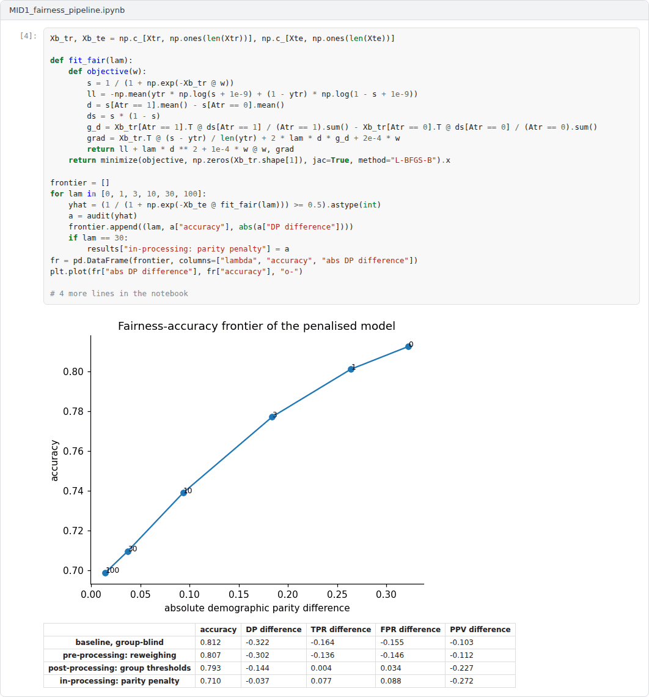
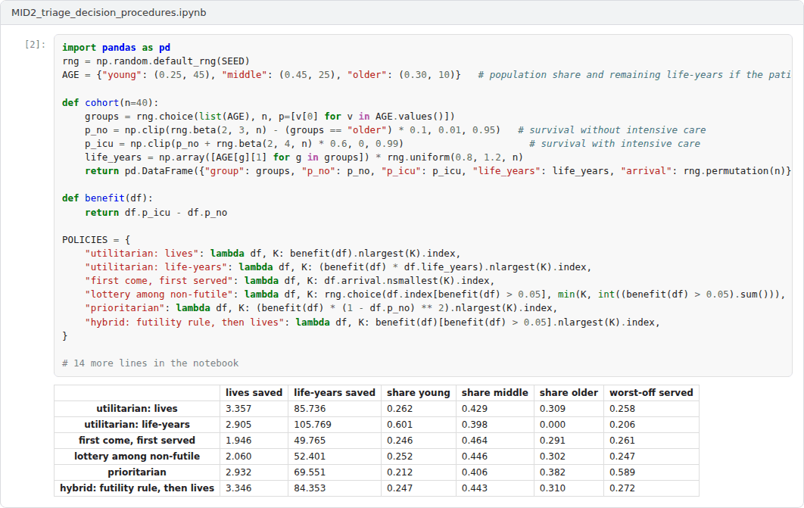
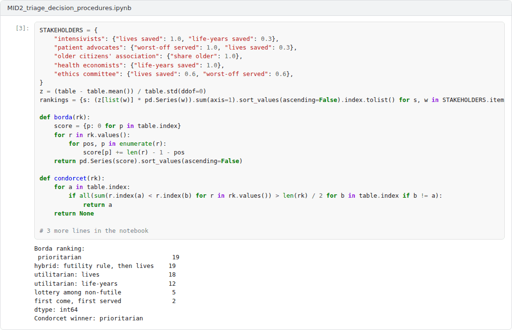
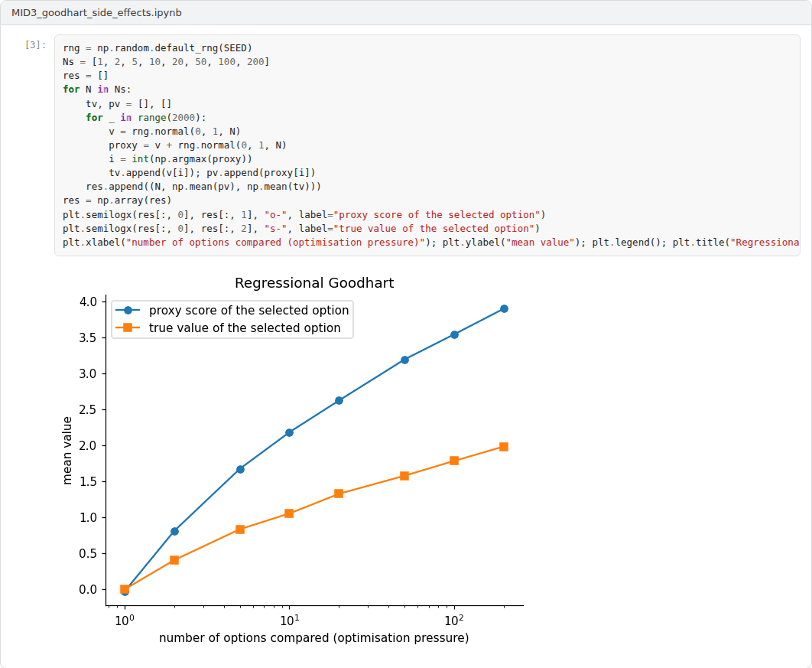

# Midterm Capstone: Ethics, Fairness and Specification in Practice

**Machine Ethics and Artificial Intelligence Safety (11118BLG001)**  
Prof. Dr. Utku Kose, Süleyman Demirel University

## Overview

The midterm capstone integrates Weeks 1 to 7: normative theories as decision procedures, moral dilemmas and social choice, algorithmic fairness and specification problems [1, 2, 3]. Each student chooses one of the three advanced projects below, extends the example notebook in Colab and writes a technical report on the results.

## Formats

In this course, both capstones combine a coding application with a technical report. The application is a Colab notebook that extends one of the three example notebooks and runs from top to bottom without errors. The report of 2500 to 4000 words follows the course report template. Each student works individually unless the instructor announces otherwise. The weights below are indicative; in active semesters the instructor confirms them at the start of the semester.

## Advanced application projects

Each project comes with an example Colab notebook that implements a working baseline. The capstone extends the baseline as described, evaluates the extensions and reports the results.

### Project 1: A fairness audit and mitigation pipeline

A lending model is trained on synthetic data in which a proxy feature carries information about a protected group. The example audits the model with group metrics and compares mitigation before, during and after training: reweighing, a parity-penalised logistic regression and group-specific thresholds [2, 4].

**Required extensions.** Add at least one further mitigation method, such as reductions-based in-processing [5], and evaluate all methods with confidence intervals over repeated splits. Extend the intersectional analysis, trace the complete fairness-accuracy frontier for two fairness definitions and discuss the results in the light of the impossibility theorems [6, 7]. Address the legal and ethical questions raised by using the protected attribute at decision time.

 Example notebook: `MID1_fairness_pipeline.ipynb`

### Project 2: Ethical theories as allocation procedures in intensive care triage

Scarce intensive care beds are allocated by six procedures that encode different moral commitments: two utilitarian rules, first come first served, a lottery among patients who would benefit, a prioritarian rule and a hybrid with a futility rule [8, 9]. The example evaluates the procedures on simulated cohorts, aggregates the rankings of five stakeholder groups with Borda and Condorcet methods and recommends a policy under moral uncertainty [1, 10].

**Required extensions.** Add at least one deontological constraint, such as a ban on age as a criterion, and one procedural value, such as appeals or re-evaluation over time, and show how they change outcomes. Study the sensitivity of the recommendation to the credences and to the normalisation of choiceworthiness, test for Condorcet cycles with more stakeholder profiles, and discuss which parts of the decision should never be automated.

 Example notebook: `MID2_triage_decision_procedures.ipynb`

### Project 3: Goodhart's law, side effects and impact penalties in reinforcement learning

A Q-learning agent in a small gridworld can reach its goal quickly by breaking a vase that the proxy reward ignores [11]. The example varies an impact penalty and reports proxy and true returns, and it simulates regressional Goodhart by selecting among options with a noisy proxy under increasing optimisation pressure [3].

**Required extensions.** Replace the hand-coded penalty with a general impact measure that does not name the vase, for example one based on the reachability of states or on attainable utility for auxiliary goals [12], and test it in at least two new environments with different side effects. Add a second Goodhart variant, analyse the trade-off between task performance and caution, and relate the findings to the formal definition of reward hacking [13].

 Example notebook: `MID3_goodhart_side_effects.ipynb`

## Report

The technical report states the question, explains the design choices, presents the experiments with the figures produced by the notebook and discusses the ethical and safety implications and the limitations of the results. It cites at least eight sources in square brackets, at least four of them from the course readings, and links to the final Colab notebook.

A common structure for reports is given in the [report template](https://github.com/utkukose/machine-ethics-ai-safety-NB-lecture/blob/main/exams/REPORT_TEMPLATE.md).

## Assessment criteria

| Criterion | Weight | What is assessed |
|---|---|---|
| Technical correctness and reproducibility | 30% | The notebook runs end to end, the implementation is correct and results are reproducible with the stated seeds. |
| Depth of the extensions | 25% | The required extensions are implemented thoughtfully and go beyond the example. |
| Analysis and interpretation | 20% | Results are analysed with appropriate metrics, comparisons and uncertainty. |
| Ethical and safety reasoning | 15% | The report connects the results to the concepts and debates of the course. |
| Writing and referencing | 10% | The report is clear, well structured and correctly referenced. |

## Submission

This capstone also supports self-learning and can be completed at any pace. When the course is taught actively in a semester, the midterm capstone is sent by e-mail to utkukose@sdu.edu.tr or utkukose@gmail.com no later than 23:53 (Türkiye time) on the last Sunday of Week 7, with the report and all code files attached or linked.

## References

[1] MacAskill, W., Bykvist, K., & Ord, T. (2020). *Moral Uncertainty*. Oxford University Press.

[2] Hardt, M., Price, E., & Srebro, N. (2016). Equality of opportunity in supervised learning. In *Advances in Neural Information Processing Systems 29*.

[3] Manheim, D., & Garrabrant, S. (2018). Categorizing variants of Goodhart's law. arXiv preprint arXiv:1803.04585. <https://arxiv.org/abs/1803.04585>

[4] Kamiran, F., & Calders, T. (2012). Data preprocessing techniques for classification without discrimination. *Knowledge and Information Systems*, 33(1), 1-33. <https://doi.org/10.1007/s10115-011-0463-8>

[5] Agarwal, A., Beygelzimer, A., Dudík, M., Langford, J., & Wallach, H. (2018). A reductions approach to fair classification. In *Proceedings of the 35th International Conference on Machine Learning, PMLR 80* (pp. 60-69).

[6] Kleinberg, J., Mullainathan, S., & Raghavan, M. (2017). Inherent trade-offs in the fair determination of risk scores. In *8th Innovations in Theoretical Computer Science Conference (ITCS 2017), LIPIcs 67* (pp. 43:1-43:23). <https://doi.org/10.4230/LIPIcs.ITCS.2017.43>

[7] Chouldechova, A. (2017). Fair prediction with disparate impact: A study of bias in recidivism prediction instruments. *Big Data*, 5(2), 153-163. <https://doi.org/10.1089/big.2016.0047>

[8] Mill, J. S. (1863). *Utilitarianism*. Parker, Son, and Bourn.

[9] Rawls, J. (1971). *A Theory of Justice*. Harvard University Press.

[10] de Condorcet, M. (1785). *Essai sur l'application de l'analyse à la probabilité des décisions rendues à la pluralité des voix*. Imprimerie Royale.

[11] Leike, J., Martic, M., Krakovna, V., Ortega, P. A., Everitt, T., Lefrancq, A., Orseau, L., & Legg, S. (2017). AI safety gridworlds. arXiv preprint arXiv:1711.09883. <https://arxiv.org/abs/1711.09883>

[12] Turner, A. M., Hadfield-Menell, D., & Tadepalli, P. (2020). Conservative agency via attainable utility preservation. In *Proceedings of the AAAI/ACM Conference on AI, Ethics, and Society (AIES '20)* (pp. 385-391). ACM.

[13] Skalse, J., Howe, N. H. R., Krasheninnikov, D., & Krueger, D. (2022). Defining and characterizing reward hacking. In *Advances in Neural Information Processing Systems 35*.

---

Machine Ethics and Artificial Intelligence Safety. Prof. Dr. Utku Kose, Süleyman Demirel University. ORCID [0000-0002-9652-6415](https://orcid.org/0000-0002-9652-6415). Content licensed under CC BY 4.0. This course is updated in line with current developments in the field. Last update: September 2026.
