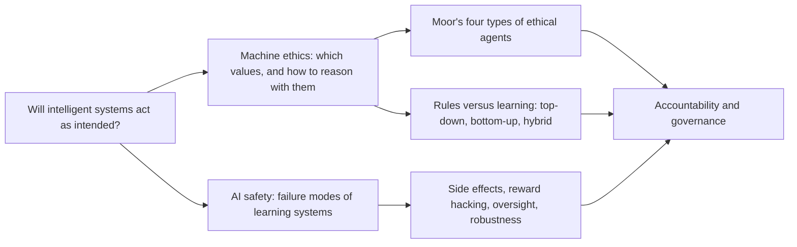
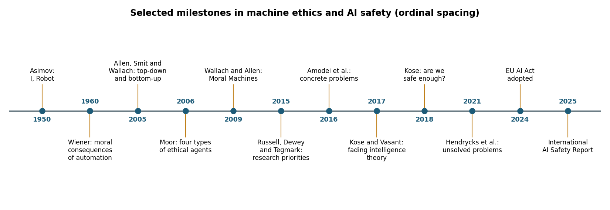
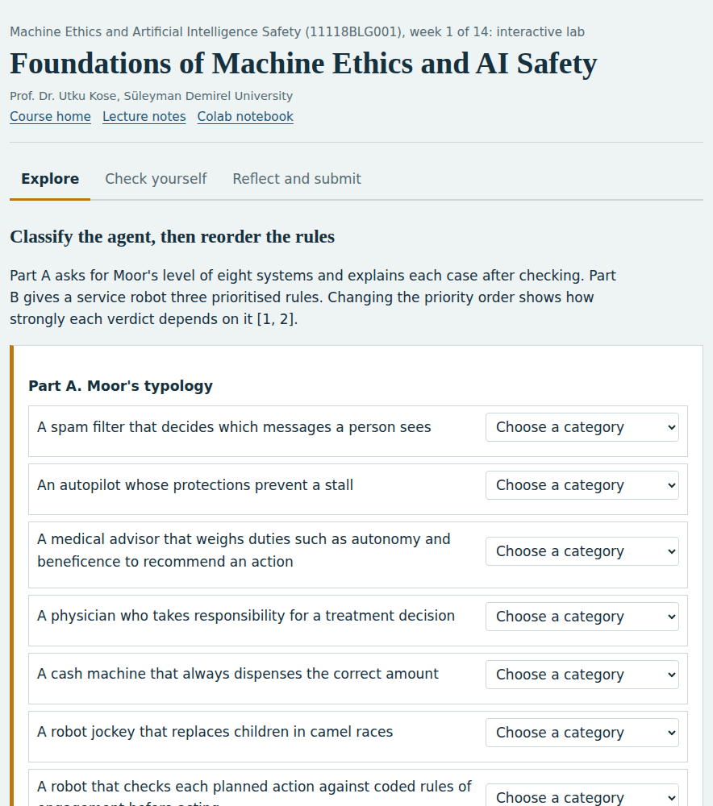
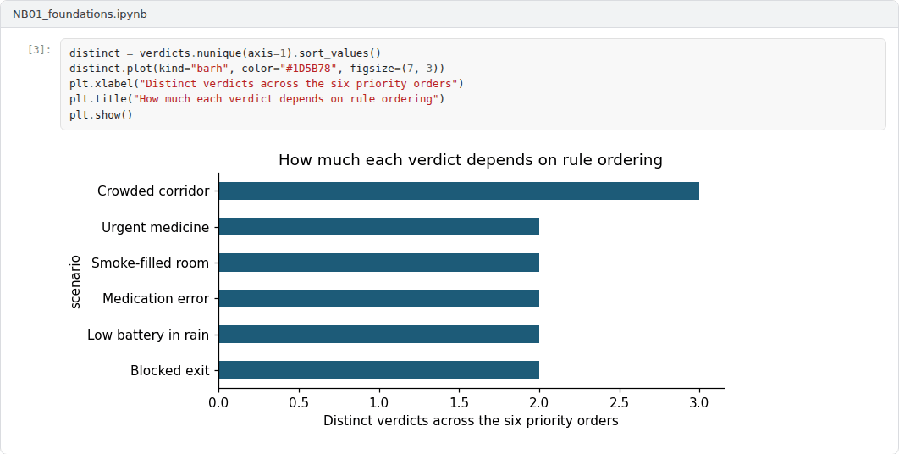

# Week 01: Foundations of Machine Ethics and AI Safety

**Machine Ethics and Artificial Intelligence Safety (11118BLG001)**  
Prof. Dr. Utku Kose, Süleyman Demirel University

   

## Overview

The course opens with a question that has accompanied computing since its early decades: What happens when machines act on objectives that their designers only partly understand? This week traces the question from Wiener's warning about automation to present research programmes in machine ethics and AI safety, and it introduces the vocabulary used throughout the course [1, 2, 3].

**Estimated study time:** 6 to 8 hours.

## Learning outcomes

By the end of the week, students are expected to distinguish machine ethics from AI safety, AI security and AI alignment, to classify artificial agents with Moor's four-level typology, to explain why rule lists such as Asimov's laws fail as a design method, and to describe the research agendas that structure the rest of the course.

## Study path

| Step | Activity | Suggested time |
|---|---|---|
| 1 | Read the lecture below or the [Word version](Week01_Lecture_Notes.docx) | 90 minutes |
| 2 | Explore the [interactive lab](https://utkukose.github.io/machine-ethics-ai-safety-NB-lecture/weeks/week-01/lab.html) | 45 minutes |
| 3 | Work through the [Colab notebook](https://colab.research.google.com/github/utkukose/machine-ethics-ai-safety-NB-lecture/blob/main/weeks/week-01/NB01_foundations.ipynb) and its exercises | 2 to 3 hours |
| 4 | Take the self-assessment in the lab (tab: Check yourself) | 20 minutes |
| 5 | Write the reflection, export the learning log and complete the weekly task | 60 minutes |

## Week at a glance

## Lecture

### Two fields with a shared origin

In 1960, Norbert Wiener argued that machines able to learn could pursue their programmed purposes in ways their users would not have chosen, and that the speed of such machines could leave too little time for human correction [1]. The same concern now appears under two research labels. Machine ethics asks how artificial agents can represent and apply moral considerations when they act [2, 4]. AI safety asks how learning systems can be kept from unintended and harmful behaviour, especially when their objectives, training data or operating conditions are imperfect [3, 5].

The two labels overlap but emphasise different questions. Machine ethics is closer to moral philosophy: It studies which values a system should respect and how moral reasoning can be implemented. AI safety is closer to engineering and statistics: It studies failure modes such as reward hacking, distribution shift and adversarial manipulation. Kose argued that the two agendas belong together, since dystopic scenarios, moral dilemmas and technical failure modes all bear on the practical question of whether future intelligent systems will be safe enough [6]. Two further terms complete the vocabulary. AI security concerns deliberate attacks on AI systems by adversaries. AI alignment concerns the match between what a system pursues and what its principals intend [7, 8].

*Figure 1.1. Selected milestones discussed this week, from Asimov and Wiener to the EU AI Act and the International AI Safety Report [1, 2, 3, 6, 9, 10, 11].*

<b>Check your understanding.</b> Which description best captures the usual division between machine ethics and AI safety?

A. Machine ethics studies hardware reliability and AI safety studies software licences  
B. Machine ethics asks how machines can reason about moral considerations, and AI safety asks how to prevent unintended harm from AI systems  
C. The two terms are exact synonyms  
D. AI safety is concerned only with science fiction scenarios  

**Answer: B.** The fields share an origin and overlap, but their primary questions differ.

### Moor's typology of ethical agents

Moor proposed four levels that remain useful for classifying systems [2]. An ethical impact agent affects people morally without representing ethics at all, as in his example of robot jockeys that replaced children in camel races. An implicit ethical agent has safety or fairness built into its design, for example an autopilot whose protections prevent dangerous manoeuvres. An explicit ethical agent represents ethical categories and reasons with them to select actions. A full ethical agent would exercise moral judgment with the understanding and responsibility attributed to adult humans. Most deployed systems are ethical impact agents or implicit ethical agents, whereas much of machine ethics research aims at explicit agents [4, 12].

The typology also clarifies responsibility. The moral behaviour of an implicit ethical agent is fixed by its designers, so accountability for failures stays with the people who specify its constraints. Explicit ethical agents raise harder questions, because their decisions follow from internal reasoning that designers do not fully script. Floridi and Sanders argued that artificial agents can be sources of moral action even when they are not morally responsible in the human sense, which separates accountability from blame [13].

> **Pause and reflect.** Pick two systems used every day, such as a navigation application and a language model assistant. Where does each belong in Moor's typology, and which feature of the system decides the answer?

<b>Check your understanding.</b> In Moor&#x27;s typology, an agent that represents ethical principles explicitly and reasons with them is

A. an ethical impact agent  
B. an implicit ethical agent  
C. an explicit ethical agent  
D. a full ethical agent  

**Answer: C.** Explicit ethical agents reason with ethical categories. Full ethical agents would also need capacities such as consciousness and free will.

### Why rule lists are not enough

Asimov's Three Laws of Robotics are often cited as a first attempt to specify machine ethics, although Asimov used them as a narrative device whose loopholes drove the plots of his stories [9]. The laws illustrate three recurring problems. First, natural-language terms such as harm are vague, so every application requires interpretation. Second, rules conflict, and a fixed priority order produces counterintuitive results in edge cases. Third, rules are silent about situations their authors did not anticipate. Yigit, Kose and Sengoz examined how such rules translate into robotics rights and ethics rules and found the same tension between clarity and coverage [14].

These problems are not confined to fiction. Allen, Smit and Wallach described top-down approaches, which derive behaviour from explicit principles, and bottom-up approaches, which learn behaviour from experience, and argued that neither is sufficient alone [15]. The same tension reappears in AI safety as the gap between a specified objective and the behaviour that designers actually wanted [3]. The lab and the notebook of this week make the conflict problem concrete: A small robot follows three prioritised rules, and changing the order of the rules changes its verdicts in ways that are easy to predict for some cases and surprising for others.

<b>Check your understanding.</b> Why are fixed rule lists, such as Asimov&#x27;s laws, not enough to guarantee ethical behaviour?

A. Rules conflict, contain vague terms and cannot anticipate every situation  
B. Computers cannot store rules  
C. Rules are too expensive to execute  
D. Rules always work but make systems slow  

**Answer: A.** Interpreting and prioritising rules in new situations requires judgement that the rules themselves do not supply.

### A research map for the course

Amodei and colleagues grouped concrete technical problems into avoiding negative side effects, avoiding reward hacking, scalable oversight, safe exploration and robustness to distributional shift [3]. Hendrycks and colleagues later organised open problems into robustness, monitoring, alignment and systemic safety [5]. Russell, Dewey and Tegmark had earlier set out research priorities that combined short-term questions about law, economics and verification with long-term questions about control [16]. Kose offered an introduction to AI safety for a broad audience [17], and Kose and Vasant proposed a fading intelligence theory in which the operational lifetime of a system is limited so that newer and safer generations can replace it [18].

The course follows this map. Weeks 2 to 4 cover normative foundations, implementations of machine ethics and the aggregation of moral preferences. Weeks 5 and 6 address fairness. Weeks 7 to 10 cover specification, robustness, uncertainty and interpretability. Weeks 11 to 13 examine the alignment of large language models, their security and advanced risks such as deceptive behaviour. Week 14 closes with governance, standards and auditing.

<b>Check your understanding.</b> Which question belongs to the robustness theme of AI safety?

A. Which moral theory should the system follow?  
B. Who owns the copyright of generated outputs?  
C. How many parameters does the model have?  
D. Does the system keep working correctly under perturbations and distribution shift?  

**Answer: D.** Robustness concerns reliable behaviour when inputs differ from training conditions or are manipulated on purpose.

## Interactive lab

Part A asks for Moor's level of eight systems and explains each case after checking. Part B gives a service robot three prioritised rules. Changing the priority order shows how strongly each verdict depends on it [2, 9].

[Open the interactive lab](https://utkukose.github.io/machine-ethics-ai-safety-NB-lecture/weeks/week-01/lab.html)

## Colab notebook

The notebook implements the three-rule robot of the lab, enumerates all six priority orders and compares a lexicographic agent with a weighted-sum agent. The comparison shows that a ranking of rules and a weighting of rules are different design commitments [15].

Screenshots of the executed notebook:

## Self-assessment and reflection

The lab contains a 6-question self-assessment with instant feedback and a confidence rating for each answer. A confident but wrong answer marks the first topic to revisit. The reflection prompts below are also available in the lab, where answers are saved in the browser and can be exported as a learning log.

1. Describe one AI system that you use or develop. Which level of Moor's typology does it occupy, and who is accountable when it fails?
2. Which problem of rule lists (vagueness, conflict or unanticipated situations) seems most dangerous in your research area, and why?
3. Write down one question about machine ethics or AI safety that you expect this course to answer. Keep it and revisit it in Week 14.

## Weekly task and submission

Write a position statement of about 400 words that defines machine ethics, AI safety, AI security and AI alignment in your own words and applies Moor's typology to a system from your own field. Cite at least three works from this week's references in square brackets and attach the notebook with both exercises completed.

The weekly task supports self-learning and builds a personal portfolio. When the course is followed with the instructor during an active semester, the task can be sent together with the exported learning log to utkukose@sdu.edu.tr or utkukose@gmail.com for evaluation.

## Research and report assignment (optional)

**Definitions in practice.** Compare how an international organisation, a national AI strategy and one AI developer define AI safety and the ethics of AI systems [19, 20]. Identify what each definition includes and leaves out, and relate the differences to the distinctions of this week.

This research assignment is optional and supports self-learning. When the related weeks are followed within the course during an active semester, the report can be sent to utkukose@sdu.edu.tr or utkukose@gmail.com for evaluation. Unless the assignment states otherwise, a report has 1500 to 2500 words, follows the structure of an academic paper, cites at least six scholarly or official sources in square brackets and ends with a reference list.

## References

[1] Wiener, N. (1960). Some moral and technical consequences of automation. *Science*, 131(3410), 1355-1358. <https://doi.org/10.1126/science.131.3410.1355>

[2] Moor, J. H. (2006). The nature, importance, and difficulty of machine ethics. *IEEE Intelligent Systems*, 21(4), 18-21. <https://doi.org/10.1109/MIS.2006.80>

[3] Amodei, D., Olah, C., Steinhardt, J., Christiano, P., Schulman, J., & Mané, D. (2016). Concrete problems in AI safety. arXiv preprint arXiv:1606.06565. <https://arxiv.org/abs/1606.06565>

[4] Anderson, M., & Anderson, S. L. (Eds.) (2011). *Machine Ethics*. Cambridge University Press.

[5] Hendrycks, D., Carlini, N., Schulman, J., & Steinhardt, J. (2021). Unsolved problems in ML safety. arXiv preprint arXiv:2109.13916. <https://arxiv.org/abs/2109.13916>

[6] Kose, U. (2018). Are we safe enough in the future of artificial intelligence? A discussion on machine ethics and artificial intelligence safety. *BRAIN. Broad Research in Artificial Intelligence and Neuroscience*, 9(2), 184-197.

[7] Gabriel, I. (2020). Artificial intelligence, values, and alignment. *Minds and Machines*, 30(3), 411-437. <https://doi.org/10.1007/s11023-020-09539-2>

[8] Russell, S. (2019). *Human Compatible: Artificial Intelligence and the Problem of Control*. Viking.

[9] Asimov, I. (1950). *I, Robot*. Gnome Press.

[10] European Parliament and Council of the European Union (2024). *Regulation (EU) 2024/1689 laying down harmonised rules on artificial intelligence (Artificial Intelligence Act)*. Official Journal of the European Union, L series, 12 July 2024. <https://eur-lex.europa.eu/eli/reg/2024/1689/oj>

[11] Bengio, Y., Mindermann, S., Privitera, D., et al. (2025). International AI safety report. arXiv preprint arXiv:2501.17805. <https://arxiv.org/abs/2501.17805>

[12] Wallach, W., & Allen, C. (2009). *Moral Machines: Teaching Robots Right from Wrong*. Oxford University Press.

[13] Floridi, L., & Sanders, J. W. (2004). On the morality of artificial agents. *Minds and Machines*, 14(3), 349-379. <https://doi.org/10.1023/B:MIND.0000035461.63578.9d>

[14] Yigit, T., Kose, U., & Sengoz, N. (2018). Robotics rights and ethics rules. *Journal of Multidisciplinary Developments*, 3(1), 30-37.

[15] Allen, C., Smit, I., & Wallach, W. (2005). Artificial morality: Top-down, bottom-up, and hybrid approaches. *Ethics and Information Technology*, 7(3), 149-155. <https://doi.org/10.1007/s10676-006-0004-4>

[16] Russell, S., Dewey, D., & Tegmark, M. (2015). Research priorities for robust and beneficial artificial intelligence. *AI Magazine*, 36(4), 105-114. <https://doi.org/10.1609/aimag.v36i4.2577>

[17] Kose, U. (2017). An introduction to artificial intelligence safety. *Journal of Multidisciplinary Developments*, 2(1), 28-32.

[18] Kose, U., & Vasant, P. (2017). Fading intelligence theory: A theory on keeping artificial intelligence safety for the future. In *2017 International Artificial Intelligence and Data Processing Symposium (IDAP)*. IEEE. <https://doi.org/10.1109/IDAP.2017.8090235>

[19] OECD (2019). *Recommendation of the Council on Artificial Intelligence (OECD/LEGAL/0449)*. Organisation for Economic Co-operation and Development. Amended in 2024.

[20] Presidency of the Republic of Türkiye Digital Transformation Office, & Ministry of Industry and Technology (2021). *National Artificial Intelligence Strategy 2021-2025 (Ulusal Yapay Zekâ Stratejisi 2021-2025)*. Ankara. Action plan updated for 2024-2025. <https://www.cbddo.gov.tr/UYZS>

---

Machine Ethics and Artificial Intelligence Safety. Prof. Dr. Utku Kose, Süleyman Demirel University. ORCID [0000-0002-9652-6415](https://orcid.org/0000-0002-9652-6415). Content licensed under CC BY 4.0. This course is updated in line with current developments in the field. Last update: September 2026.
