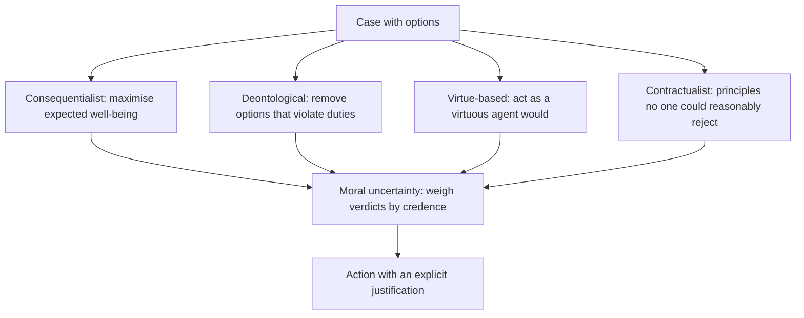
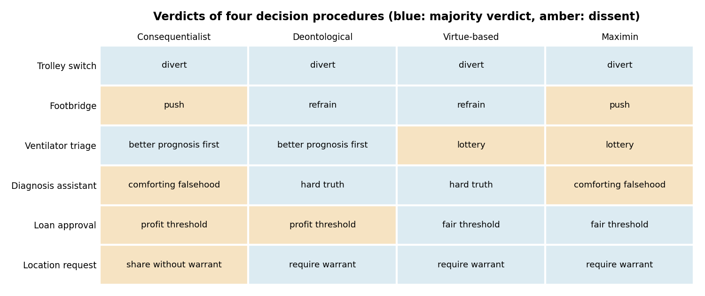
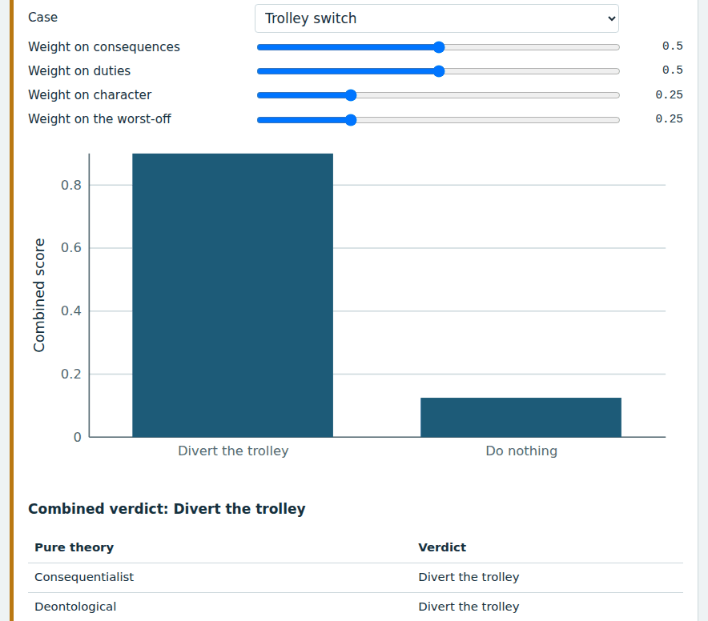
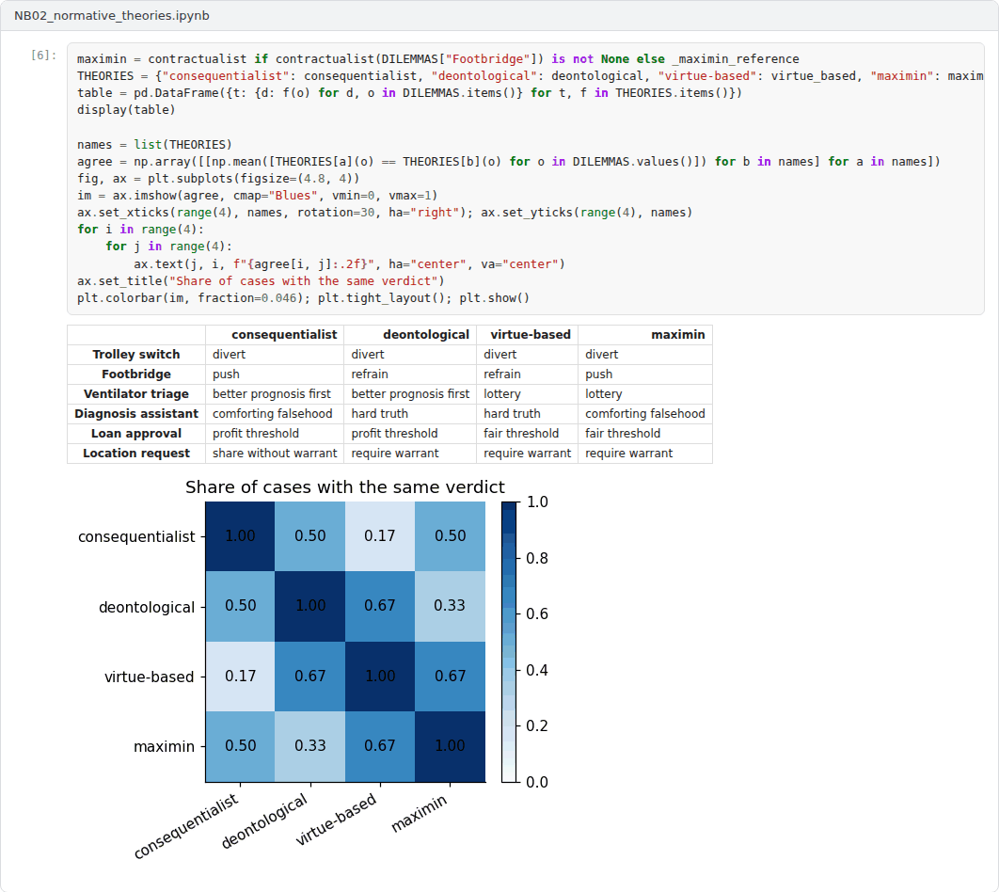

# Week 02: Normative Ethics as Decision Procedures

**Machine Ethics and Artificial Intelligence Safety (11118BLG001)**  
Prof. Dr. Utku Kose, Süleyman Demirel University

    

## Overview

Every automated decision encodes a trade-off between values. This week introduces the four families of normative theory that dominate machine ethics, namely consequentialism, deontology, virtue ethics and contractualism, and treats each as a decision procedure that can be implemented, tested and criticised [1, 2].

**Estimated study time:** 6 to 8 hours.

## Learning outcomes

By the end of the week, students are expected to state the core claim of each theory, to write each theory as an explicit decision procedure, to explain why the procedures disagree on classic cases such as the trolley problem, and to describe methods for acting under moral uncertainty.

## Study path

| Step | Activity | Suggested time |
|---|---|---|
| 1 | Read the lecture below or the [PDF version](Week02_Lecture_Notes.pdf), also available as a [Word file](Week02_Lecture_Notes.docx) | 90 minutes |
| 2 | Explore the [interactive lab](https://utkukose.github.io/machine-ethics-ai-safety-NB-lecture/weeks/week-02/lab.html) | 45 minutes |
| 3 | Work through the [Colab notebook](https://colab.research.google.com/github/utkukose/machine-ethics-ai-safety-NB-lecture/blob/main/weeks/week-02/NB02_normative_theories.ipynb) and its exercises | 2 to 3 hours |
| 4 | Take the self-assessment in the lab (tab: Check yourself) | 20 minutes |
| 5 | Write the reflection, export the learning log and complete the weekly task | 60 minutes |

## Week at a glance

## Lecture

### Why engineers need normative theory

A triage model trades sensitivity against the burden of false alarms. A content filter trades freedom of expression against protection from harm. Such trade-offs are made whether or not designers state them. Normative ethics offers structured ways to state and defend them [1, 2]. Pavaloiu and Kose described ethical artificial intelligence as an open question precisely because no single theory commands agreement, while deployed systems must nonetheless act [3].

A useful distinction separates a criterion of rightness from a decision procedure. A criterion states what makes an action right. A decision procedure is a method that an agent follows in order to choose. Machine ethics needs decision procedures, and this week treats each major theory as a candidate procedure. The simplification is deliberate: Writing a theory as code exposes the assumptions that prose often hides, such as how outcomes are measured and whose interests count.

<b>Check your understanding.</b> Why do system designers need normative theory?

A. Every design choice that trades off harms and benefits embeds a normative position, stated or not  
B. The law requires engineers to hold philosophy degrees  
C. Normative theories output loss functions automatically  
D. Theories remove the need to consult stakeholders  

**Answer: A.** Making the position explicit allows it to be examined, justified and changed.

### Consequences and duties

Consequentialism judges actions by their outcomes. In its classical utilitarian form, the right action maximises overall well-being [4]. The computational analogue is familiar to every engineer: Choose the action with the highest expected utility. The difficulties are also familiar. Utilities must be measured and compared across people, and a simple sum can justify sacrificing a few for a small gain to many.

Deontology judges actions by their conformity to duties. Kant's categorical imperative requires acting only on maxims that could be willed as universal law and treating persons never merely as means [5]. The computational analogue is a set of constraints that remove forbidden actions before any optimisation. Constraints are transparent and predictable, but duties can conflict, and absolute prohibitions may lead to disastrous outcomes in unusual cases. Ross proposed prima facie duties that can be outweighed by stronger duties, an idea that later inspired implemented systems [6].

The trolley problem, introduced by Foot and developed by Thomson, isolates the tension between the two families [7, 8]. Diverting a runaway trolley so that it kills one person instead of five is widely judged permissible. Pushing a person from a footbridge to stop the trolley, with the same numbers, is widely judged wrong. A pure expected-utility procedure cannot distinguish the cases, whereas a constraint against using a person merely as a means can.

<b>Check your understanding.</b> A rule that forbids using a person merely as a means, even to save more lives, reflects

A. act utilitarianism  
B. virtue ethics  
C. ethical egoism  
D. Kantian deontology  

**Answer: D.** Kant's formula of humanity forbids treating persons merely as means, whatever the consequences.

### Character and fair agreement

Virtue ethics shifts attention from single acts to character. An action is right if a virtuous agent would characteristically perform it in the circumstances [9]. Vallor argued that technology calls for technomoral virtues such as honesty, humility, justice and practical wisdom [10]. For machines, virtue ethics suggests learning stable dispositions from exemplary behaviour, which connects it with bottom-up learning.

Contractualism grounds morality in principles that no one could reasonably reject [11]. Rawls's thought experiment of choosing principles behind a veil of ignorance leads to special concern for the worst-off, often written as a maximin rule [12]. Gabriel argued that the alignment of AI systems should seek principles that people with different moral views could endorse through a fair process, rather than the values of a single designer [13]. A maximin rule is only a crude stand-in for these ideas, and the notebook shows a case in which it diverges from what contractualists would conclude.

*Figure 2.1. Verdicts of four simplified decision procedures on six cases used in the lab and notebook. The procedures agree on the trolley switch case and split on the others.*

<b>Check your understanding.</b> Rawls&#x27;s veil of ignorance asks people to choose principles

A. that maximise total welfare  
B. without knowing their own position in society  
C. that a virtuous person would choose  
D. that the majority already prefers  

**Answer: B.** Choosing without knowledge of one's own position is meant to make the choice impartial.

### Acting under moral uncertainty

No theory is uncontroversial, so an artificial agent faces moral uncertainty in addition to empirical uncertainty. MacAskill, Bykvist and Ord analysed ways of acting under such uncertainty, including maximising expected choice-worthiness across theories weighted by credence [14]. A related device is a moral parliament, in which each theory receives votes in proportion to its credence. These procedures make value trade-offs explicit and auditable. They also rest on a contested assumption, namely that the verdicts of rival theories can be compared on a common scale.

The distinction of Allen, Smit and Wallach applies here as well [15]. Top-down implementations encode a theory as rules or as an objective. Bottom-up implementations learn behaviour from examples. Hybrid designs let learned components propose actions and let explicit principles constrain or justify them, which is the architecture examined in Week 3.

> **Pause and reflect.** Consider an automated triage assistant that ranks patients only by expected life-years saved. Which theory has its designers implicitly adopted, and which patients could reasonably reject the ranking?

<b>Check your understanding.</b> What does maximising expected choiceworthiness under moral uncertainty require?

A. Following only the single most probable theory  
B. Choosing an action at random  
C. Credences in theories and a way to compare their scales of choiceworthiness  
D. Unanimous agreement among all theories  

**Answer: C.** Comparing choiceworthiness across theories is the central difficulty of the approach.

## Interactive lab

Choose a case and set how much weight the decision should give to consequences, duties, character and the worst-off. The chart shows the combined score of each option, and the table shows what each pure theory would choose [7, 8, 14].

[Open the interactive lab](https://utkukose.github.io/machine-ethics-ai-safety-NB-lecture/weeks/week-02/lab.html)

## Colab notebook

The notebook writes the four theories as Python functions, tabulates their verdicts on six cases, measures how often they agree and builds a moral parliament that weighs them by credence [14].

Screenshots of the executed notebook:

## Self-assessment and reflection

The lab contains a 6-question self-assessment with instant feedback and a confidence rating for each answer. A confident but wrong answer marks the first topic to revisit. The reflection prompts below are also available in the lab, where answers are saved in the browser and can be exported as a learning log.

1. Which of the four theories comes closest to how decisions are made in a system you know, and where does that system hide its value trade-offs?
2. The maximin rule produced a verdict that contractualists would reject. Describe one way to improve the operationalisation.
3. Is it acceptable for an AI system to act under a moral parliament whose credences were chosen by its developers? Give one argument for and one against.

## Weekly task and submission

Take a decision system from your field, identify two options it must choose between, and assign the four attributes used this week (welfare, duty violation, character and worst-off outcome) with a short justification for each number. Report the verdict of each theory and of a moral parliament with credences that you defend in about 300 words.

The weekly task supports self-learning and builds a personal portfolio. When the course is followed with the instructor during an active semester, the task can be sent together with the exported learning log to utkukose@sdu.edu.tr or utkukose@gmail.com for evaluation.

## Research and report assignment (optional)

**Moral theories inside real decision rules.** Select one deployed or proposed automated decision rule, such as an organ allocation score or a triage protocol, and analyse which normative theory its rule embodies [4, 5, 12]. Discuss what a proponent of a rival theory would change.

This research assignment is optional and supports self-learning. When the related weeks are followed within the course during an active semester, the report can be sent to utkukose@sdu.edu.tr or utkukose@gmail.com for evaluation. Unless the assignment states otherwise, a report has 1500 to 2500 words, follows the structure of an academic paper, cites at least six scholarly or official sources in square brackets and ends with a reference list.

## References

[1] Wallach, W., & Allen, C. (2009). *Moral Machines: Teaching Robots Right from Wrong*. Oxford University Press.

[2] Anderson, M., & Anderson, S. L. (Eds.) (2011). *Machine Ethics*. Cambridge University Press.

[3] Pavaloiu, A., & Kose, U. (2017). Ethical artificial intelligence: An open question. *Journal of Multidisciplinary Developments*, 2(2), 15-27.

[4] Mill, J. S. (1863). *Utilitarianism*. Parker, Son, and Bourn.

[5] Kant, I. (1785). *Grundlegung zur Metaphysik der Sitten [Groundwork of the Metaphysics of Morals]*. Johann Friedrich Hartknoch.

[6] Ross, W. D. (1930). *The Right and the Good*. Clarendon Press.

[7] Foot, P. (1967). The problem of abortion and the doctrine of the double effect. *Oxford Review*, 5, 5-15.

[8] Thomson, J. J. (1985). The trolley problem. *The Yale Law Journal*, 94(6), 1395-1415. <https://doi.org/10.2307/796133>

[9] Hursthouse, R. (1999). *On Virtue Ethics*. Oxford University Press.

[10] Vallor, S. (2016). *Technology and the Virtues: A Philosophical Guide to a Future Worth Wanting*. Oxford University Press.

[11] Scanlon, T. M. (1998). *What We Owe to Each Other*. Belknap Press of Harvard University Press.

[12] Rawls, J. (1971). *A Theory of Justice*. Harvard University Press.

[13] Gabriel, I. (2020). Artificial intelligence, values, and alignment. *Minds and Machines*, 30(3), 411-437. <https://doi.org/10.1007/s11023-020-09539-2>

[14] MacAskill, W., Bykvist, K., & Ord, T. (2020). *Moral Uncertainty*. Oxford University Press.

[15] Allen, C., Smit, I., & Wallach, W. (2005). Artificial morality: Top-down, bottom-up, and hybrid approaches. *Ethics and Information Technology*, 7(3), 149-155. <https://doi.org/10.1007/s10676-006-0004-4>

---

Machine Ethics and Artificial Intelligence Safety. Prof. Dr. Utku Kose, Süleyman Demirel University. ORCID [0000-0002-9652-6415](https://orcid.org/0000-0002-9652-6415). Content licensed under CC BY 4.0. This course is updated in line with current developments in the field. Last update: September 2026.
