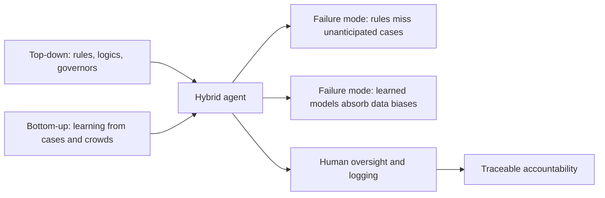
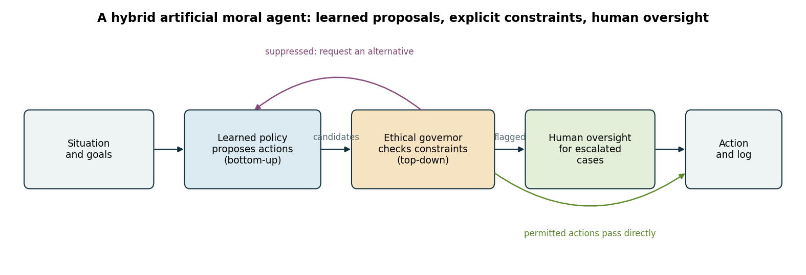
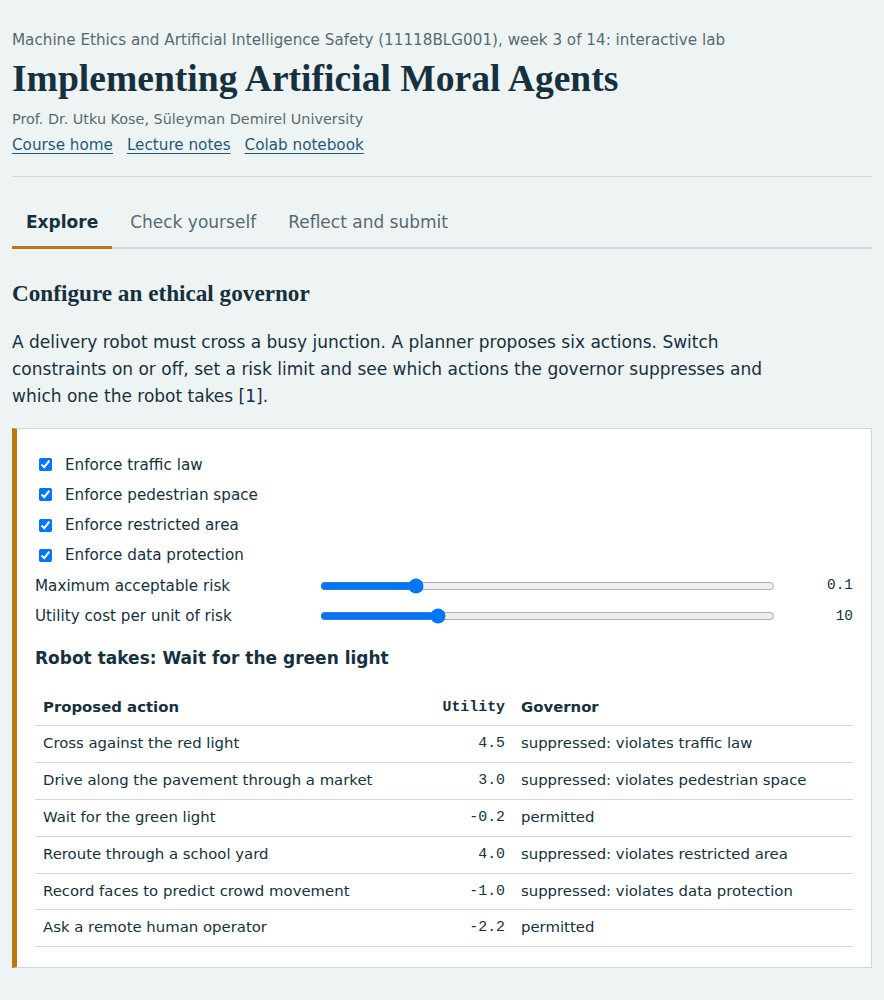
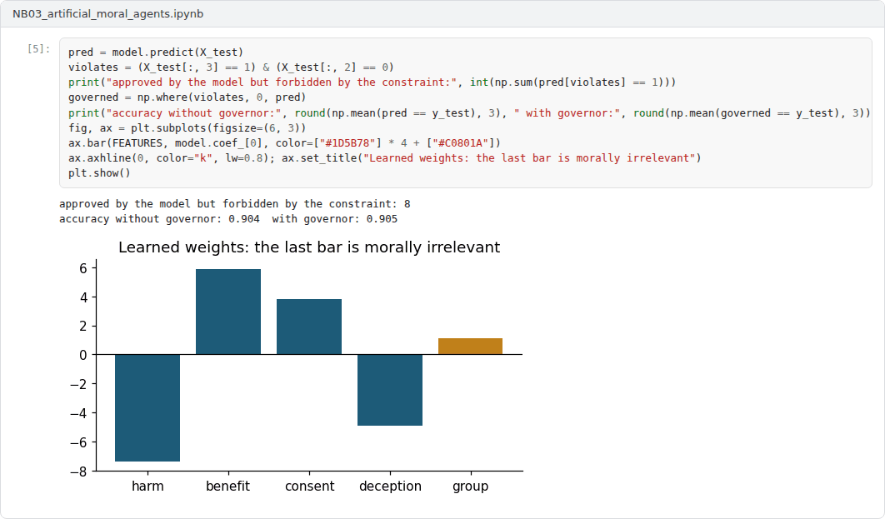

# Week 03: Implementing Artificial Moral Agents

**Machine Ethics and Artificial Intelligence Safety (11118BLG001)**  
Prof. Dr. Utku Kose, Süleyman Demirel University

    

## Overview

Theories become engineering once they are implemented. This week surveys top-down, bottom-up and hybrid artificial moral agents, from ethical governors and formally verified agents to systems that learn moral judgments from cases or crowds, and asks what each design can guarantee [1, 2].

**Estimated study time:** 6 to 8 hours.

## Learning outcomes

By the end of the week, students are expected to describe the architecture of an ethical governor, to explain how case-based and crowd-trained systems learn moral judgments, to identify the failure modes of each approach, and to design a hybrid agent that combines learned proposals, explicit constraints and human oversight.

## Study path

| Step | Activity | Suggested time |
|---|---|---|
| 1 | Read the lecture below or the [PDF version](Week03_Lecture_Notes.pdf), also available as a [Word file](Week03_Lecture_Notes.docx) | 90 minutes |
| 2 | Explore the [interactive lab](https://utkukose.github.io/machine-ethics-ai-safety-NB-lecture/weeks/week-03/lab.html) | 45 minutes |
| 3 | Work through the [Colab notebook](https://colab.research.google.com/github/utkukose/machine-ethics-ai-safety-NB-lecture/blob/main/weeks/week-03/NB03_artificial_moral_agents.ipynb) and its exercises | 2 to 3 hours |
| 4 | Take the self-assessment in the lab (tab: Check yourself) | 20 minutes |
| 5 | Write the reflection, export the learning log and complete the weekly task | 60 minutes |

## Week at a glance

## Lecture

### Top-down architectures: governors and verification

Arkin designed an ethical governor for autonomous robots that could use lethal force [3]. The governor sits between the planner and the actuators. It evaluates each proposed action against constraints derived from the laws of war and the rules of engagement, and it suppresses actions that violate them. The design makes the constraints inspectable and allows responsibility to be traced to the people who wrote them. Its limits are equally clear: The constraints are only as good as the perception that classifies a person as a civilian or a combatant, and they cover only the situations their authors anticipated.

Formal methods add guarantees to such designs. Dennis and colleagues verified with model checking that an autonomous agent selects the most ethical option available under a prioritised set of ethical principles, and that it acts unethically only when no ethical option exists [4]. Verification proves properties of the decision logic. It cannot prove that the logic's inputs describe the world correctly, which is why perception and specification remain open problems in later weeks.

*Figure 3.1. A hybrid artificial moral agent. A learned policy proposes actions, an ethical governor removes those that violate constraints, and flagged cases are escalated to a human [3, 5].*

<b>Check your understanding.</b> What does an ethical governor do in a top-down architecture?

A. It checks proposed actions against explicit constraints before they are executed  
B. It learns values from rewards alone  
C. It replaces the planner entirely  
D. It only runs after an incident has occurred  

**Answer: A.** A governor sits between deliberation and action and can veto actions that violate encoded constraints.

### Learning moral judgments from cases and crowds

Bottom-up systems learn from examples. MedEthEx, an early medical ethics advisor, represented cases with duties drawn from Ross's prima facie duties, such as non-maleficence, beneficence and respect for autonomy, and learned a decision principle from cases on which ethicists agreed [6, 7]. The learned principle could then justify its recommendation by citing the duties involved.

Large neural models extended this idea to broad coverage. Delphi was trained on a large collection of crowdsourced moral judgments and produced plausible answers to many everyday questions [8]. Its critics and its authors documented inconsistencies under rephrasing and the reproduction of social biases present in the training judgments. The ETHICS benchmark of Hendrycks and colleagues tests whether language models predict human judgments about justice, well-being, duties, virtues and commonsense morality, and it found promising but incomplete ability [9]. A central lesson is that a learned model reproduces the regularities of its data, including morally irrelevant ones. The notebook makes this concrete with a classifier that absorbs a sampling bias from its annotators.

<b>Check your understanding.</b> What is a main risk of learning moral judgements from crowd-sourced data?

A. The model cannot process text  
B. The model requires a theorem prover  
C. The model reproduces inconsistencies and biases of its data and may change its verdict when a question is rephrased  
D. The model always refuses to answer  

**Answer: C.** Systems such as Delphi showed both broad agreement with annotators and fragile, biased verdicts.

### What the survey literature shows

Tolmeijer and colleagues surveyed implementations in machine ethics and classified them by the ethical theory they encode, by their implementation approach and by their evaluation [1]. They found that systematic evaluation was rare and that the choice of theory often followed the convenience of the technique rather than philosophical argument. Wallach and Allen had anticipated that practical systems would need both rules and learning [2].

The literature also stresses oversight. Kose proposed a human-supervised model for safe artificial intelligence systems, in which human supervision is part of the control architecture rather than an afterthought [10]. Kose, Cankaya and Yigit listed remarkable issues for ethics and safety in the future of AI, including the difficulty of anticipating the behaviour of learning systems [11].

<b>Check your understanding.</b> What do surveys of implemented artificial moral agents report about most systems?

A. They are widely deployed in hospitals  
B. They are narrow prototypes evaluated on few cases  
C. They are formally verified for all situations  
D. They contain no learning components at all  

**Answer: B.** Evidence of general moral competence in implemented systems remains limited.

### Hybrid designs

A hybrid agent can combine the strengths of both families. A learned component proposes candidate actions and ranks them by expected benefit. An explicit governor removes candidates that violate hard constraints and flags uncertain ones. Flagged cases go to a human, and every decision is logged for later audit. The design follows the recommendation of Allen, Smit and Wallach to use learning where rules lack coverage and rules where learning lacks guarantees [5].

Two cautions apply. First, a governor can only filter what it can recognise, so a constraint on deception is useless if the system cannot detect deception. Second, human oversight is effective only if humans have the time, information and authority to intervene. These conditions reappear in Week 14, where the EU AI Act requires human oversight for high-risk systems.

> **Pause and reflect.** In the hybrid design of Figure 3.1, which component would be blamed after a harmful decision, and which component should be?

<b>Check your understanding.</b> What is the typical motivation for hybrid designs?

A. Removing all explicit constraints  
B. Reducing ethics to a lookup table  
C. Removing human oversight  
D. Combining the transparency of rules with the flexibility of learning  

**Answer: D.** Hybrids aim to keep verifiable constraints while learning to handle situations that rules do not anticipate.

## Interactive lab

A delivery robot must cross a busy junction. A planner proposes six actions. Switch constraints on or off, set a risk limit and see which actions the governor suppresses and which one the robot takes [3].

[Open the interactive lab](https://utkukose.github.io/machine-ethics-ai-safety-NB-lecture/weeks/week-03/lab.html)

## Colab notebook

The notebook trains a moral judgment classifier on synthetic cases whose annotations carry a sampling bias, measures how often its verdicts change when only a morally irrelevant attribute changes, and then adds an explicit governor on top of the learned model [3, 8].

Screenshots of the executed notebook:

## Self-assessment and reflection

The lab contains a 6-question self-assessment with instant feedback and a confidence rating for each answer. A confident but wrong answer marks the first topic to revisit. The reflection prompts below are also available in the lab, where answers are saved in the browser and can be exported as a learning log.

1. Which constraint in the lab was most costly in utility, and would you keep it? Justify your answer with one of the theories from Week 2.
2. Describe a morally irrelevant attribute that could leak into a model in your own field, and the data collection process that could cause the leak.
3. Where in your own work would a human reviewer add value, and what information would the reviewer need?

## Weekly task and submission

Design a hybrid artificial moral agent for a decision task in your field. Submit a one-page architecture description with a diagram, listing the learned component, at least three explicit constraints, the escalation rule for human oversight and what is logged. Attach the notebook with both exercises completed.

The weekly task supports self-learning and builds a personal portfolio. When the course is followed with the instructor during an active semester, the task can be sent together with the exported learning log to utkukose@sdu.edu.tr or utkukose@gmail.com for evaluation.

## Research and report assignment (optional)

**Artificial moral agents after a decade.** Review implemented architectures for artificial moral agents published since 2015 and classify them as top-down, bottom-up or hybrid [1]. Include the debate around Delphi and assess what the systems can and cannot do [8].

This research assignment is optional and supports self-learning. When the related weeks are followed within the course during an active semester, the report can be sent to utkukose@sdu.edu.tr or utkukose@gmail.com for evaluation. Unless the assignment states otherwise, a report has 1500 to 2500 words, follows the structure of an academic paper, cites at least six scholarly or official sources in square brackets and ends with a reference list.

## References

[1] Tolmeijer, S., Kneer, M., Sarasua, C., Christen, M., & Bernstein, A. (2021). Implementations in machine ethics: A survey. *ACM Computing Surveys*, 53(6), Article 132. <https://doi.org/10.1145/3419633>

[2] Wallach, W., & Allen, C. (2009). *Moral Machines: Teaching Robots Right from Wrong*. Oxford University Press.

[3] Arkin, R. C. (2009). *Governing Lethal Behavior in Autonomous Robots*. Chapman and Hall/CRC.

[4] Dennis, L., Fisher, M., Slavkovik, M., & Webster, M. (2016). Formal verification of ethical choices in autonomous systems. *Robotics and Autonomous Systems*, 77, 1-14. <https://doi.org/10.1016/j.robot.2015.11.012>

[5] Allen, C., Smit, I., & Wallach, W. (2005). Artificial morality: Top-down, bottom-up, and hybrid approaches. *Ethics and Information Technology*, 7(3), 149-155. <https://doi.org/10.1007/s10676-006-0004-4>

[6] Anderson, M., Anderson, S. L., & Armen, C. (2006). MedEthEx: A prototype medical ethics advisor. In *Proceedings of the 18th Conference on Innovative Applications of Artificial Intelligence (IAAI-06)*. AAAI Press.

[7] Ross, W. D. (1930). *The Right and the Good*. Clarendon Press.

[8] Jiang, L., Hwang, J. D., Bhagavatula, C., et al. (2021). Can machines learn morality? The Delphi experiment. arXiv preprint arXiv:2110.07574. <https://arxiv.org/abs/2110.07574>

[9] Hendrycks, D., Burns, C., Basart, S., Critch, A., Li, J., Song, D., & Steinhardt, J. (2021). Aligning AI with shared human values. In *International Conference on Learning Representations (ICLR)*. <https://arxiv.org/abs/2008.02275>

[10] Kose, U. (2018). Güvenli yapay zekâ sistemleri için insan denetimli bir model geliştirilmesi [Developing a human-supervised model for safe artificial intelligence systems]. *Mühendislik Bilimleri ve Tasarım Dergisi*, 6(1), 93-107. In Turkish.

[11] Kose, U., Cankaya, I. A., & Yigit, T. (2017). Ethics and safety in the future of artificial intelligence: Remarkable issues. *International Journal of Engineering Science and Application*, 2(2), 65-70.

---

Machine Ethics and Artificial Intelligence Safety. Prof. Dr. Utku Kose, Süleyman Demirel University. ORCID [0000-0002-9652-6415](https://orcid.org/0000-0002-9652-6415). Content licensed under CC BY 4.0. This course is updated in line with current developments in the field. Last update: September 2026.
