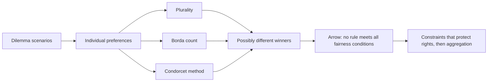
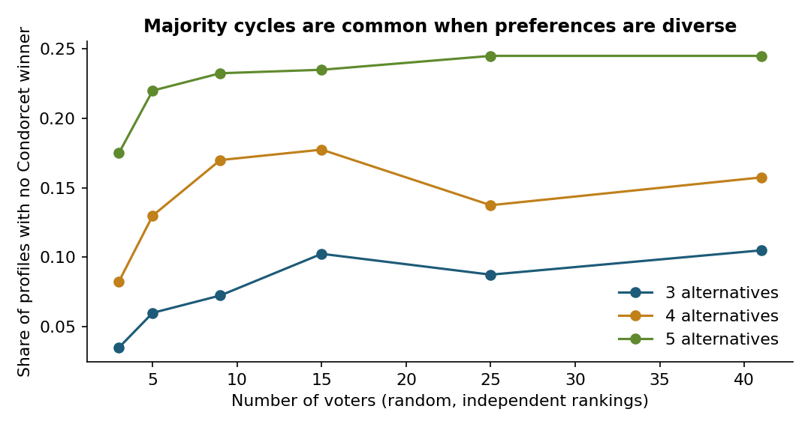
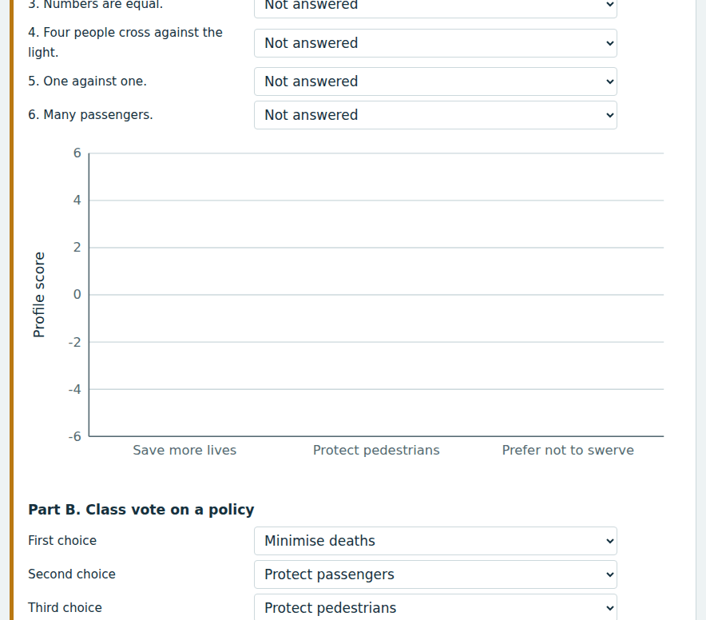
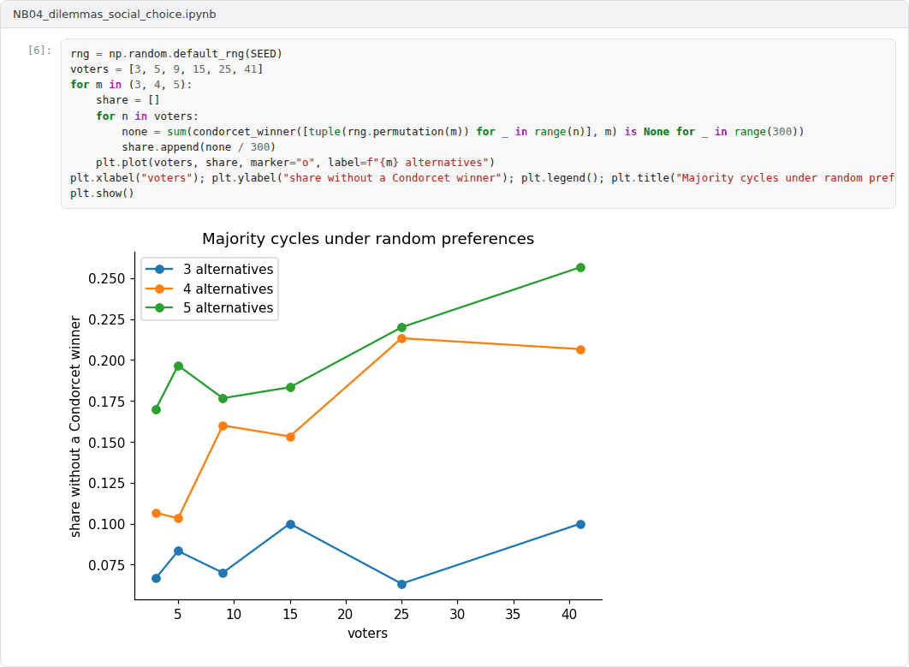

# Week 04: Moral Dilemmas, Pluralism and Social Choice

**Machine Ethics and Artificial Intelligence Safety (11118BLG001)**  
Prof. Dr. Utku Kose, Süleyman Demirel University

   

## Overview

If machines should reflect human values, whose values count and how are they combined? This week examines dilemma studies such as the Moral Machine experiment and the mathematics of aggregating preferences, including results that show why no aggregation rule is neutral [1, 2].

**Estimated study time:** 6 to 8 hours.

## Learning outcomes

By the end of the week, students are expected to interpret the findings and limitations of large dilemma studies, to compute plurality, Borda and Condorcet outcomes for a preference profile, to explain Arrow's impossibility theorem and majority cycles, and to argue when aggregation of preferences is an appropriate basis for machine behaviour.

## Study path

| Step | Activity | Suggested time |
|---|---|---|
| 1 | Read the lecture below or the [PDF version](Week04_Lecture_Notes.pdf) | 90 minutes |
| 2 | Explore the [interactive lab](https://utkukose.github.io/machine-ethics-ai-safety-NB-lecture/weeks/week-04/lab.html) | 45 minutes |
| 3 | Work through the [Colab notebook](https://colab.research.google.com/github/utkukose/machine-ethics-ai-safety-NB-lecture/blob/main/weeks/week-04/NB04_dilemmas_social_choice.ipynb) and its exercises | 2 to 3 hours |
| 4 | Take the self-assessment in the lab (tab: Check yourself) | 20 minutes |
| 5 | Write the reflection, export the learning log and complete the weekly task | 60 minutes |

## Week at a glance

## Lecture

### Dilemmas as research instruments

Moral dilemmas are simplified scenarios in which every option has a moral cost. The trolley cases of Foot and Thomson became the template [3, 4]. Vasant and Kose used dilemma scenarios to compare the possible actions of humans and AI-based systems, showing how the same scenario raises different questions when the agent is a machine [5]. Bonnefon, Shariff and Rahwan found a social dilemma in attitudes towards autonomous vehicles: Respondents approved of vehicles that would sacrifice their passengers to save more pedestrians, yet preferred to ride in vehicles that would protect their passengers [6].

Dilemmas are useful because they isolate one variable at a time. They are also artificial. Real systems rarely face a clean choice between two certain outcomes, and a system designed around dramatic dilemmas may neglect the many small trade-offs that matter more in daily operation.

<b>Check your understanding.</b> Why are stylised dilemmas limited as guides for machine design?

A. Real situations involve uncertainty and options that dilemmas deliberately remove  
B. They have no philosophical value  
C. Machines never face trade-offs  
D. Dilemmas are too easy to answer  

**Answer: A.** Dilemmas isolate intuitions, which makes them useful instruments but poor models of real decisions.

### The Moral Machine experiment

Awad and colleagues deployed an online platform that presented unavoidable accident scenarios and collected about forty million decisions in ten languages from people in 233 countries and territories [1]. Strong global preferences emerged for sparing humans over animals, more lives over fewer and young lives over old. Preferences also varied across cultural clusters, which the authors linked to cultural and economic variables.

The study is a landmark and a cautionary tale. Its participants were self-selected, its scenarios were stylised and it measured stated rather than revealed preferences. More fundamentally, a majority preference is not automatically a justified norm. A preference for sparing people of higher status, for example, raises questions of equal treatment that a vote cannot settle.

<b>Check your understanding.</b> What did the Moral Machine experiment collect?

A. Rankings of ethical theories by philosophers  
B. Accident statistics from autonomous vehicles  
C. Brain imaging data of drivers  
D. Millions of choices on autonomous vehicle dilemmas from people in many countries  

**Answer: D.** The study reported broadly shared preferences and systematic cultural variation.

### Aggregating preferences

Noothigattu and colleagues proposed a voting-based system that learns a model of each participant's preferences from dilemma responses and aggregates the models with a voting rule when a new decision arises [7]. The approach inherits the properties of social choice theory, which studies how individual rankings can be combined.

Social choice theory contains sobering results. Condorcet observed that majority preferences can be cyclic: A majority may prefer option A to B, another majority B to C and a third C to A [8]. Arrow proved that no rule for aggregating rankings of three or more options satisfies a small set of reasonable conditions at once, namely unrestricted domain, the Pareto principle, independence of irrelevant alternatives and non-dictatorship [2]. Different rules therefore produce different winners from the same preferences. Plurality counts only first choices, the Borda count rewards broad acceptability and a Condorcet winner, when one exists, beats every rival in pairwise majority votes. Figure 4.1 shows how often no Condorcet winner exists when rankings are diverse.

*Figure 4.1. Simulated share of preference profiles without a Condorcet winner when every voter ranks the alternatives independently at random. The chance of a majority cycle grows with the number of alternatives [2, 8].*

<b>Check your understanding.</b> What does Arrow&#x27;s impossibility theorem show?

A. Majority voting is always transitive  
B. No rank aggregation rule for three or more options satisfies a small set of reasonable conditions at once  
C. The Borda count is always dictatorial  
D. Preferences cannot be measured  

**Answer: B.** Every aggregation rule gives up at least one desirable property, so the choice of rule is itself normative.

### Pluralism beyond aggregation

Aggregation treats morality as a matter of preference. Gabriel argued instead for principles that people could endorse despite their disagreements, selected through a fair process that protects minorities [9]. Moral uncertainty offers a further perspective, in which a system weighs theories rather than voters [10]. In practice, designers can combine the approaches: Hard constraints protect rights that no majority may override, and aggregation is used only among options that respect those constraints.

> **Pause and reflect.** Should the behaviour of a medical triage system deployed in Türkiye follow the preferences of Turkish respondents, of global respondents or of neither? What would justify each answer?

<b>Check your understanding.</b> What characterises a pluralist response to value conflict?

A. Choosing whatever the majority prefers  
B. Keeping several values in view, deliberating and documenting trade-offs  
C. Collapsing all values into one score  
D. Deferring to the engineer's intuition  

**Answer: B.** Pluralism treats some conflicts as genuine and asks for transparent, contestable trade-offs.

## Interactive lab

Part A records choices in six accident dilemmas and summarises them as a preference profile. Part B combines a ranking with those of a synthetic class of forty voters and compares plurality, Borda and pairwise majority outcomes [1, 7].

[Open the interactive lab](https://utkukose.github.io/machine-ethics-ai-safety-NB-lecture/weeks/week-04/lab.html)

## Colab notebook

The notebook implements plurality, Borda and Condorcet rules, estimates how often majority cycles occur, and aggregates synthetic dilemma preferences in the spirit of the voting-based approach of Noothigattu and colleagues [7].

Screenshots of the executed notebook:

## Self-assessment and reflection

The lab contains a 6-question self-assessment with instant feedback and a confidence rating for each answer. A confident but wrong answer marks the first topic to revisit. The reflection prompts below are also available in the lab, where answers are saved in the browser and can be exported as a learning log.

1. Did your ranking in Part B match the class winner under any rule? What does that suggest about building a system from aggregated preferences?
2. Name one preference revealed in dilemma studies that should not be implemented even if a majority holds it, and explain why.
3. How would you collect moral preferences for a system in your field so that the sample is appropriate and minorities are protected?

## Weekly task and submission

Design a small preference study for a decision made by an AI system in your field. Write four dilemma items, specify the target population and the sampling procedure, name the aggregation rule you would use and the constraints that no aggregation may override. Keep the design to about one page and attach the completed notebook.

The weekly task supports self-learning and builds a personal portfolio. When the course is followed with the instructor during an active semester, the task can be sent together with the exported learning log to utkukose@sdu.edu.tr or utkukose@gmail.com for evaluation.

## Research and report assignment (optional)

**Aggregating moral preferences.** Analyse the Moral Machine experiment and the criticism it received [1]. Discuss whether aggregating the preferences of many people is a sound basis for machine decisions, with reference to the results of social choice theory [2].

This research assignment is optional and supports self-learning. When the related weeks are followed within the course during an active semester, the report can be sent to utkukose@sdu.edu.tr or utkukose@gmail.com for evaluation. Unless the assignment states otherwise, a report has 1500 to 2500 words, follows the structure of an academic paper, cites at least six scholarly or official sources in square brackets and ends with a reference list.

## References

[1] Awad, E., Dsouza, S., Kim, R., Schulz, J., Henrich, J., Shariff, A., Bonnefon, J.-F., & Rahwan, I. (2018). The Moral Machine experiment. *Nature*, 563(7729), 59-64. <https://doi.org/10.1038/s41586-018-0637-6>

[2] Arrow, K. J. (1951). *Social Choice and Individual Values*. John Wiley & Sons.

[3] Foot, P. (1967). The problem of abortion and the doctrine of the double effect. *Oxford Review*, 5, 5-15.

[4] Thomson, J. J. (1985). The trolley problem. *The Yale Law Journal*, 94(6), 1395-1415. <https://doi.org/10.2307/796133>

[5] Vasant, P., & Kose, U. (2017). Moral dilemma scenarios considering possible actions by humans and artificial intelligence based systems. *Journal of Multidisciplinary Developments*, 2(2), 39-49.

[6] Bonnefon, J.-F., Shariff, A., & Rahwan, I. (2016). The social dilemma of autonomous vehicles. *Science*, 352(6293), 1573-1576. <https://doi.org/10.1126/science.aaf2654>

[7] Noothigattu, R., Gaikwad, S., Awad, E., Dsouza, S., Rahwan, I., Ravikumar, P., & Procaccia, A. D. (2018). A voting-based system for ethical decision making. In *Proceedings of the AAAI Conference on Artificial Intelligence, 32(1)*.

[8] de Condorcet, M. (1785). *Essai sur l'application de l'analyse à la probabilité des décisions rendues à la pluralité des voix*. Imprimerie Royale.

[9] Gabriel, I. (2020). Artificial intelligence, values, and alignment. *Minds and Machines*, 30(3), 411-437. <https://doi.org/10.1007/s11023-020-09539-2>

[10] MacAskill, W., Bykvist, K., & Ord, T. (2020). *Moral Uncertainty*. Oxford University Press.

---

Machine Ethics and Artificial Intelligence Safety. Prof. Dr. Utku Kose, Süleyman Demirel University. ORCID [0000-0002-9652-6415](https://orcid.org/0000-0002-9652-6415). Content licensed under CC BY 4.0. This course is updated in line with current developments in the field. Last update: September 2026.
