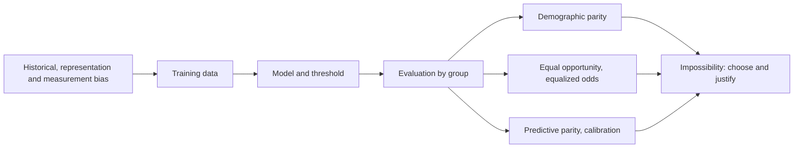
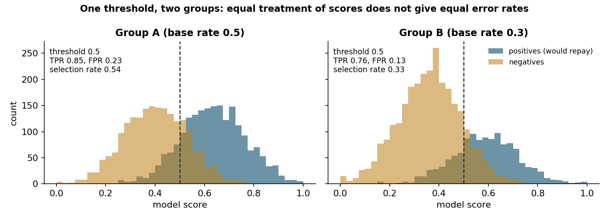
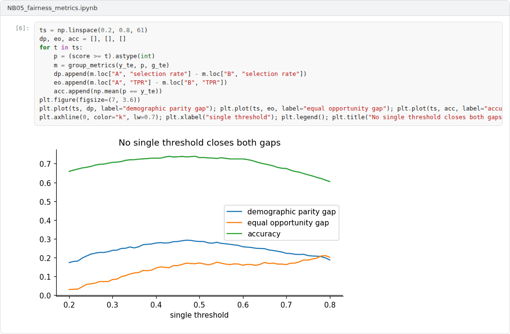
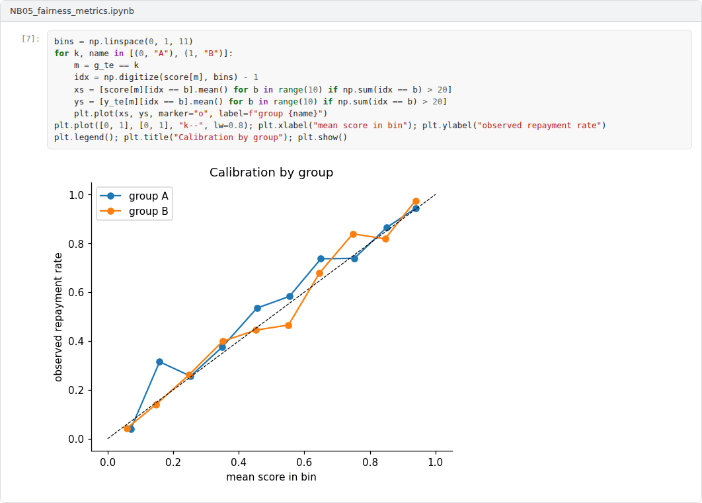

# Week 05: Algorithmic Fairness I: Harms, Metrics and Impossibility

**Machine Ethics and Artificial Intelligence Safety (11118BLG001)**  
Prof. Dr. Utku Kose, Süleyman Demirel University

   

## Overview

Machine learning systems allocate loans, jobs, medical attention and police attention. This week studies how unfair outcomes arise across the machine learning life cycle, how group and individual fairness are measured, and why several natural fairness criteria cannot hold together [1, 2, 3].

**Estimated study time:** 6 to 8 hours.

## Learning outcomes

By the end of the week, students are expected to trace a fairness harm to its source in the life cycle, to compute demographic parity, equal opportunity, equalized odds and predictive parity from a confusion matrix, to state the impossibility results of Kleinberg and colleagues and of Chouldechova, and to justify the choice of a fairness criterion for a concrete application.

## Study path

| Step | Activity | Suggested time |
|---|---|---|
| 1 | Read the lecture below or the [PDF version](Week05_Lecture_Notes.pdf) | 90 minutes |
| 2 | Explore the [interactive lab](https://utkukose.github.io/machine-ethics-ai-safety-NB-lecture/weeks/week-05/lab.html) | 45 minutes |
| 3 | Work through the [Colab notebook](https://colab.research.google.com/github/utkukose/machine-ethics-ai-safety-NB-lecture/blob/main/weeks/week-05/NB05_fairness_metrics.ipynb) and its exercises | 2 to 3 hours |
| 4 | Take the self-assessment in the lab (tab: Check yourself) | 20 minutes |
| 5 | Write the reflection, export the learning log and complete the weekly task | 60 minutes |

## Week at a glance

## Lecture

### Where unfairness enters

Suresh and Guttag organised sources of harm along the machine learning life cycle [1]. Historical bias exists in the world before any data is collected. Representation bias arises when some groups are under-sampled. Measurement bias arises when features or labels are poor proxies for the construct of interest. Aggregation, learning, evaluation and deployment biases arise later, when one model is fitted to heterogeneous groups, when the objective amplifies disparities, when benchmarks do not represent users and when a system is used differently from how it was designed. Mehrabi and colleagues surveyed the resulting landscape of definitions and methods [4].

Three cases show the variety of mechanisms. An investigation by ProPublica reported that a recidivism risk tool produced higher false positive rates for Black defendants than for white defendants [5]. Obermeyer and colleagues found that a widely used health algorithm predicted health care costs as a proxy for health needs, and because less money had been spent on Black patients with the same needs, the algorithm assigned them lower risk scores [6]. Buolamwini and Gebru found that commercial gender classification systems had error rates of up to 34.7 percent for darker-skinned women, while the maximum error rate for lighter-skinned men was 0.8 percent [7]. The first case concerns error rates, the second the choice of label and the third representation in training and evaluation data.

<b>Check your understanding.</b> When does historical bias enter a model?

A. When the optimiser diverges  
B. When a random seed changes  
C. When the data faithfully record a world that was already unjust  
D. When the test set is too small  

**Answer: C.** A perfectly measured dataset can still encode past injustice, which the model then learns.

### Group fairness criteria

Most criteria compare statistics of a classifier across groups defined by a protected attribute. Demographic parity requires equal selection rates. Equalized odds requires equal true positive rates and equal false positive rates, and equal opportunity relaxes it to equal true positive rates only [8]. Predictive parity requires equal precision, so that a positive prediction means the same probability of a positive outcome in every group. Calibration within groups strengthens this to every score level.

Each criterion encodes a different view of what equal treatment means. Demographic parity treats unequal selection rates as the harm, which suits settings where historical labels themselves reflect discrimination. Equal opportunity treats unequal chances for qualified individuals as the harm. Predictive parity protects the meaning of a score for the people who use it. Dwork and colleagues proposed a complementary individual notion: Similar individuals should receive similar outcomes, where similarity is defined by a task-specific metric [9]. The difficulty moves to the metric, which must itself be justified.

<b>Check your understanding.</b> Equal opportunity requires which quantity to be equal across groups?

A. True positive rates  
B. Selection rates  
C. Precision  
D. Overall accuracy  

**Answer: A.** Equal opportunity asks that qualified individuals have the same chance of a positive decision in every group.

### Impossibility results

Kleinberg, Mullainathan and Raghavan proved that three conditions, calibration within groups and balance of scores for the positive and for the negative class, cannot hold together except in two degenerate situations: perfect prediction or equal base rates across groups [2]. Chouldechova showed a closely related result for binary predictions: When prevalence differs between groups, a predictor with equal positive predictive value cannot also have equal false positive and false negative rates [3]. The recidivism debate illustrates both results. The tool was reported to be roughly calibrated across groups, while its error rates differed, and both observations can be true at once [3, 5].

The results do not show that fairness is hopeless. They show that fairness criteria express value judgments that must be chosen, justified and documented. Figure 5.1 shows the mechanism in its simplest form: A single threshold applied to two groups with different score distributions yields different error rates and selection rates.

*Figure 5.1. Synthetic scores for two groups with different base rates. The same threshold of 0.5 yields different true positive rates, false positive rates and selection rates.*

<b>Check your understanding.</b> When base rates differ between groups, an imperfect classifier cannot at the same time satisfy

A. accuracy and precision  
B. any two metrics whatsoever  
C. demographic parity and nothing else  
D. calibration within groups and equal false positive and false negative rates  

**Answer: D.** This is the core of the impossibility results of Kleinberg and colleagues and of Chouldechova.

### Fairness as a socio-technical question

Metrics are computed on data, and data carry the history of the institutions that collected them. The health algorithm studied by Obermeyer and colleagues was well calibrated for cost and still unfair for need, because cost was the wrong label [6]. A fairness audit therefore begins with questions that no metric can answer: What is the decision for, who is affected, what does each type of error cost each group and who had a voice in answering these questions [1]?

> **Pause and reflect.** In a university admission model, is a false negative (rejecting a student who would have succeeded) worse than a false positive? Does the answer differ for students from under-represented schools?

<b>Check your understanding.</b> What does it mean to treat fairness as a socio-technical question?

A. Ignoring metrics  
B. Considering context, institutions and affected people, not only model metrics  
C. Delegating all decisions to lawyers  
D. Optimising accuracy first and fairness later  

**Answer: B.** Metrics capture only part of fairness. The deployment context decides which harms matter.

## Interactive lab

Two synthetic groups receive scores from the same model. Move the thresholds and the base rate of group B and watch the fairness gaps. Untick the single-threshold option to try equalising true positive rates, which is the idea behind post-processing in Week 6 [2, 8].

[Open the interactive lab](https://utkukose.github.io/machine-ethics-ai-safety-NB-lecture/weeks/week-05/lab.html)

## Colab notebook

The notebook builds a synthetic lending data set in which group B carries a historical disadvantage, trains a model that never sees the group attribute, and measures every fairness criterion of the lecture. An optional section repeats the audit on the Adult census data set when an internet connection is available [2, 8].

Screenshots of the executed notebook:

## Self-assessment and reflection

The lab contains a 6-question self-assessment with instant feedback and a confidence rating for each answer. A confident but wrong answer marks the first topic to revisit. The reflection prompts below are also available in the lab, where answers are saved in the browser and can be exported as a learning log.

1. Which source of harm in the framework of Suresh and Guttag is most likely in a data set from your field, and how would you detect it?
2. Choose one fairness criterion for a decision system you know and defend it against the other criteria in three sentences.
3. The impossibility results turn fairness into a choice. Who should make that choice for a public-sector system, and how should it be documented?

## Weekly task and submission

Write a fairness audit of about 500 words for the synthetic lending model or for a model and data set from your field. Report at least four group metrics, discuss which criterion matters most for the decision and why, and state one limitation of the audit. Attach the executed notebook.

The weekly task supports self-learning and builds a personal portfolio. When the course is followed with the instructor during an active semester, the task can be sent together with the exported learning log to utkukose@sdu.edu.tr or utkukose@gmail.com for evaluation.

## Research and report assignment (optional)

**Fairness definitions in a regulated domain.** Choose credit, hiring or health care and review which fairness definitions regulators, auditors and practitioners actually use. Relate the choices to the impossibility results of this week [2, 3].

This research assignment is optional and supports self-learning. When the related weeks are followed within the course during an active semester, the report can be sent to utkukose@sdu.edu.tr or utkukose@gmail.com for evaluation. Unless the assignment states otherwise, a report has 1500 to 2500 words, follows the structure of an academic paper, cites at least six scholarly or official sources in square brackets and ends with a reference list.

## References

[1] Suresh, H., & Guttag, J. (2021). A framework for understanding sources of harm throughout the machine learning life cycle. In *Equity and Access in Algorithms, Mechanisms, and Optimization (EAAMO '21)*. ACM. <https://doi.org/10.1145/3465416.3483305>

[2] Kleinberg, J., Mullainathan, S., & Raghavan, M. (2017). Inherent trade-offs in the fair determination of risk scores. In *8th Innovations in Theoretical Computer Science Conference (ITCS 2017), LIPIcs 67* (pp. 43:1-43:23). <https://doi.org/10.4230/LIPIcs.ITCS.2017.43>

[3] Chouldechova, A. (2017). Fair prediction with disparate impact: A study of bias in recidivism prediction instruments. *Big Data*, 5(2), 153-163. <https://doi.org/10.1089/big.2016.0047>

[4] Mehrabi, N., Morstatter, F., Saxena, N., Lerman, K., & Galstyan, A. (2021). A survey on bias and fairness in machine learning. *ACM Computing Surveys*, 54(6), Article 115. <https://doi.org/10.1145/3457607>

[5] Angwin, J., Larson, J., Mattu, S., & Kirchner, L. (2016). *Machine bias*. ProPublica. <https://www.propublica.org/article/machine-bias-risk-assessments-in-criminal-sentencing>

[6] Obermeyer, Z., Powers, B., Vogeli, C., & Mullainathan, S. (2019). Dissecting racial bias in an algorithm used to manage the health of populations. *Science*, 366(6464), 447-453. <https://doi.org/10.1126/science.aax2342>

[7] Buolamwini, J., & Gebru, T. (2018). Gender shades: Intersectional accuracy disparities in commercial gender classification. In *Proceedings of the 1st Conference on Fairness, Accountability and Transparency, PMLR 81* (pp. 77-91).

[8] Hardt, M., Price, E., & Srebro, N. (2016). Equality of opportunity in supervised learning. In *Advances in Neural Information Processing Systems 29*.

[9] Dwork, C., Hardt, M., Pitassi, T., Reingold, O., & Zemel, R. (2012). Fairness through awareness. In *Proceedings of the 3rd Innovations in Theoretical Computer Science Conference* (pp. 214-226). ACM. <https://doi.org/10.1145/2090236.2090255>

---

Machine Ethics and Artificial Intelligence Safety. Prof. Dr. Utku Kose, Süleyman Demirel University. ORCID [0000-0002-9652-6415](https://orcid.org/0000-0002-9652-6415). Content licensed under CC BY 4.0. This course is updated in line with current developments in the field. Last update: September 2026.
