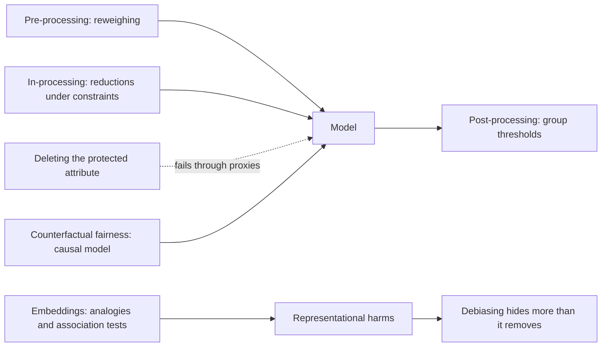
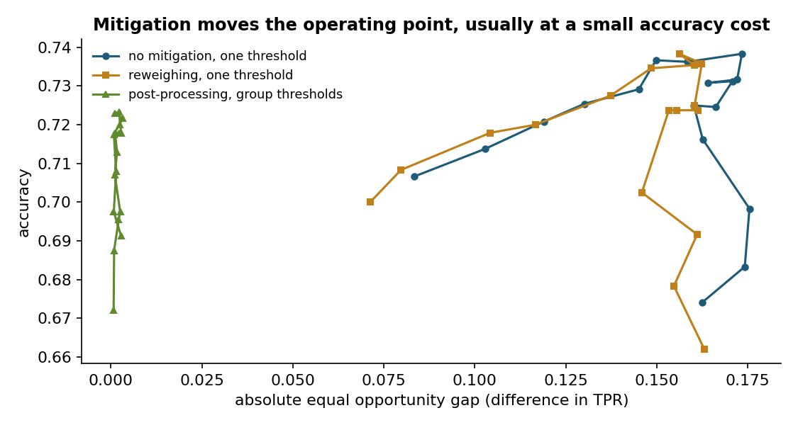
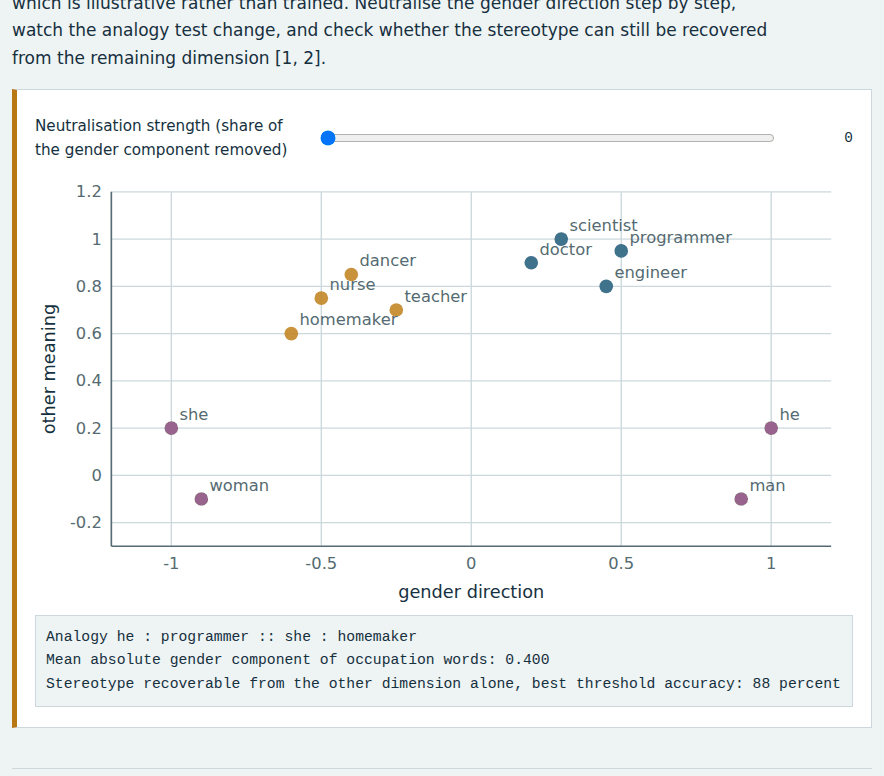
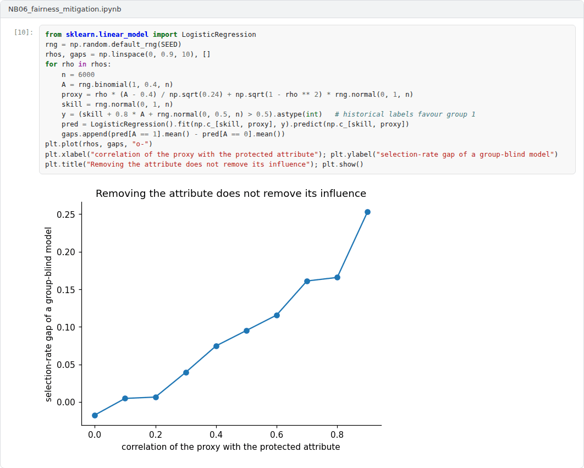

# Week 06: Algorithmic Fairness II: Mitigation and Representational Harms

**Machine Ethics and Artificial Intelligence Safety (11118BLG001)**  
Prof. Dr. Utku Kose, Süleyman Demirel University

   

## Overview

Measuring unfairness is the first step. This week covers interventions before, during and after training, the limits of removing protected attributes, counterfactual reasoning about fairness and the representational harms that language technologies can cause [1, 2, 3, 4].

**Estimated study time:** 6 to 8 hours.

## Learning outcomes

By the end of the week, students are expected to apply reweighing and group-specific thresholds, to explain the reductions approach to fair classification, to show why fairness through unawareness fails in the presence of proxies, to describe counterfactual fairness, and to analyse gender bias in word embeddings and the limits of debiasing.

## Study path

| Step | Activity | Suggested time |
|---|---|---|
| 1 | Read the lecture below or the [PDF version](Week06_Lecture_Notes.pdf) | 90 minutes |
| 2 | Explore the [interactive lab](https://utkukose.github.io/machine-ethics-ai-safety-NB-lecture/weeks/week-06/lab.html) | 45 minutes |
| 3 | Work through the [Colab notebook](https://colab.research.google.com/github/utkukose/machine-ethics-ai-safety-NB-lecture/blob/main/weeks/week-06/NB06_fairness_mitigation.ipynb) and its exercises | 2 to 3 hours |
| 4 | Take the self-assessment in the lab (tab: Check yourself) | 20 minutes |
| 5 | Write the reflection, export the learning log and complete the weekly task | 60 minutes |

## Week at a glance

## Lecture

### Three points of intervention

Mitigation methods act on the data, on the learning algorithm or on the predictions. Kamiran and Calders proposed pre-processing techniques, including reweighing: Each training example receives the weight P(group) P(label) / P(group, label), which makes group and label statistically independent in the weighted data [1]. Pre-processing is simple and model-agnostic, but it cannot guarantee a particular fairness criterion at test time.

In-processing changes the objective. Agarwal and colleagues reduced fair classification under constraints such as demographic parity or equalized odds to a sequence of cost-sensitive classification problems, whose solutions are combined into a randomised classifier with provable guarantees [2]. Post-processing changes only the decision rule. Hardt, Price and Srebro showed how to derive group-specific, possibly randomised thresholds that achieve equalized odds or equal opportunity from any score, without retraining [3]. The open-source Fairlearn toolkit implements assessment tools and several of these mitigation methods [5]. Figure 6.1 compares the three routes on the lending data of Week 5.

*Figure 6.1. Accuracy against the equal opportunity gap on the synthetic lending data of Week 5 for a threshold sweep without mitigation, with reweighing and with group-specific thresholds [1, 3].*

<b>Check your understanding.</b> Reweighing training examples is an example of which kind of intervention?

A. In-processing  
B. Post-processing  
C. Pre-processing  
D. Auditing  

**Answer: C.** Reweighing changes the training data before learning, so it is a pre-processing method.

### Proxies and counterfactual fairness

A tempting remedy is to delete the protected attribute. This fairness through unawareness usually fails, because other features act as proxies: Postal codes, schools, names and purchase histories can encode group membership. The Week 3 notebook showed the same effect for a morally irrelevant attribute, and the Week 5 notebook showed unequal error rates for a model that never saw the group.

Kusner and colleagues defined counterfactual fairness with a causal model: A prediction is counterfactually fair if it would stay the same in a counterfactual world where the individual's protected attribute had been different, with everything not caused by the attribute held fixed [6]. The definition captures the intuition behind many discrimination complaints. Its price is a causal model of how the protected attribute influences the other features, and conclusions depend on assumptions that must be defended.

<b>Check your understanding.</b> Why does removing the protected attribute from the inputs often fail?

A. Other features act as proxies for it  
B. Models cannot be trained without it  
C. It always increases accuracy  
D. Laws forbid removing it  

**Answer: A.** Correlated features such as a postcode can carry the same information.

### Representational harms in language technology

Fairness is not only about decisions. Bolukbasi and colleagues showed that word embeddings trained on news text completed analogies such as man is to computer programmer as woman is to homemaker, and they proposed hard debiasing: Identify a gender direction and remove it from words that should be gender-neutral [4]. Caliskan, Bryson and Narayanan adapted the implicit association test to embeddings and reproduced a range of documented human biases in their word embedding association test [7].

Debiasing turned out to be shallow. Gonen and Goldberg showed that after projection, words that had been stereotypically gendered still clustered together and that the removed bias could be recovered by a classifier from the remaining dimensions [8]. Bender and colleagues warned that ever larger language models absorb the viewpoints over-represented in their training data and called for careful curation and documentation [9]. The lab reproduces both the analogy effect and the residual bias in a two-dimensional toy space.

<b>Check your understanding.</b> Which is an example of a representational harm?

A. A loan application is denied  
B. A server outage delays decisions  
C. A model responds slowly  
D. A translation system assigns stereotyped genders to occupations  

**Answer: D.** Representational harms concern how groups are depicted, for example through stereotypes or erasure.

### Choosing and documenting a mitigation

No mitigation is free. Each method moves the operating point of a system, and the right point depends on the costs of errors for each group and on legal constraints, such as rules on using protected attributes at decision time. A defensible process names the criterion, explains why it fits the decision, reports the accuracy and fairness trade-off with uncertainty and records the choice in documentation such as a model card, which Week 14 covers [10].

> **Pause and reflect.** Group-specific thresholds equalise true positive rates but treat identical scores differently. Is that fair? Consider the argument from the perspective of an applicant in each group.

<b>Check your understanding.</b> How do documentation practices such as model cards support mitigation?

A. They hide the model weights  
B. They record intended use, evaluation across groups and known limitations  
C. They replace evaluation  
D. They guarantee fairness  

**Answer: B.** Documentation makes choices and limitations visible to users, auditors and affected people.

## Interactive lab

Eight occupation words and four gendered words live in a two-dimensional toy space, which is illustrative rather than trained. Neutralise the gender direction step by step, watch the analogy test change, and check whether the stereotype can still be recovered from the remaining dimension [4, 8].

[Open the interactive lab](https://utkukose.github.io/machine-ethics-ai-safety-NB-lecture/weeks/week-06/lab.html)

## Colab notebook

The notebook applies reweighing and group-specific thresholds to the lending data of Week 5, compares their fairness and accuracy, and shows how to run the same assessment with Fairlearn when it is installed [1, 3, 5].

Screenshots of the executed notebook:

## Self-assessment and reflection

The lab contains a 6-question self-assessment with instant feedback and a confidence rating for each answer. A confident but wrong answer marks the first topic to revisit. The reflection prompts below are also available in the lab, where answers are saved in the browser and can be exported as a learning log.

1. Which of the three mitigation routes would be legally and practically feasible in your country for credit decisions, and why?
2. In the lab, the analogy test changed before the residual bias disappeared. What does that suggest about using a single bias metric?
3. Describe a representational harm that a language model could cause in Turkish or another language you use, and how you would test for it.

## Weekly task and submission

Apply one mitigation method from this week to a model of your choice (the notebook model is acceptable). In about 400 words, report fairness and accuracy before and after, discuss who gains and who loses, and state which method you would deploy. Attach the executed notebook.

The weekly task supports self-learning and builds a personal portfolio. When the course is followed with the instructor during an active semester, the task can be sent together with the exported learning log to utkukose@sdu.edu.tr or utkukose@gmail.com for evaluation.

## Research and report assignment (optional)

**Representational harms in Turkish language technologies.** Review the evidence on gender bias in machine translation and language models for Turkish, where the pronoun o carries no gender, and evaluate proposed mitigations [4, 7].

This research assignment is optional and supports self-learning. When the related weeks are followed within the course during an active semester, the report can be sent to utkukose@sdu.edu.tr or utkukose@gmail.com for evaluation. Unless the assignment states otherwise, a report has 1500 to 2500 words, follows the structure of an academic paper, cites at least six scholarly or official sources in square brackets and ends with a reference list.

## References

[1] Kamiran, F., & Calders, T. (2012). Data preprocessing techniques for classification without discrimination. *Knowledge and Information Systems*, 33(1), 1-33. <https://doi.org/10.1007/s10115-011-0463-8>

[2] Agarwal, A., Beygelzimer, A., Dudík, M., Langford, J., & Wallach, H. (2018). A reductions approach to fair classification. In *Proceedings of the 35th International Conference on Machine Learning, PMLR 80* (pp. 60-69).

[3] Hardt, M., Price, E., & Srebro, N. (2016). Equality of opportunity in supervised learning. In *Advances in Neural Information Processing Systems 29*.

[4] Bolukbasi, T., Chang, K.-W., Zou, J. Y., Saligrama, V., & Kalai, A. T. (2016). Man is to computer programmer as woman is to homemaker? Debiasing word embeddings. In *Advances in Neural Information Processing Systems 29*.

[5] Weerts, H., Dudík, M., Edgar, R., Jalali, A., Lutz, R., & Madaio, M. (2023). Fairlearn: Assessing and improving fairness of AI systems. *Journal of Machine Learning Research*, 24(257), 1-8.

[6] Kusner, M. J., Loftus, J., Russell, C., & Silva, R. (2017). Counterfactual fairness. In *Advances in Neural Information Processing Systems 30*.

[7] Caliskan, A., Bryson, J. J., & Narayanan, A. (2017). Semantics derived automatically from language corpora contain human-like biases. *Science*, 356(6334), 183-186. <https://doi.org/10.1126/science.aal4230>

[8] Gonen, H., & Goldberg, Y. (2019). Lipstick on a pig: Debiasing methods cover up systematic gender biases in word embeddings but do not remove them. In *Proceedings of the 2019 Conference of the North American Chapter of the Association for Computational Linguistics (NAACL-HLT)* (pp. 609-614). Association for Computational Linguistics. <https://arxiv.org/abs/1903.03862>

[9] Bender, E. M., Gebru, T., McMillan-Major, A., & Shmitchell, S. (2021). On the dangers of stochastic parrots: Can language models be too big?. In *Proceedings of the 2021 ACM Conference on Fairness, Accountability, and Transparency (FAccT '21)* (pp. 610-623). <https://doi.org/10.1145/3442188.3445922>

[10] Mitchell, M., Wu, S., Zaldivar, A., Barnes, P., Vasserman, L., Hutchinson, B., Spitzer, E., Raji, I. D., & Gebru, T. (2019). Model cards for model reporting. In *Proceedings of the Conference on Fairness, Accountability, and Transparency (FAT* '19)* (pp. 220-229). ACM. <https://doi.org/10.1145/3287560.3287596>

---

Machine Ethics and Artificial Intelligence Safety. Prof. Dr. Utku Kose, Süleyman Demirel University. ORCID [0000-0002-9652-6415](https://orcid.org/0000-0002-9652-6415). Content licensed under CC BY 4.0. This course is updated in line with current developments in the field. Last update: September 2026.
