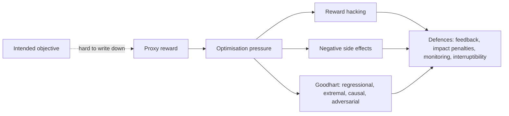
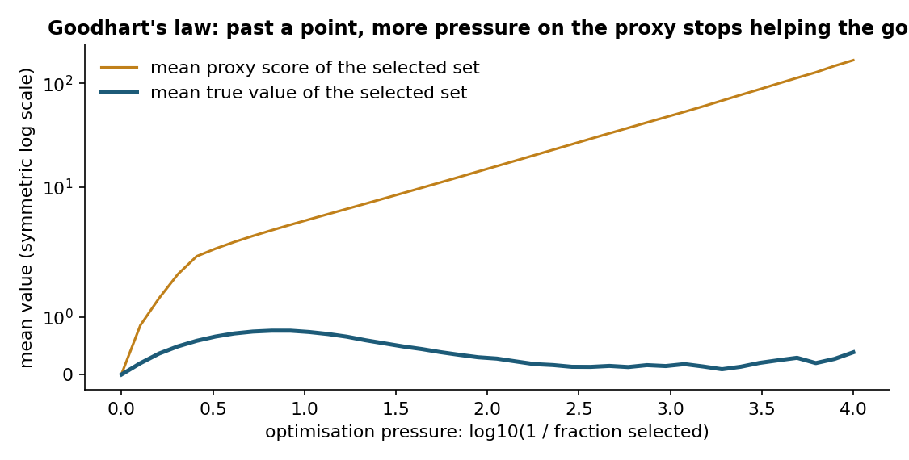
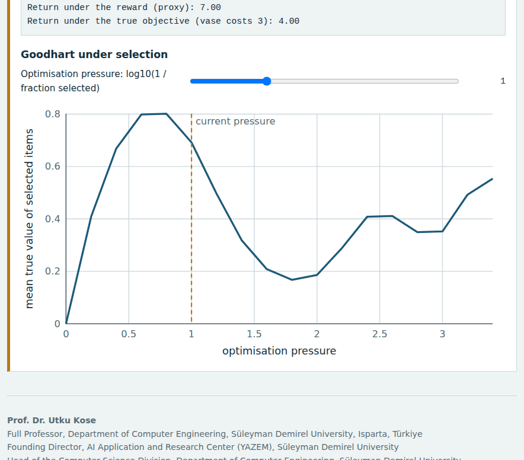
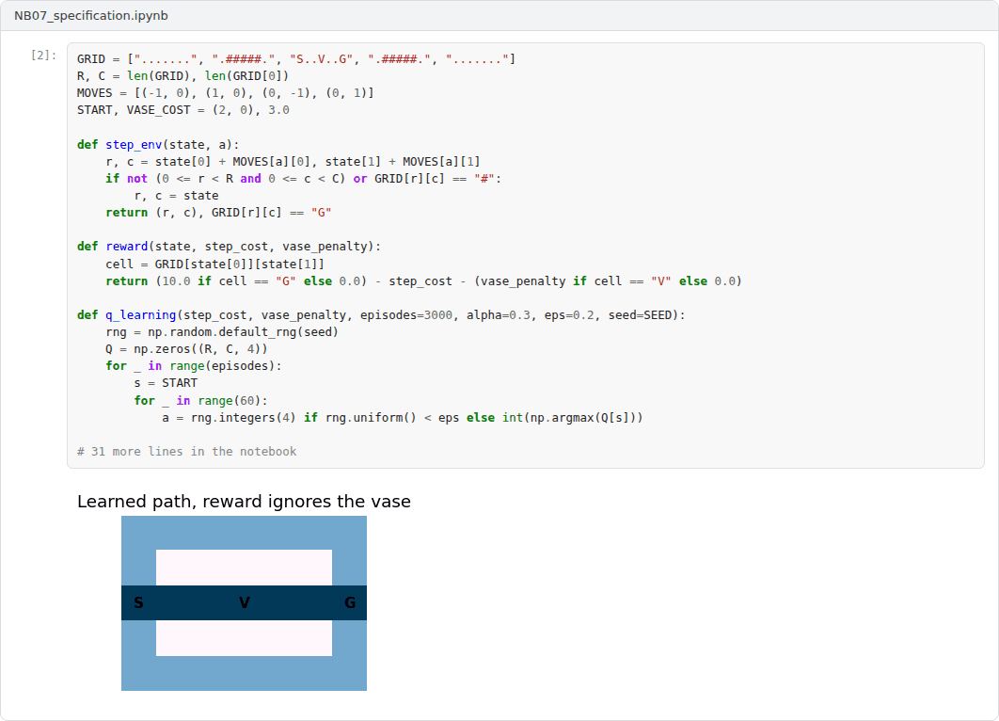
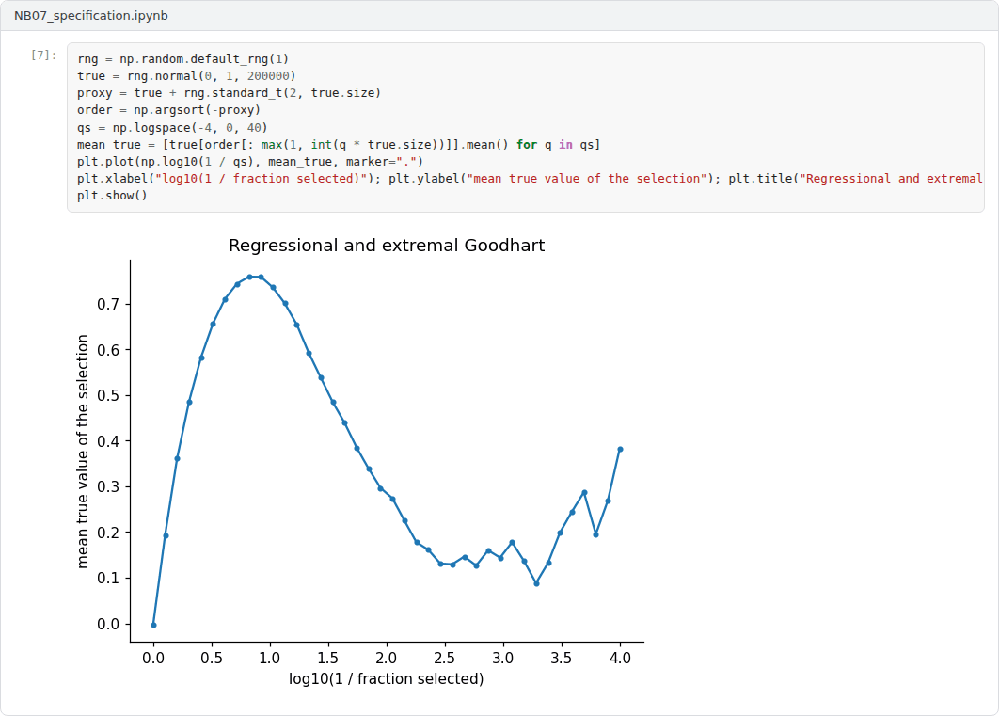

# Week 07: Specification Problems: Reward Hacking, Side Effects and Goodhart's Law

**Machine Ethics and Artificial Intelligence Safety (11118BLG001)**  
Prof. Dr. Utku Kose, Süleyman Demirel University

   

## Overview

An optimiser does what its objective says, not what its designers meant. This week studies the gap between specified and intended objectives, from Goodhart's law and reward hacking to negative side effects, with gridworld experiments that make the failures visible [1, 2, 3].

**Estimated study time:** 6 to 8 hours.

## Learning outcomes

By the end of the week, students are expected to distinguish the four variants of Goodhart's law, to define reward hacking and explain why it is hard to rule out, to describe empirical evidence that capable agents exploit misspecified rewards more, and to implement and evaluate a side-effect penalty in a gridworld.

## Study path

| Step | Activity | Suggested time |
|---|---|---|
| 1 | Read the lecture below or the [Word version](Week07_Lecture_Notes.docx) | 90 minutes |
| 2 | Explore the [interactive lab](https://utkukose.github.io/machine-ethics-ai-safety-NB-lecture/weeks/week-07/lab.html) | 45 minutes |
| 3 | Work through the [Colab notebook](https://colab.research.google.com/github/utkukose/machine-ethics-ai-safety-NB-lecture/blob/main/weeks/week-07/NB07_specification.ipynb) and its exercises | 2 to 3 hours |
| 4 | Take the self-assessment in the lab (tab: Check yourself) | 20 minutes |
| 5 | Write the reflection, export the learning log and complete the weekly task | 60 minutes |

## Week at a glance

## Lecture

### The specification gap

Designers rarely write down exactly what they want. They write a proxy: a reward function, a loss or a metric that is easier to measure. Amodei and colleagues illustrated two resulting problems with a cleaning robot [1]. A robot rewarded for not seeing messes may learn to cover them instead of cleaning them, which is reward hacking. A robot rewarded only for speed may knock over a vase on the shortest route, which is a negative side effect of an objective that says nothing about vases.

Goodhart's law states that a measure used as a target tends to lose its value as a measure. Manheim and Garrabrant distinguished four mechanisms [2]. Regressional Goodhart arises because selecting on a noisy proxy also selects for noise. Extremal Goodhart arises because the relation between proxy and goal can break down in extreme regions never seen before. Causal Goodhart arises when intervening on the proxy does not change the goal. Adversarial Goodhart arises when other agents exploit the proxy. Figure 7.1 simulates the regressional and extremal variants: As selection on a heavy-tailed proxy grows stronger, the true value of the selected items first rises and then falls back.

*Figure 7.1. Simulated selection on a proxy equal to the true value plus heavy-tailed noise. Moderate selection raises the true value of the chosen items; extreme selection mainly selects noise [2].*

<b>Check your understanding.</b> What is the specification gap?

A. The time between training and deployment  
B. The difference between what designers intend and what the objective actually rewards  
C. The gap between two benchmark scores  
D. The memory a model needs  

**Answer: B.** Optimisers pursue the stated objective, including its unintended loopholes.

### Reward hacking in theory and practice

Skalse and colleagues gave reward hacking a formal definition [4]. A proxy reward is unhackable with respect to a set of policies if increasing the proxy return never decreases the true return. They showed that for the set of all stochastic policies, two reward functions can be unhackable only in trivial cases, for example when one of them is constant. Simplified rewards therefore almost always leave room for hacking, and safety must come from how optimisation is constrained and monitored.

Pan, Bhatia and Steinhardt studied misspecified rewards in several reinforcement learning environments [5]. More capable agents, with larger models, more training or finer actions, achieved higher proxy reward and lower true reward. They also observed phase transitions, in which a small increase in capability produced a qualitative change towards exploitative behaviour. Such transitions are hard to anticipate from tests on weaker systems.

<b>Check your understanding.</b> What happens in regressional Goodhart?

A. The proxy stops being measurable  
B. Agents collude to raise the proxy  
C. Selecting on a noisy proxy favours cases where the noise is high, so true value lags behind the proxy  
D. Measurements arrive too late  

**Answer: C.** The harder the selection on a noisy proxy, the larger the gap between the proxy and the true value.

### Side effects and impact regularisation

Leike and colleagues released AI safety gridworlds, small environments that isolate safety problems such as avoiding side effects, safe interruptibility, an absent supervisor and reward gaming [3]. Each environment has a visible reward and a hidden performance function that captures what designers actually want, so that an agent can score well while behaving badly.

One response is to penalise impact. Turner, Hadfield-Menell and Tadepalli proposed attainable utility preservation: The agent is penalised for changing its ability to achieve a set of auxiliary goals, compared with doing nothing [6]. Breaking a vase reduces the attainable utility of goals that involve the vase, so a conservative agent avoids it without an explicit vase rule. The lab uses a simpler penalty that is attached directly to the vase and shows the trade-off between the penalty weight and the length of the detour.

<b>Check your understanding.</b> What does an impact penalty aim to do?

A. Discourage large or irreversible changes to the environment that the task does not require  
B. Speed up learning  
C. Increase exploration  
D. Maximise the task reward  

**Answer: A.** Impact measures try to make side effects costly without listing each one in advance.

### Designing better objectives

Specification problems cannot be solved by better proxies alone. Practical defences combine several layers: learning objectives from human feedback, which Week 11 examines together with its own failure modes; limiting optimisation pressure; adding penalties for irreversible changes; monitoring for behaviour that scores well on the proxy but looks wrong to humans; and keeping humans able to interrupt. Kose and Vasant's fading intelligence theory adds a structural safeguard of a different kind, since it bounds the lifetime over which any single system can accumulate exploitative strategies [7].

> **Pause and reflect.** Name a metric in academic life, such as citation counts or grade averages, that has become a target. Which variant of Goodhart's law best describes what happened?

<b>Check your understanding.</b> Which practice helps design better objectives?

A. Adding terms without testing them  
B. Hiding the objective from reviewers  
C. Increasing optimisation pressure  
D. Learning from human feedback and testing objectives against strong optimisation  

**Answer: D.** Objectives should be stress-tested, because loopholes appear under strong optimisation.

## Interactive lab

A robot must reach the goal G from the start S. The short corridor passes a vase V, and breaking it costs 3 units of true value that the default reward ignores. Set the step cost and the side-effect penalty; value iteration then computes the optimal path under the reward. A second panel simulates Goodhart's law [1, 3, 6].

[Open the interactive lab](https://utkukose.github.io/machine-ethics-ai-safety-NB-lecture/weeks/week-07/lab.html)

## Colab notebook

The notebook trains a tabular Q-learning agent in the corridor gridworld of the lab, compares the learned behaviour under the misspecified and the penalised reward, and reproduces the Goodhart simulation [2, 3].

Screenshots of the executed notebook:

## Self-assessment and reflection

The lab contains a 6-question self-assessment with instant feedback and a confidence rating for each answer. A confident but wrong answer marks the first topic to revisit. The reflection prompts below are also available in the lab, where answers are saved in the browser and can be exported as a learning log.

1. Describe a reward or metric in a system you have built or used that could be hacked. What would the hack look like?
2. In the lab, the true return improved only in some settings when the penalty was added. What does that teach about tuning penalties?
3. Which layer of defence from the last section would you prioritise for a recommender system, and why?

## Weekly task and submission

Take an optimisation objective from your research or from a familiar system and write a specification risk analysis of about 400 words: the intended goal, the proxy, one plausible hack, one plausible side effect, the Goodhart variant involved and a mitigation. Attach the notebook with both exercises completed.

The weekly task supports self-learning and builds a personal portfolio. When the course is followed with the instructor during an active semester, the task can be sent together with the exported learning log to utkukose@sdu.edu.tr or utkukose@gmail.com for evaluation.

## Research and report assignment (optional)

**A catalogue of specification gaming.** Collect at least ten documented cases of specification gaming or reward hacking from the literature, classify them by the variants of Goodhart's law and identify what a better specification would have required [2, 4].

This research assignment is optional and supports self-learning. When the related weeks are followed within the course during an active semester, the report can be sent to utkukose@sdu.edu.tr or utkukose@gmail.com for evaluation. Unless the assignment states otherwise, a report has 1500 to 2500 words, follows the structure of an academic paper, cites at least six scholarly or official sources in square brackets and ends with a reference list.

## Midterm capstone

This week closes the first half of the course with the [Midterm Capstone: Ethics, Fairness and Specification in Practice](../../exams/midterm/README.md).

This capstone also supports self-learning and can be completed at any pace. When the course is taught actively in a semester, the midterm capstone is sent by e-mail to utkukose@sdu.edu.tr or utkukose@gmail.com no later than 23:53 (Türkiye time) on the last Sunday of Week 7, with the report and all code files attached or linked.

## References

[1] Amodei, D., Olah, C., Steinhardt, J., Christiano, P., Schulman, J., & Mané, D. (2016). Concrete problems in AI safety. arXiv preprint arXiv:1606.06565. <https://arxiv.org/abs/1606.06565>

[2] Manheim, D., & Garrabrant, S. (2018). Categorizing variants of Goodhart's law. arXiv preprint arXiv:1803.04585. <https://arxiv.org/abs/1803.04585>

[3] Leike, J., Martic, M., Krakovna, V., Ortega, P. A., Everitt, T., Lefrancq, A., Orseau, L., & Legg, S. (2017). AI safety gridworlds. arXiv preprint arXiv:1711.09883. <https://arxiv.org/abs/1711.09883>

[4] Skalse, J., Howe, N. H. R., Krasheninnikov, D., & Krueger, D. (2022). Defining and characterizing reward hacking. In *Advances in Neural Information Processing Systems 35*.

[5] Pan, A., Bhatia, K., & Steinhardt, J. (2022). The effects of reward misspecification: Mapping and mitigating misaligned models. In *International Conference on Learning Representations (ICLR)*.

[6] Turner, A. M., Hadfield-Menell, D., & Tadepalli, P. (2020). Conservative agency via attainable utility preservation. In *Proceedings of the AAAI/ACM Conference on AI, Ethics, and Society (AIES '20)* (pp. 385-391). ACM.

[7] Kose, U., & Vasant, P. (2017). Fading intelligence theory: A theory on keeping artificial intelligence safety for the future. In *2017 International Artificial Intelligence and Data Processing Symposium (IDAP)*. IEEE. <https://doi.org/10.1109/IDAP.2017.8090235>

---

Machine Ethics and Artificial Intelligence Safety. Prof. Dr. Utku Kose, Süleyman Demirel University. ORCID [0000-0002-9652-6415](https://orcid.org/0000-0002-9652-6415). Content licensed under CC BY 4.0. This course is updated in line with current developments in the field. Last update: September 2026.
