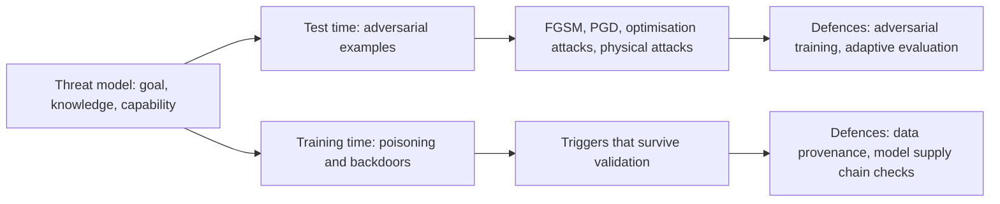
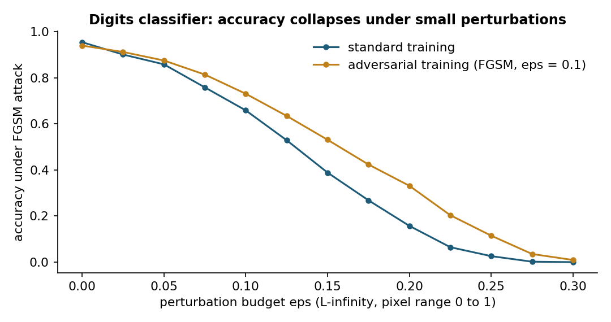
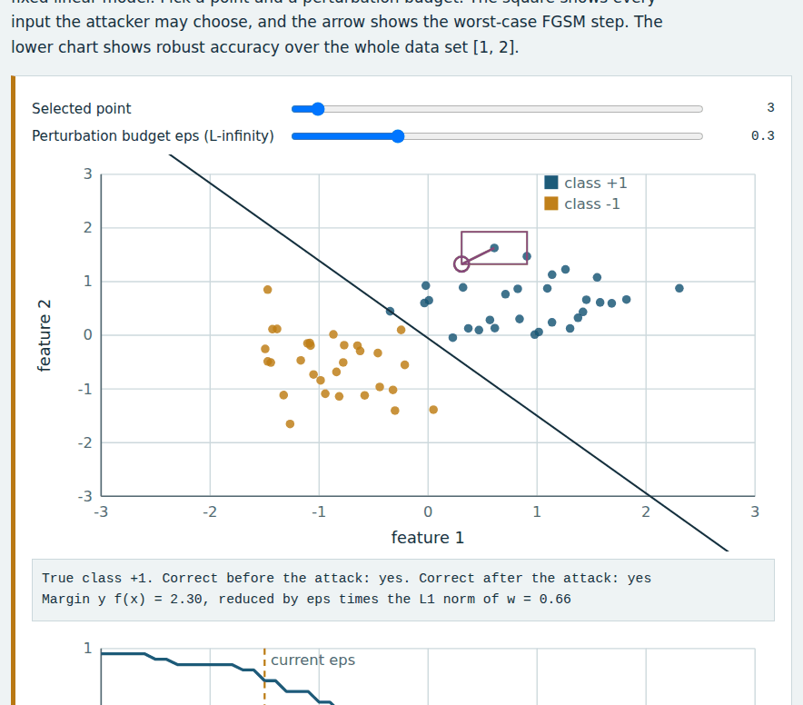
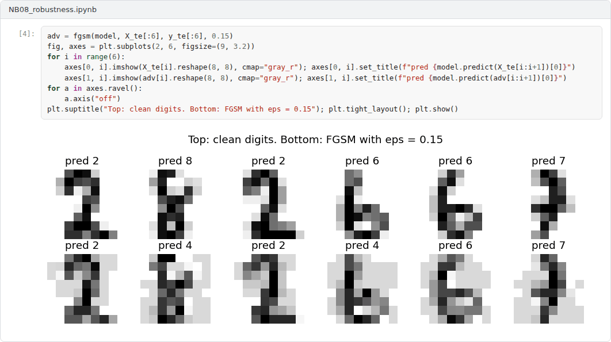
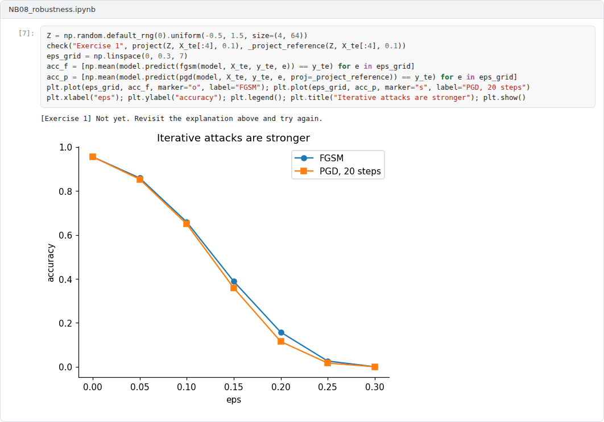

# Week 08: Robustness: Adversarial Examples, Poisoning and Backdoors

**Machine Ethics and Artificial Intelligence Safety (11118BLG001)**  
Prof. Dr. Utku Kose, Süleyman Demirel University

   

## Overview

Small, deliberate changes to inputs or training data can make accurate models fail. This week covers adversarial examples, attacks at training time, the author's work on adversarial threats to AI safety and the practice of evaluating defences honestly [1, 2, 3].

**Estimated study time:** 6 to 8 hours.

## Learning outcomes

By the end of the week, students are expected to derive and implement the fast gradient sign method and projected gradient descent, to explain adversarial training as robust optimisation, to describe poisoning and backdoor attacks, and to design an evaluation that states a threat model and uses adaptive attacks.

## Study path

| Step | Activity | Suggested time |
|---|---|---|
| 1 | Read the lecture below or the [Word version](Week08_Lecture_Notes.docx) | 90 minutes |
| 2 | Explore the [interactive lab](https://utkukose.github.io/machine-ethics-ai-safety-NB-lecture/weeks/week-08/lab.html) | 45 minutes |
| 3 | Work through the [Colab notebook](https://colab.research.google.com/github/utkukose/machine-ethics-ai-safety-NB-lecture/blob/main/weeks/week-08/NB08_robustness.ipynb) and its exercises | 2 to 3 hours |
| 4 | Take the self-assessment in the lab (tab: Check yourself) | 20 minutes |
| 5 | Write the reflection, export the learning log and complete the weekly task | 60 minutes |

## Week at a glance

## Lecture

### Adversarial examples

Szegedy and colleagues found that imperceptible perturbations could change the predictions of deep networks, and that the same perturbations often transferred between models [1]. Goodfellow, Shlens and Szegedy explained the phenomenon by the approximately linear behaviour of networks in high dimensions: Many tiny changes aligned with the weights add up to a large change in the output [2]. Their fast gradient sign method (FGSM) perturbs an input x with label y as x' = x + eps sign(grad_x L(x, y)), where L is the training loss and eps bounds the change of each input component.

Madry and colleagues framed robustness as a min-max problem: Train the parameters to minimise the loss under the worst perturbation within the allowed set [4]. The inner maximisation is approximated by projected gradient descent (PGD), which takes several small gradient steps and projects back into the allowed set after each one. Carlini and Wagner designed optimisation-based attacks that defeated defences previously thought robust, which made strong attacks the standard for evaluation [5]. Eykholt and colleagues showed that the threat reaches the physical world: Stickers on stop signs caused misclassification under varying viewing conditions [6].

*Figure 8.1. Accuracy of a softmax classifier on the digits data set under FGSM attacks of growing budget, with standard and adversarial training [2, 4].*

<b>Check your understanding.</b> How does the fast gradient sign method perturb an input?

A. It adds random noise  
B. It steps in the direction of the sign of the loss gradient, scaled by a budget  
C. It moves the input towards the data mean  
D. It retrains the model  

**Answer: B.** A single signed-gradient step within an L-infinity budget is often enough to change the prediction.

### Adversarial threats to AI safety

Kose reviewed techniques for generating adversarial examples and argued that they threaten the safety of AI-based systems in general, not only their security [3]. Kose and Deperlioglu examined adversarial examples as a threat in biomedical engineering problems, where a manipulated signal or image can alter a diagnostic decision without any visible sign [7]. Kose, Cankaya and Deperlioglu discussed a broader future in which AI is both a weapon and a target in cyber conflict [8].

Biggio and Roli traced adversarial machine learning back to attacks on spam filters and described the field as an arms race between attacks and defences [9]. Their central methodological lesson is the threat model. An evaluation must state the attacker's goal, the attacker's knowledge of the system and the attacker's capability, such as the size of allowed perturbations or the fraction of training data that can be modified.

<b>Check your understanding.</b> What did physical-world attacks, such as stickers on road signs, demonstrate?

A. Attacks work only in digital form  
B. Models are robust outside the laboratory  
C. Adversarial perturbations can survive printing and changes in viewpoint and lighting  
D. Cameras filter out perturbations  

**Answer: C.** Robust physical perturbations make adversarial examples a concern for deployed perception systems.

### Poisoning and backdoors

Attacks at training time modify the data or the model before deployment. Poisoning attacks insert crafted examples to degrade accuracy or to cause targeted errors [9]. Backdoor attacks are more insidious. Gu and colleagues showed with BadNets that a network can be trained to behave normally on clean inputs while producing an attacker-chosen output whenever a small trigger pattern is present, such as a sticker on a traffic sign [10]. Because the model performs well on standard tests, the backdoor survives ordinary validation. Outsourced training, pretrained models and scraped data therefore form a supply chain whose integrity matters for safety.

<b>Check your understanding.</b> What is a backdoor attack?

A. Planting a trigger in the training data so that the model misbehaves only when the trigger appears  
B. Stealing model weights  
C. Overloading a server  
D. Replacing the test set  

**Answer: A.** Backdoored models behave normally on clean inputs, which makes the attack hard to detect.

### Defences and honest evaluation

Adversarial training with PGD remains one of the most reliable empirical defences, at the cost of extra computation and often some clean accuracy [4]. Many other defences, such as input transformations that hide gradients, failed once attacks were adapted to them [5]. A credible robustness claim therefore reports accuracy as a function of the perturbation budget, uses strong iterative attacks with several restarts, tries attacks designed against the specific defence and states the threat model explicitly [9].

Figure 8.1 shows the pattern on a simple digits classifier. Accuracy falls quickly as the budget grows, and adversarial training shifts the curve without removing the vulnerability.

> **Pause and reflect.** A hospital plans to deploy an image classifier for skin lesions. Write down a threat model: Who might attack the system, what would they know and what could they change?

<b>Check your understanding.</b> What does an honest evaluation of a defence require?

A. Reporting only clean accuracy  
B. Using only the attack seen in training  
C. Hiding gradients  
D. Testing against adaptive attacks designed with knowledge of the defence  

**Answer: D.** Many defences that looked strong failed once attacks were adapted to them.

## Interactive lab

Each point is a sample of one of two classes, and the line is the decision boundary of a fixed linear model. Pick a point and a perturbation budget. The square shows every input the attacker may choose, and the arrow shows the worst-case FGSM step. The lower chart shows robust accuracy over the whole data set [2, 4].

[Open the interactive lab](https://utkukose.github.io/machine-ethics-ai-safety-NB-lecture/weeks/week-08/lab.html)

## Colab notebook

The notebook attacks a softmax classifier on the scikit-learn digits data set with FGSM and PGD, visualises adversarial digits, applies adversarial training and plants a small backdoor to measure its success rate [2, 4, 10].

Screenshots of the executed notebook:

## Self-assessment and reflection

The lab contains a 6-question self-assessment with instant feedback and a confidence rating for each answer. A confident but wrong answer marks the first topic to revisit. The reflection prompts below are also available in the lab, where answers are saved in the browser and can be exported as a learning log.

1. State a complete threat model (goal, knowledge, capability) for an AI system in your field.
2. Why can a model be accurate and still unsafe? Use the backdoor experiment in your answer.
3. Which part of the machine learning supply chain in your own projects is least verified, and how could you check it?

## Weekly task and submission

Write a robustness evaluation plan of about 400 words for a model in your field: the threat model, the attacks you would run, the metrics and budgets you would report and the defence you would try first. Attach the notebook with both exercises completed and the accuracy curves.

The weekly task supports self-learning and builds a personal portfolio. When the course is followed with the instructor during an active semester, the task can be sent together with the exported learning log to utkukose@sdu.edu.tr or utkukose@gmail.com for evaluation.

## Research and report assignment (optional)

**Robustness in safety-critical perception.** Review physical-world adversarial attacks and certified or empirical defences for perception systems, and assess how far current evidence supports deployment in vehicles or medical imaging [4, 6].

This research assignment is optional and supports self-learning. When the related weeks are followed within the course during an active semester, the report can be sent to utkukose@sdu.edu.tr or utkukose@gmail.com for evaluation. Unless the assignment states otherwise, a report has 1500 to 2500 words, follows the structure of an academic paper, cites at least six scholarly or official sources in square brackets and ends with a reference list.

## References

[1] Szegedy, C., Zaremba, W., Sutskever, I., Bruna, J., Erhan, D., Goodfellow, I., & Fergus, R. (2014). Intriguing properties of neural networks. In *International Conference on Learning Representations (ICLR)*. <https://arxiv.org/abs/1312.6199>

[2] Goodfellow, I. J., Shlens, J., & Szegedy, C. (2015). Explaining and harnessing adversarial examples. In *International Conference on Learning Representations (ICLR)*. <https://arxiv.org/abs/1412.6572>

[3] Kose, U. (2019). Techniques for adversarial examples threatening the safety of artificial intelligence based systems. In *I. International Science and Innovation Congress (INSI Congress 2019)*. Pamukkale, Denizli, Türkiye. <https://arxiv.org/abs/1910.06907>

[4] Madry, A., Makelov, A., Schmidt, L., Tsipras, D., & Vladu, A. (2018). Towards deep learning models resistant to adversarial attacks. In *International Conference on Learning Representations (ICLR)*. <https://arxiv.org/abs/1706.06083>

[5] Carlini, N., & Wagner, D. (2017). Towards evaluating the robustness of neural networks. In *2017 IEEE Symposium on Security and Privacy (SP)* (pp. 39-57). IEEE. <https://doi.org/10.1109/SP.2017.49>

[6] Eykholt, K., Evtimov, I., Fernandes, E., Li, B., Rahmati, A., Xiao, C., Prakash, A., Kohno, T., & Song, D. (2018). Robust physical-world attacks on deep learning visual classification. In *Proceedings of the IEEE Conference on Computer Vision and Pattern Recognition (CVPR)* (pp. 1625-1634).

[7] Kose, U., & Deperlioglu, O. (2019). Adversarial examples as a threat for artificial intelligence safety in biomedical engineering problems. In *International Conference on Data Science and Applications (ICONDATA'19)*. Balıkesir, Türkiye.

[8] Kose, U., Cankaya, S. F., & Deperlioglu, O. (2017). Cyber wars under the shadow of artificial intelligence: A future perspective. *International Journal of Engineering Science and Application*, 2(2), 71-76.

[9] Biggio, B., & Roli, F. (2018). Wild patterns: Ten years after the rise of adversarial machine learning. *Pattern Recognition*, 84, 317-331. <https://doi.org/10.1016/j.patcog.2018.07.023>

[10] Gu, T., Liu, K., Dolan-Gavitt, B., & Garg, S. (2019). BadNets: Evaluating backdooring attacks on deep neural networks. *IEEE Access*, 7, 47230-47244. <https://doi.org/10.1109/ACCESS.2019.2909068>

---

Machine Ethics and Artificial Intelligence Safety. Prof. Dr. Utku Kose, Süleyman Demirel University. ORCID [0000-0002-9652-6415](https://orcid.org/0000-0002-9652-6415). Content licensed under CC BY 4.0. This course is updated in line with current developments in the field. Last update: September 2026.
