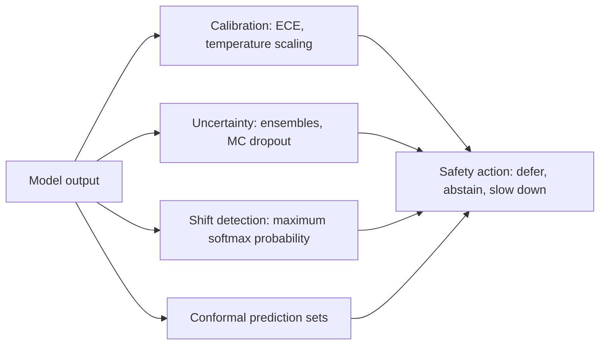
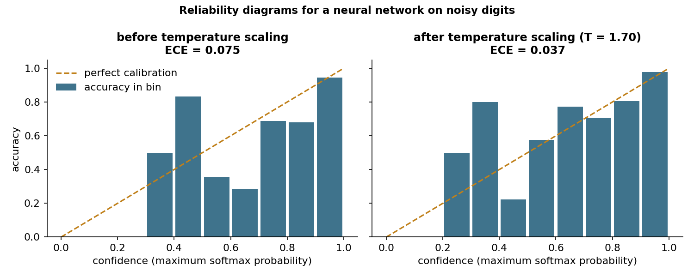
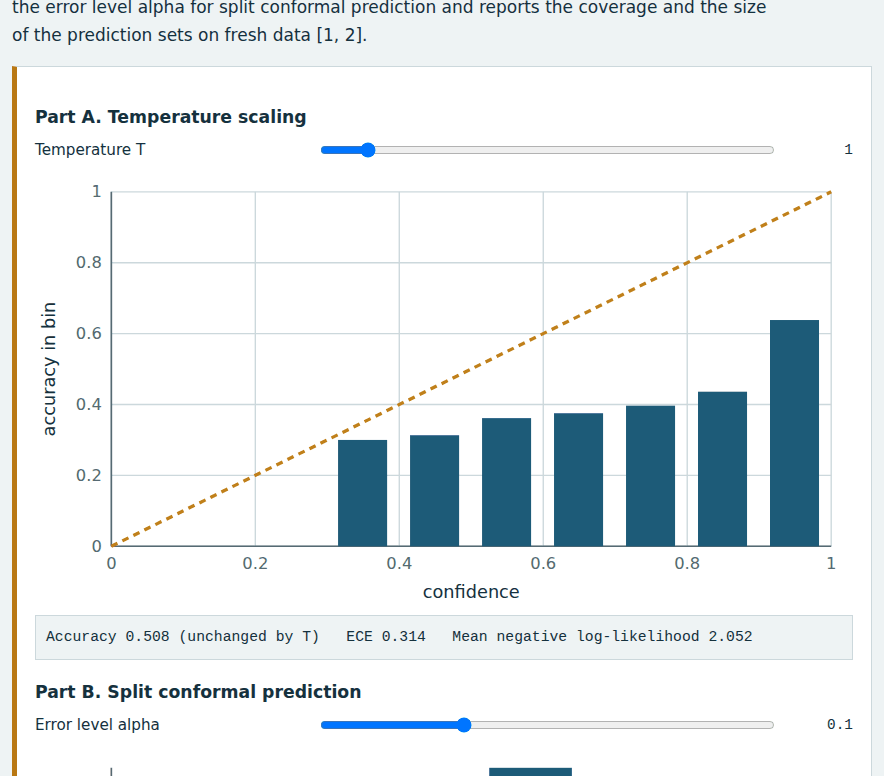
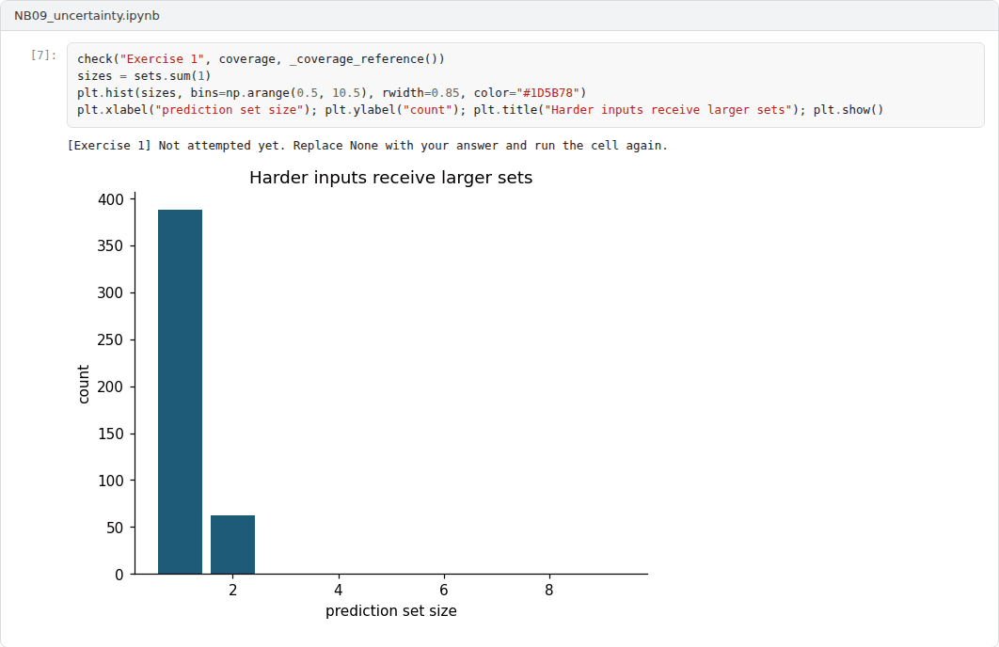
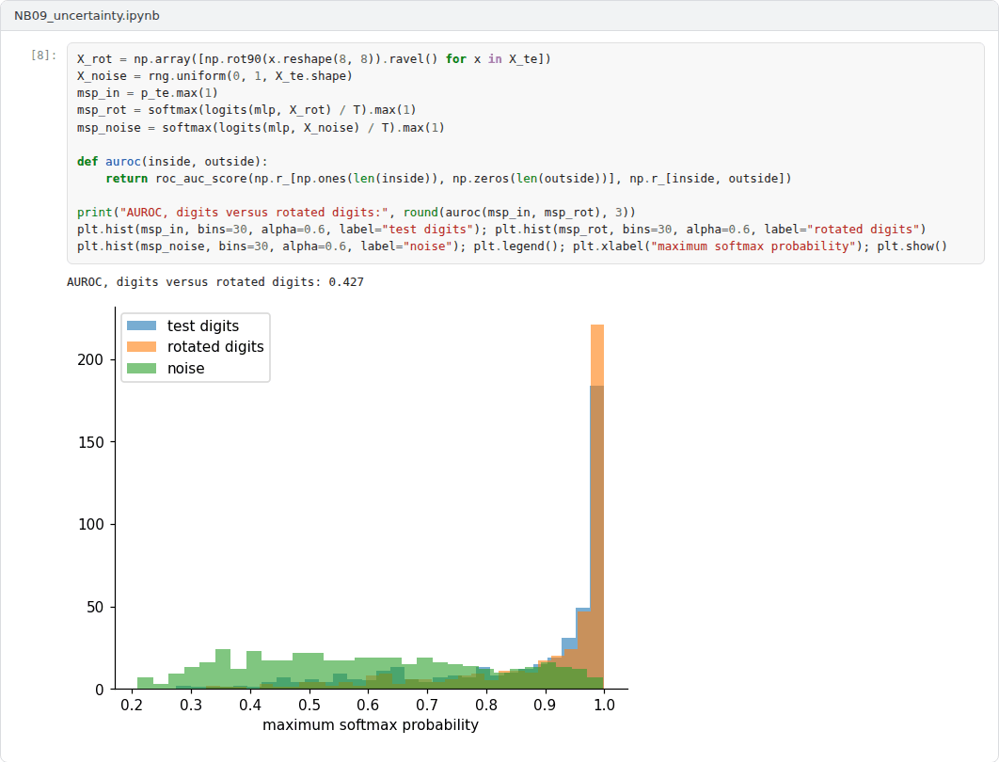

# Week 09: Uncertainty, Calibration and Distribution Shift

**Machine Ethics and Artificial Intelligence Safety (11118BLG001)**  
Prof. Dr. Utku Kose, Süleyman Demirel University

   

## Overview

A safe system must know when it does not know. This week studies calibration, the estimation of predictive uncertainty, the detection of inputs unlike the training data and conformal prediction, which turns any model into one with a distribution-free coverage guarantee [1, 2, 3].

**Estimated study time:** 6 to 8 hours.

## Learning outcomes

By the end of the week, students are expected to compute and interpret the expected calibration error, to apply temperature scaling, to explain deep ensembles and Monte Carlo dropout, to classify types of dataset shift and use a maximum softmax probability detector, and to construct split conformal prediction sets and verify their coverage.

## Study path

| Step | Activity | Suggested time |
|---|---|---|
| 1 | Read the lecture below or the [Word version](Week09_Lecture_Notes.docx) | 90 minutes |
| 2 | Explore the [interactive lab](https://utkukose.github.io/machine-ethics-ai-safety-NB-lecture/weeks/week-09/lab.html) | 45 minutes |
| 3 | Work through the [Colab notebook](https://colab.research.google.com/github/utkukose/machine-ethics-ai-safety-NB-lecture/blob/main/weeks/week-09/NB09_uncertainty.ipynb) and its exercises | 2 to 3 hours |
| 4 | Take the self-assessment in the lab (tab: Check yourself) | 20 minutes |
| 5 | Write the reflection, export the learning log and complete the weekly task | 60 minutes |

## Week at a glance

## Lecture

### Why confidence matters for safety

Many safety mechanisms depend on a model's confidence. A diagnostic assistant should defer to a clinician when unsure, and an autonomous vehicle should slow down when its perception is uncertain. Such mechanisms work only if confidence is meaningful. A model is calibrated when, among predictions made with confidence p, the fraction that is correct is also p. The expected calibration error (ECE) measures the gap: Predictions are grouped into confidence bins, and the absolute differences between accuracy and mean confidence are averaged with weights proportional to the bin sizes.

Guo and colleagues found that modern deep networks, although more accurate than older ones, are often overconfident, and they linked the change to greater depth and width, batch normalisation and weaker weight decay [1]. They also found that temperature scaling, which divides all logits by a single constant T fitted on held-out data, is a simple and effective remedy. Because dividing by T does not change which class has the largest logit, temperature scaling leaves accuracy unchanged while improving confidence estimates. Figure 9.1 shows the effect on a small network.

*Figure 9.1. Reliability diagrams on a held-out test set before and after temperature scaling for a neural network trained on noisy digits [1].*

<b>Check your understanding.</b> A model is well calibrated when

A. all of its predictions are correct  
B. about 80 percent of the predictions it makes with 80 percent confidence are correct  
C. its accuracy exceeds 80 percent  
D. its confidence is always high  

**Answer: B.** Calibration concerns the agreement between stated confidence and observed frequency.

### Estimating uncertainty

Two kinds of uncertainty are usually distinguished. Aleatoric uncertainty comes from noise in the data and cannot be reduced by more data of the same kind. Epistemic uncertainty comes from limited knowledge of the model and shrinks with more data. Safety failures often involve epistemic uncertainty, when a model meets inputs unlike its training data.

Gal and Ghahramani showed that keeping dropout active at test time and averaging several stochastic forward passes approximates Bayesian inference, which yields uncertainty estimates from networks that were trained with dropout anyway [4]. Lakshminarayanan, Pritzel and Blundell proposed deep ensembles: Several networks are trained independently from different random initialisations, and their predictions are averaged [5]. Ensembles are simple, parallel and among the strongest practical baselines for both calibration and the detection of unfamiliar inputs.

<b>Check your understanding.</b> Which statement describes epistemic uncertainty?

A. Uncertainty from limited knowledge of the model that more data can reduce  
B. Noise inherent in the data that more data cannot remove  
C. Rounding error in floating point arithmetic  
D. Uncertainty about the choice of loss function  

**Answer: A.** Aleatoric uncertainty is irreducible noise. Epistemic uncertainty shrinks with more data.

### Distribution shift and out-of-distribution detection

Deployed models rarely see data from exactly the training distribution. The collection edited by Quiñonero-Candela and colleagues describes several forms of dataset shift [6]. Covariate shift changes the input distribution while the relation between inputs and labels stays fixed. Prior probability shift changes the frequency of classes. Concept shift changes the relation itself. Amodei and colleagues listed robustness to distributional shift among the concrete problems of AI safety [7].

Hendrycks and Gimpel proposed a baseline for detecting misclassified and out-of-distribution inputs: the maximum softmax probability, which tends to be lower for such inputs [2]. The baseline is useful and easy to deploy, but it has a clear limit. Inputs that resemble training data in the wrong way can receive high confidence. The notebook shows this: The detector separates random noise from digits reasonably well, yet it fails on rotated digits, which the network classifies with confidence.

<b>Check your understanding.</b> What is covariate shift?

A. The labels change while the inputs stay the same  
B. The model architecture changes  
C. The input distribution changes while the relation between inputs and labels stays the same  
D. The loss function changes  

**Answer: C.** A classic example is a scanner change that alters image statistics but not the diagnosis.

### Distribution-free guarantees: conformal prediction

Conformal prediction, developed by Vovk, Gammerman and Shafer, wraps any model in a procedure that outputs prediction sets with a guaranteed coverage rate [8]. Angelopoulos and Bates gave an accessible introduction to its split form [3]. A nonconformity score is computed for each example of a held-out calibration set, for instance one minus the probability assigned to the true class. The empirical quantile of these scores at level ceil((n + 1)(1 - alpha)) / n defines a threshold, and the prediction set for a new input contains every class whose score falls below it. If calibration and test data are exchangeable, the set contains the true label with probability at least 1 - alpha.

The guarantee is marginal, averaged over inputs, rather than conditional on each input, and it breaks when the test distribution differs from the calibration distribution. Set size is informative in itself: A large set signals a hard or unfamiliar input, which is exactly when a safety mechanism should ask for help.

> **Pause and reflect.** A triage model outputs the set {pneumonia, bronchitis} for one patient and {pneumonia} for another. How should a clinical workflow treat the two cases differently?

<b>Check your understanding.</b> What does split conformal prediction guarantee?

A. Correct point predictions  
B. Calibration for every individual  
C. Coverage under any distribution shift  
D. Prediction sets that contain the true label with at least the chosen probability, if the data are exchangeable  

**Answer: D.** The guarantee is marginal and rests on exchangeability, so it can fail under shift.

## Interactive lab

A simulated five-class model produces overconfident logits. Part A varies the temperature and shows the reliability diagram and the calibration error. Part B chooses the error level alpha for split conformal prediction and reports the coverage and the size of the prediction sets on fresh data [1, 3].

[Open the interactive lab](https://utkukose.github.io/machine-ethics-ai-safety-NB-lecture/weeks/week-09/lab.html)

## Colab notebook

The notebook trains a small neural network on noisy digits, measures and repairs its calibration, compares it with a deep ensemble, builds conformal prediction sets and tests the maximum softmax probability detector on two kinds of unfamiliar inputs [1, 2, 3, 5].

Screenshots of the executed notebook:

## Self-assessment and reflection

The lab contains a 6-question self-assessment with instant feedback and a confidence rating for each answer. A confident but wrong answer marks the first topic to revisit. The reflection prompts below are also available in the lab, where answers are saved in the browser and can be exported as a learning log.

1. Describe a decision in your field where a model should abstain. Which signal from this week would you use to trigger abstention?
2. Conformal guarantees break under distribution shift. How would you monitor for shift after deployment?
3. Was the model in the notebook more dangerous before or after temperature scaling? Argue both sides briefly.

## Weekly task and submission

Evaluate the uncertainty of a classifier from your field or the notebook model. Report accuracy, ECE before and after temperature scaling, conformal coverage and mean set size at alpha = 0.1, and an out-of-distribution test of your choice. Discuss in about 300 words how the results would change a deployment decision.

The weekly task supports self-learning and builds a personal portfolio. When the course is followed with the instructor during an active semester, the task can be sent together with the exported learning log to utkukose@sdu.edu.tr or utkukose@gmail.com for evaluation.

## Research and report assignment (optional)

**Reporting uncertainty in clinical AI.** Examine how a sample of clinical AI studies reports calibration and uncertainty. Propose a short reporting checklist based on the methods of this week [1, 3].

This research assignment is optional and supports self-learning. When the related weeks are followed within the course during an active semester, the report can be sent to utkukose@sdu.edu.tr or utkukose@gmail.com for evaluation. Unless the assignment states otherwise, a report has 1500 to 2500 words, follows the structure of an academic paper, cites at least six scholarly or official sources in square brackets and ends with a reference list.

## References

[1] Guo, C., Pleiss, G., Sun, Y., & Weinberger, K. Q. (2017). On calibration of modern neural networks. In *Proceedings of the 34th International Conference on Machine Learning, PMLR 70* (pp. 1321-1330).

[2] Hendrycks, D., & Gimpel, K. (2017). A baseline for detecting misclassified and out-of-distribution examples in neural networks. In *International Conference on Learning Representations (ICLR)*. <https://arxiv.org/abs/1610.02136>

[3] Angelopoulos, A. N., & Bates, S. (2023). Conformal prediction: A gentle introduction. *Foundations and Trends in Machine Learning*, 16(4), 494-591. <https://doi.org/10.1561/2200000101>

[4] Gal, Y., & Ghahramani, Z. (2016). Dropout as a Bayesian approximation: Representing model uncertainty in deep learning. In *Proceedings of the 33rd International Conference on Machine Learning, PMLR 48* (pp. 1050-1059).

[5] Lakshminarayanan, B., Pritzel, A., & Blundell, C. (2017). Simple and scalable predictive uncertainty estimation using deep ensembles. In *Advances in Neural Information Processing Systems 30*.

[6] Quiñonero-Candela, J., Sugiyama, M., Schwaighofer, A., & Lawrence, N. D. (Eds.) (2009). *Dataset Shift in Machine Learning*. MIT Press.

[7] Amodei, D., Olah, C., Steinhardt, J., Christiano, P., Schulman, J., & Mané, D. (2016). Concrete problems in AI safety. arXiv preprint arXiv:1606.06565. <https://arxiv.org/abs/1606.06565>

[8] Vovk, V., Gammerman, A., & Shafer, G. (2005). *Algorithmic Learning in a Random World*. Springer.

---

Machine Ethics and Artificial Intelligence Safety. Prof. Dr. Utku Kose, Süleyman Demirel University. ORCID [0000-0002-9652-6415](https://orcid.org/0000-0002-9652-6415). Content licensed under CC BY 4.0. This course is updated in line with current developments in the field. Last update: September 2026.
