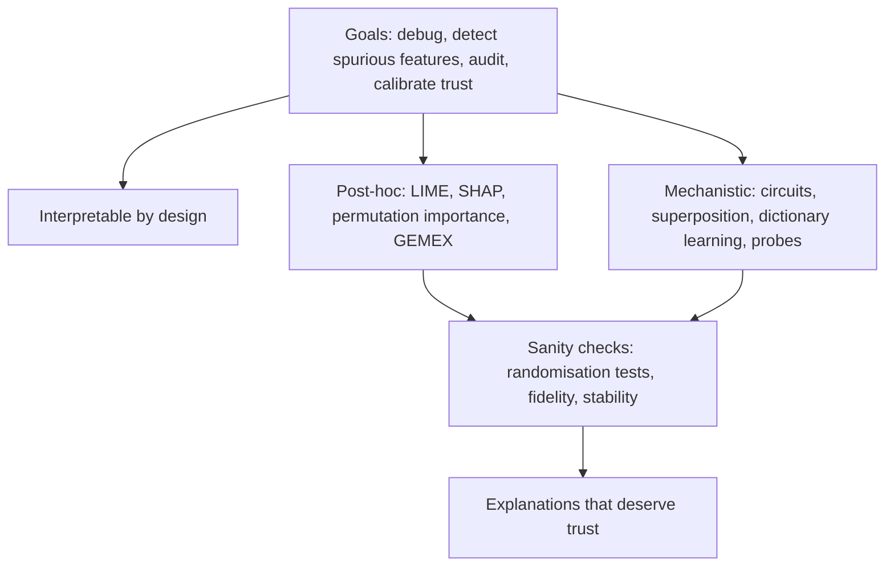
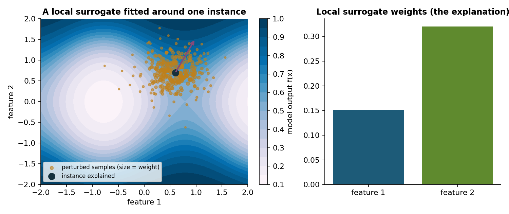
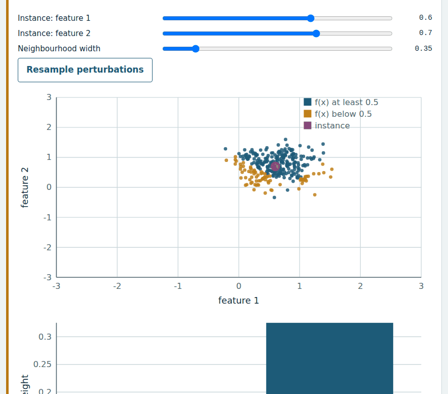
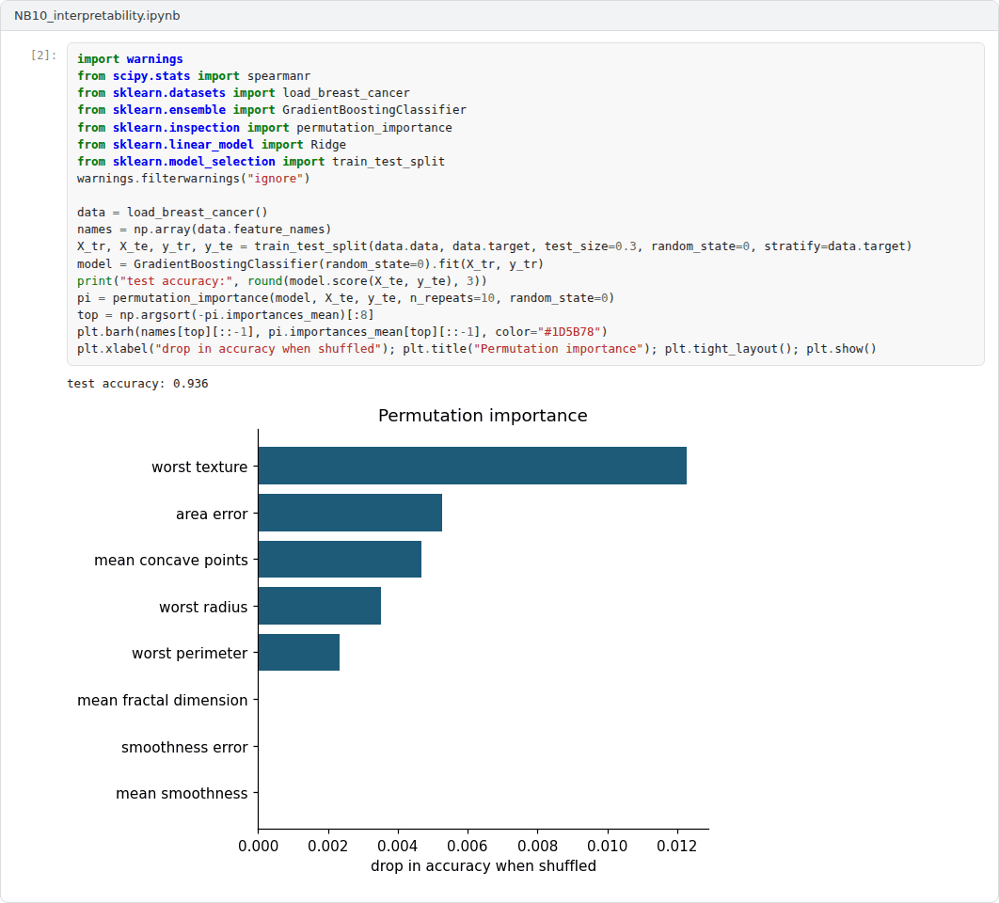

# Week 10: Interpretability and Transparency for Safety

**Machine Ethics and Artificial Intelligence Safety (11118BLG001)**  
Prof. Dr. Utku Kose, Süleyman Demirel University

    

## Overview

Explanations can reveal spurious features, support audits and help people decide when to trust a model, but they can also mislead. This week covers the goals and evaluation of interpretability, post-hoc attribution including the author's information-geometric GEMEX package, sanity checks and mechanistic interpretability [1, 2, 3].

**Estimated study time:** 6 to 8 hours.

## Learning outcomes

By the end of the week, students are expected to state what an explanation is for and how it can be evaluated, to implement a local surrogate explanation and measure its fidelity, to run permutation importance and GEMEX on a tabular model, to perform a model randomisation sanity check, and to describe circuits, superposition, dictionary learning and probing.

## Study path

| Step | Activity | Suggested time |
|---|---|---|
| 1 | Read the lecture below or the [PDF version](Week10_Lecture_Notes.pdf), also available as a [Word file](Week10_Lecture_Notes.docx) | 90 minutes |
| 2 | Explore the [interactive lab](https://utkukose.github.io/machine-ethics-ai-safety-NB-lecture/weeks/week-10/lab.html) | 45 minutes |
| 3 | Work through the [Colab notebook](https://colab.research.google.com/github/utkukose/machine-ethics-ai-safety-NB-lecture/blob/main/weeks/week-10/NB10_interpretability.ipynb) and its exercises | 2 to 3 hours |
| 4 | Take the self-assessment in the lab (tab: Check yourself) | 20 minutes |
| 5 | Write the reflection, export the learning log and complete the weekly task | 60 minutes |

## Week at a glance

## Lecture

### What explanations are for

Doshi-Velez and Kim defined interpretability as the ability to explain or present in understandable terms to a human, and proposed three levels of evaluation [1]. Application-grounded evaluation tests explanations with experts on the real task, human-grounded evaluation uses simplified tasks with lay people and functionally-grounded evaluation uses formal proxies without humans. For safety, explanations serve several purposes: debugging, detecting reliance on spurious features, supporting audits and appeals, and calibrating the trust that users place in a system.

Rudin argued that for high-stakes decisions, inherently interpretable models should be preferred over black boxes with post-hoc explanations, because such explanations can be unfaithful to the model they describe and because interpretable models are often nearly as accurate [2]. The volume edited by Kose, Sengoz, Chen and Marmolejo Saucedo collects methods and applications of explainable AI in healthcare, where both positions are argued in practice [4].

<b>Check your understanding.</b> Why are explanations needed in safety-critical settings?

A. To make models faster  
B. To reduce training cost  
C. To debug models, contest decisions and justify trust to users and auditors  
D. To replace evaluation  

**Answer: C.** Explanations serve different stakeholders and purposes, which affects how they should be evaluated.

### Post-hoc attribution

Ribeiro, Singh and Guestrin introduced LIME, which explains one prediction by sampling perturbations around the instance, weighting them by proximity and fitting a simple interpretable model, usually a sparse linear model, to the black box's outputs [5]. The surrogate's weights form the explanation, and its fit in the neighbourhood, the fidelity, indicates how far the explanation can be trusted. Lundberg and Lee showed that several attribution methods belong to one class of additive feature attributions and that Shapley values from cooperative game theory are the unique member satisfying local accuracy, missingness and consistency; their SHAP framework estimates these values efficiently [6]. Permutation importance is a simpler global method: It measures how much performance drops when one feature's values are shuffled.

GEMEX, a model-agnostic Python package developed by Kose, takes a geometric route [3]. It treats the prediction surface of a model as a curved manifold described with Riemannian information geometry, computes feature attributions along geodesic paths instead of straight lines and reports additional quantities such as curvature, which it links to the uncertainty of the explanation. The notebook applies GEMEX in its simplest configuration and compares its ranking with permutation importance and a local surrogate. Figure 10.1 illustrates the local surrogate idea.

*Figure 10.1. A local surrogate explanation. Perturbed samples near the instance are weighted by proximity, and a weighted linear model fitted to the model's outputs gives the local feature weights [5].*

<b>Check your understanding.</b> SHAP attributions are based on

A. Shapley values from cooperative game theory  
B. gradients at a single point  
C. attention weights  
D. the depth of a decision tree  

**Answer: A.** Shapley values divide a prediction among features according to a set of axioms.

### Do explanations reflect the model?

Adebayo and colleagues proposed sanity checks for saliency maps [7]. In the model parameter randomisation test, the weights of a trained network are progressively randomised; in the data randomisation test, a model is trained on permuted labels. An explanation method that produces nearly the same output for the trained and the randomised model cannot be explaining what the model learned. Several popular methods failed these tests and behaved more like edge detectors applied to the input.

Local surrogates face a related problem of stability: Two runs with different random perturbations can yield different explanations for the same instance, as the lab shows. A careful practitioner therefore reports fidelity and stability along with the explanation and repeats sanity checks whenever a method is used in an audit.

<b>Check your understanding.</b> What did the model randomisation sanity check reveal about some saliency methods?

A. They require labels  
B. They are always faithful  
C. They cannot be computed for images  
D. They produce similar maps even for a model with randomised weights  

**Answer: D.** If an explanation does not change when the model is destroyed, it cannot reflect what the model learned.

### Mechanistic interpretability

Mechanistic interpretability tries to reverse-engineer the computations inside a network. Olah and colleagues proposed that features and the circuits connecting them are meaningful units, and they traced circuits such as curve detectors in vision models [8]. Elhage and colleagues showed with toy models that networks can represent more features than they have dimensions by storing them in superposition, which explains why many neurons respond to unrelated concepts [9]. Bricken and colleagues used dictionary learning with sparse autoencoders to decompose the activations of a small transformer into many features that were more interpretable than individual neurons [10]. Alain and Bengio introduced linear probes, classifiers trained on intermediate activations to test which information is linearly decodable [11]. A probe shows that information is present, not that the model uses it.

For AI safety, these tools promise ways to inspect internal states, for example to detect deceptive behaviour that output-based tests miss, which Week 13 discusses. Their main limitation is scale: Methods that work on small models are hard to apply comprehensively to frontier systems.

> **Pause and reflect.** A hospital asks for an explanation of every automated risk score. Which method from this week would you provide, and how would you show that the explanation is faithful?

<b>Check your understanding.</b> What does mechanistic interpretability aim to do?

A. Rank features by importance  
B. Reverse-engineer internal computations of networks into understandable features and circuits  
C. Compress models  
D. Generate counterfactual examples  

**Answer: B.** It studies what networks compute internally rather than only their input-output behaviour.

## Interactive lab

A nonlinear model maps two features to a probability. Choose an instance and a neighbourhood width, sample perturbations and fit a weighted linear surrogate. Compare the weights, the fidelity and the stability across samples [5, 7].

[Open the interactive lab](https://utkukose.github.io/machine-ethics-ai-safety-NB-lecture/weeks/week-10/lab.html)

## Colab notebook

The notebook explains a gradient boosting model on the breast cancer data set with permutation importance, a hand-written local surrogate and GEMEX, then runs a data randomisation sanity check and trains a linear probe on the hidden layer of a small network [3, 5, 7, 11].

Screenshots of the executed notebook:

## Self-assessment and reflection

The lab contains a 6-question self-assessment with instant feedback and a confidence rating for each answer. A confident but wrong answer marks the first topic to revisit. The reflection prompts below are also available in the lab, where answers are saved in the browser and can be exported as a learning log.

1. In the lab, how much did the explanation change when you resampled? What would that mean for an explanation shown to a loan applicant?
2. Compare the GEMEX, surrogate and permutation rankings from the notebook. Where do they agree, and how would you explain the differences?
3. Which safety question in your field could mechanistic interpretability help to answer, if it worked at scale?

## Weekly task and submission

Explain the predictions of a model from your field or the notebook model with at least two methods from this week. Report fidelity or stability for each, run one sanity check and write about 400 words on which explanation you would show to a domain expert and why.

The weekly task supports self-learning and builds a personal portfolio. When the course is followed with the instructor during an active semester, the task can be sent together with the exported learning log to utkukose@sdu.edu.tr or utkukose@gmail.com for evaluation.

## Research and report assignment (optional)

**How should explanations be evaluated?.** Review evaluation approaches for explanation methods, from functionally grounded metrics to user studies and sanity checks [1, 7]. Discuss which evaluations matter for safety and include recent geometric approaches to attribution [3].

This research assignment is optional and supports self-learning. When the related weeks are followed within the course during an active semester, the report can be sent to utkukose@sdu.edu.tr or utkukose@gmail.com for evaluation. Unless the assignment states otherwise, a report has 1500 to 2500 words, follows the structure of an academic paper, cites at least six scholarly or official sources in square brackets and ends with a reference list.

## References

[1] Doshi-Velez, F., & Kim, B. (2017). Towards a rigorous science of interpretable machine learning. arXiv preprint arXiv:1702.08608. <https://arxiv.org/abs/1702.08608>

[2] Rudin, C. (2019). Stop explaining black box machine learning models for high stakes decisions and use interpretable models instead. *Nature Machine Intelligence*, 1(5), 206-215. <https://doi.org/10.1038/s42256-019-0048-x>

[3] Kose, U. (2026). *GEMEX: Geodesic Entropic Manifold Explainability (Version 1.2.2) [Python package]*. Python Package Index. <https://pypi.org/project/gemex/>

[4] Kose, U., Sengoz, N., Chen, X., & Marmolejo Saucedo, J. A. (Eds.) (2024). *Explainable Artificial Intelligence (XAI) in Healthcare*. CRC Press.

[5] Ribeiro, M. T., Singh, S., & Guestrin, C. (2016). "Why should I trust you?": Explaining the predictions of any classifier. In *Proceedings of the 22nd ACM SIGKDD International Conference on Knowledge Discovery and Data Mining* (pp. 1135-1144). <https://doi.org/10.1145/2939672.2939778>

[6] Lundberg, S. M., & Lee, S.-I. (2017). A unified approach to interpreting model predictions. In *Advances in Neural Information Processing Systems 30*.

[7] Adebayo, J., Gilmer, J., Muelly, M., Goodfellow, I., Hardt, M., & Kim, B. (2018). Sanity checks for saliency maps. In *Advances in Neural Information Processing Systems 31*.

[8] Olah, C., Cammarata, N., Schubert, L., Goh, G., Petrov, M., & Carter, S. (2020). Zoom in: An introduction to circuits. *Distill*, 5(3), e00024.001. <https://doi.org/10.23915/distill.00024.001>

[9] Elhage, N., Hume, T., Olsson, C., et al. (2022). Toy models of superposition. arXiv preprint arXiv:2209.10652. <https://arxiv.org/abs/2209.10652>

[10] Bricken, T., Templeton, A., Batson, J., et al. (2023). *Towards monosemanticity: Decomposing language models with dictionary learning*. Transformer Circuits Thread. <https://transformer-circuits.pub/2023/monosemantic-features>

[11] Alain, G., & Bengio, Y. (2016). Understanding intermediate layers using linear classifier probes. arXiv preprint arXiv:1610.01644. <https://arxiv.org/abs/1610.01644>

---

Machine Ethics and Artificial Intelligence Safety. Prof. Dr. Utku Kose, Süleyman Demirel University. ORCID [0000-0002-9652-6415](https://orcid.org/0000-0002-9652-6415). Content licensed under CC BY 4.0. This course is updated in line with current developments in the field. Last update: September 2026.
