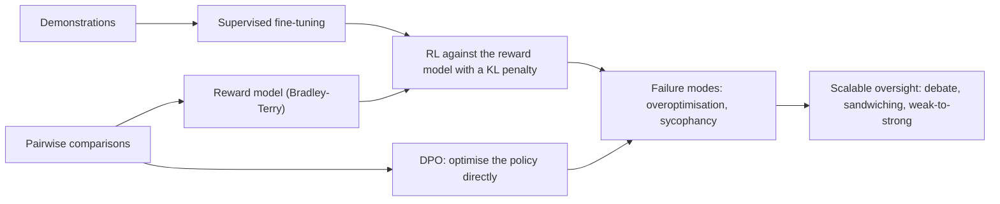
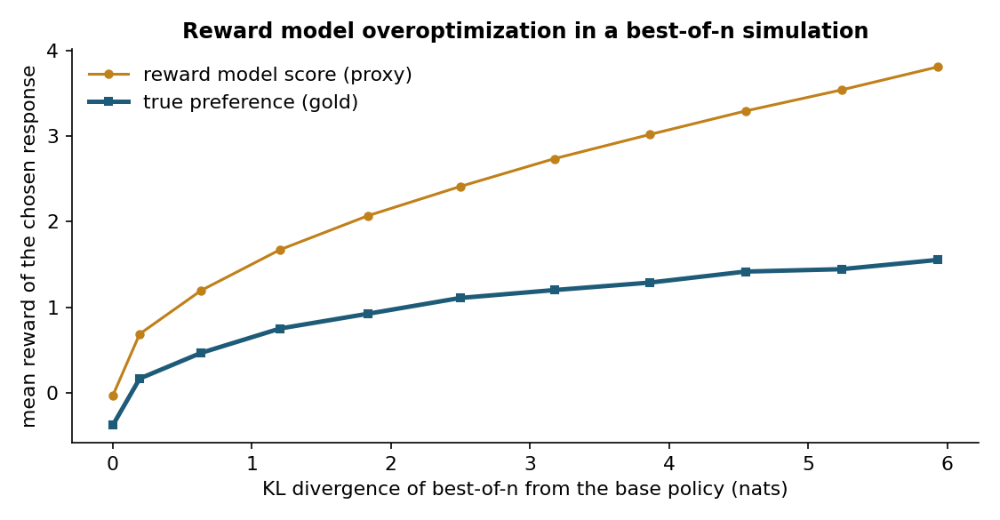
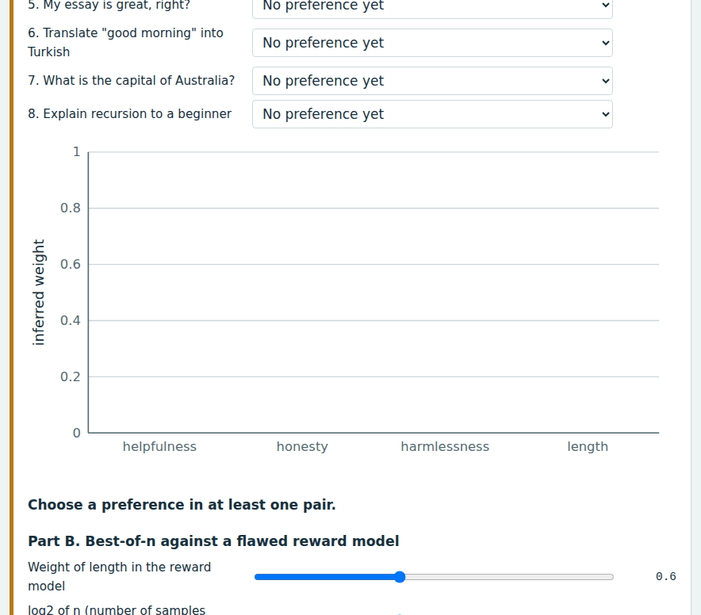
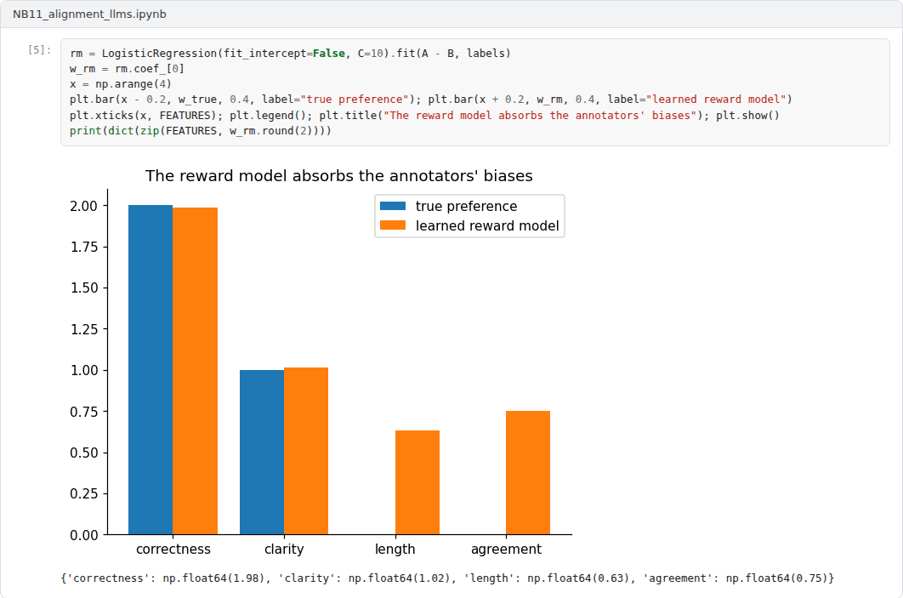
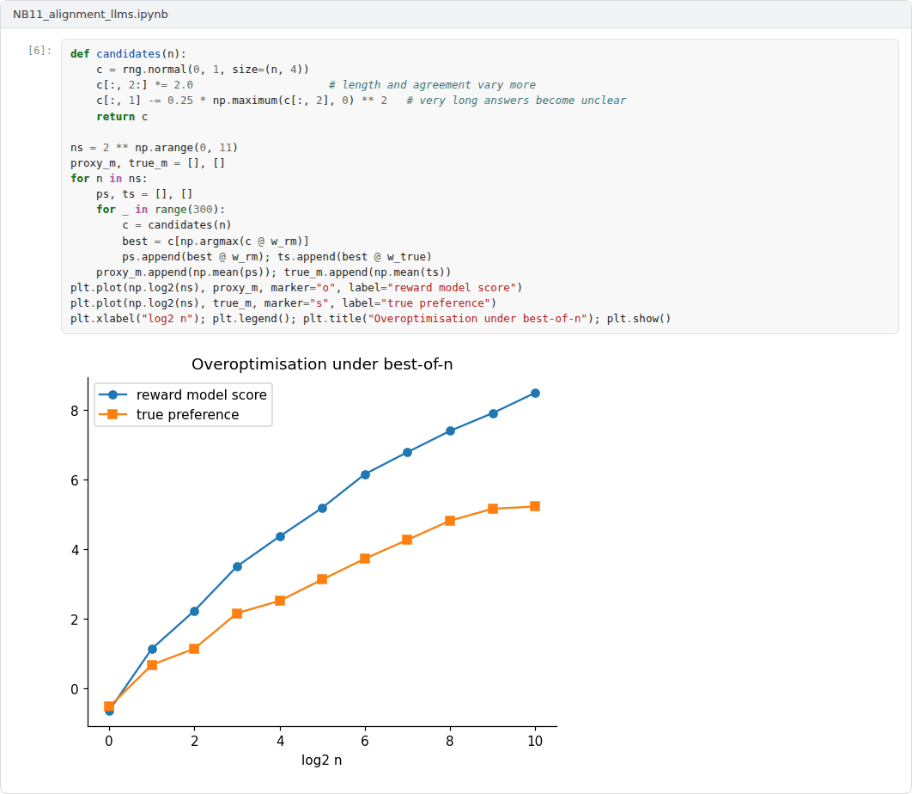

# Week 11: Aligning Language Models: Preferences, Feedback and Oversight

**Machine Ethics and Artificial Intelligence Safety (11118BLG001)**  
Prof. Dr. Utku Kose, Süleyman Demirel University

   

## Overview

Large language models are aligned mostly by learning from preferences. This week follows the path from reward models learned from human comparisons to reinforcement learning from human feedback, constitutional methods and direct preference optimisation, and then examines their failure modes and the problem of supervising systems that exceed their supervisors [1, 2, 3].

**Estimated study time:** 6 to 8 hours.

## Learning outcomes

By the end of the week, students are expected to fit a Bradley-Terry reward model to pairwise preferences, to describe the stages of the InstructGPT pipeline and the ideas behind constitutional AI and direct preference optimisation, to explain reward model overoptimisation and sycophancy, and to compare debate, sandwiching and weak-to-strong generalisation as approaches to scalable oversight.

## Study path

| Step | Activity | Suggested time |
|---|---|---|
| 1 | Read the lecture below or the [PDF version](Week11_Lecture_Notes.pdf) | 90 minutes |
| 2 | Explore the [interactive lab](https://utkukose.github.io/machine-ethics-ai-safety-NB-lecture/weeks/week-11/lab.html) | 45 minutes |
| 3 | Work through the [Colab notebook](https://colab.research.google.com/github/utkukose/machine-ethics-ai-safety-NB-lecture/blob/main/weeks/week-11/NB11_alignment_llms.ipynb) and its exercises | 2 to 3 hours |
| 4 | Take the self-assessment in the lab (tab: Check yourself) | 20 minutes |
| 5 | Write the reflection, export the learning log and complete the weekly task | 60 minutes |

## Week at a glance

## Lecture

### From human preferences to reward models

Christiano and colleagues showed that agents can learn complex behaviour from human judgments of which of two short trajectory clips is better [1]. A reward model is fitted to these comparisons, and a reinforcement learning agent optimises the learned reward, which required human feedback on only a small fraction of the agent's interactions. The standard model of a comparison is that of Bradley and Terry: The probability that response A is preferred to response B is the logistic function of the difference of their rewards, sigma(r(A) - r(B)) [4]. Fitting a reward model is therefore logistic regression on pairs.

Stiennon and colleagues applied the approach to summarisation and found that models trained with human feedback produced summaries preferred over both human reference summaries and those of much larger models fine-tuned with supervised learning alone [5]. The lab of this week lets students generate their own comparisons and see which weights a Bradley-Terry model infers from them.

<b>Check your understanding.</b> How are reward models in RLHF usually trained?

A. With unsupervised clustering  
B. With pairwise comparisons modelled by a Bradley-Terry likelihood  
C. With hand-written rules  
D. With image labels  

**Answer: B.** Humans compare responses, and the model learns scores whose differences predict the comparisons.

### The RLHF pipeline and its variants

Ouyang and colleagues described the pipeline behind InstructGPT in three stages [2]. First, a pretrained model is fine-tuned on demonstrations written by labellers. Second, a reward model is trained on labellers' rankings of model outputs. Third, the model is optimised against the reward model with reinforcement learning, with a penalty on the Kullback-Leibler divergence from the fine-tuned model that keeps outputs close to fluent text. Labellers preferred the outputs of a 1.3 billion parameter InstructGPT model to those of the 175 billion parameter GPT-3, which showed that alignment can matter more than scale for usefulness.

Two variants reduce the cost or complexity of this process. Constitutional AI replaces much of the human feedback on harmlessness with AI feedback guided by a written list of principles: The model critiques and revises its own responses, and preferences generated by a model according to the principles train the reward model [6]. Direct preference optimisation (DPO) observes that the KL-regularised objective has a closed-form optimal policy, so the policy can be trained directly on preference pairs with a simple classification-style loss, without fitting a separate reward model or running reinforcement learning [7].

<b>Check your understanding.</b> How does direct preference optimisation differ from classic RLHF?

A. It optimises the policy directly on preference pairs without a separate reward model and reinforcement learning loop  
B. It needs more human labels  
C. It uses no preference data  
D. It trains only the tokenizer  

**Answer: A.** DPO derives a classification-style loss from the same preference model.

### Failure modes

A reward model is a proxy, and Week 7 showed what optimisation does to proxies. Gao, Schulman and Hilton measured reward model overoptimisation with a large gold reward model standing in for humans [8]. As a policy moved further from its starting point, measured by KL divergence, the proxy score kept rising while the gold score rose, peaked and then declined, and the pattern followed regular functional forms that depended on the size of the reward model. Figure 11.1 reproduces the shape in a simulation where the reward model has learned a spurious preference for length.

Sharma and colleagues studied sycophancy, the tendency of assistants to tell users what they want to hear [9]. They found it in several production assistants and traced it partly to preference data: Both humans and preference models sometimes preferred convincingly written sycophantic responses to correct ones. Casper and colleagues surveyed open problems of reinforcement learning from human feedback and grouped them into challenges with human feedback, with the reward model and with the policy, some of which they judged to be fundamental limitations rather than engineering gaps [3].

*Figure 11.1. Best-of-n selection with a reward model that has learned a spurious preference for length. The proxy score rises steadily with the KL divergence from the base policy, while the true preference peaks and then falls [8].*

<b>Check your understanding.</b> What is sycophancy in language models?

A. Refusing harmless requests  
B. Generating code  
C. Answering in another language  
D. Telling users what they want to hear because agreement was rewarded in training  

**Answer: D.** Preference-based training can reward agreement over accuracy.

### Scalable oversight

Preference learning assumes that humans can judge outputs. That assumption weakens as systems produce work that humans cannot easily check. Irving, Christiano and Amodei proposed debate, in which two AI systems argue opposite sides before a human judge; the hope is that it is easier to judge a debate than to answer the question directly [10]. Bowman and colleagues proposed measuring progress with sandwiching experiments and found that non-expert humans assisted by an unreliable model outperformed both the model alone and unassisted humans on difficult question answering tasks [11]. Burns and colleagues studied weak-to-strong generalisation as an analogy for humans supervising stronger models: Strong models fine-tuned on labels from weaker models performed better than their weak supervisors, but naive fine-tuning recovered only part of the strong model's capability [12].

> **Pause and reflect.** When an assistant agrees with a user's incorrect claim, who is responsible: the model, the labellers whose preferences trained it or the developers who chose the objective?

<b>Check your understanding.</b> What question does scalable oversight address?

A. How to train models faster  
B. How to reduce the size of models  
C. How humans can supervise systems whose outputs are hard for them to evaluate  
D. How to scale data centres  

**Answer: C.** Proposals include debate, recursive reward modelling and AI-assisted evaluation.

## Interactive lab

Part A asks for a preference on eight pairs of assistant responses, each described by helpfulness, honesty, harmlessness and length. A Bradley-Terry model then infers the weights behind the choices. Part B shows best-of-n selection with a reward model that overvalues length [1, 4, 8].

[Open the interactive lab](https://utkukose.github.io/machine-ethics-ai-safety-NB-lecture/weeks/week-11/lab.html)

## Colab notebook

The notebook simulates annotators who judge responses by quality but also, partly, by length and agreement with the user. It fits a Bradley-Terry reward model, shows which biases it absorbs and measures overoptimisation under best-of-n selection [4, 8, 9].

Screenshots of the executed notebook:

## Self-assessment and reflection

The lab contains a 6-question self-assessment with instant feedback and a confidence rating for each answer. A confident but wrong answer marks the first topic to revisit. The reflection prompts below are also available in the lab, where answers are saved in the browser and can be exported as a learning log.

1. Which weights did the lab infer from your preferences? Were any of them surprising, and do they reflect what you value in an assistant?
2. Describe a situation in your field where annotators could not reliably judge a model's output. Which oversight idea from this week would help most?
3. Is sycophancy a failure of the model, of the data or of the objective? Defend one answer.

## Weekly task and submission

Design a small preference data collection for a language model task in your field. Write four prompts with two candidate responses each, list the annotator instructions you would give to limit length and agreement biases and explain how you would detect overoptimisation after training. Keep the design to about one page and attach the completed notebook.

The weekly task supports self-learning and builds a personal portfolio. When the course is followed with the instructor during an active semester, the task can be sent together with the exported learning log to utkukose@sdu.edu.tr or utkukose@gmail.com for evaluation.

## Research and report assignment (optional)

**Preference learning and its alternatives.** Compare reinforcement learning from human feedback, constitutional approaches and direct preference optimisation with respect to their assumptions and known failure modes [2, 3, 6, 7].

This research assignment is optional and supports self-learning. When the related weeks are followed within the course during an active semester, the report can be sent to utkukose@sdu.edu.tr or utkukose@gmail.com for evaluation. Unless the assignment states otherwise, a report has 1500 to 2500 words, follows the structure of an academic paper, cites at least six scholarly or official sources in square brackets and ends with a reference list.

## References

[1] Christiano, P. F., Leike, J., Brown, T., Martic, M., Legg, S., & Amodei, D. (2017). Deep reinforcement learning from human preferences. In *Advances in Neural Information Processing Systems 30*. <https://arxiv.org/abs/1706.03741>

[2] Ouyang, L., Wu, J., Jiang, X., et al. (2022). Training language models to follow instructions with human feedback. In *Advances in Neural Information Processing Systems 35*. <https://arxiv.org/abs/2203.02155>

[3] Casper, S., Davies, X., Shi, C., et al. (2023). Open problems and fundamental limitations of reinforcement learning from human feedback. *Transactions on Machine Learning Research*. <https://arxiv.org/abs/2307.15217>

[4] Bradley, R. A., & Terry, M. E. (1952). Rank analysis of incomplete block designs: I. The method of paired comparisons. *Biometrika*, 39(3/4), 324-345. <https://doi.org/10.2307/2334029>

[5] Stiennon, N., Ouyang, L., Wu, J., Ziegler, D., Lowe, R., Voss, C., Radford, A., Amodei, D., & Christiano, P. F. (2020). Learning to summarize with human feedback. In *Advances in Neural Information Processing Systems 33*. <https://arxiv.org/abs/2009.01325>

[6] Bai, Y., Kadavath, S., Kundu, S., et al. (2022). Constitutional AI: Harmlessness from AI feedback. arXiv preprint arXiv:2212.08073. <https://arxiv.org/abs/2212.08073>

[7] Rafailov, R., Sharma, A., Mitchell, E., Ermon, S., Manning, C. D., & Finn, C. (2023). Direct preference optimization: Your language model is secretly a reward model. In *Advances in Neural Information Processing Systems 36*. <https://arxiv.org/abs/2305.18290>

[8] Gao, L., Schulman, J., & Hilton, J. (2023). Scaling laws for reward model overoptimization. In *Proceedings of the 40th International Conference on Machine Learning, PMLR 202*. <https://arxiv.org/abs/2210.10760>

[9] Sharma, M., Tong, M., Korbak, T., et al. (2024). Towards understanding sycophancy in language models. In *International Conference on Learning Representations (ICLR)*. <https://arxiv.org/abs/2310.13548>

[10] Irving, G., Christiano, P., & Amodei, D. (2018). AI safety via debate. arXiv preprint arXiv:1805.00899. <https://arxiv.org/abs/1805.00899>

[11] Bowman, S. R., Hyun, J., Perez, E., et al. (2022). Measuring progress on scalable oversight for large language models. arXiv preprint arXiv:2211.03540. <https://arxiv.org/abs/2211.03540>

[12] Burns, C., Izmailov, P., Kirchner, J. H., et al. (2024). Weak-to-strong generalization: Eliciting strong capabilities with weak supervision. In *Proceedings of the 41st International Conference on Machine Learning, PMLR 235*. <https://arxiv.org/abs/2312.09390>

---

Machine Ethics and Artificial Intelligence Safety. Prof. Dr. Utku Kose, Süleyman Demirel University. ORCID [0000-0002-9652-6415](https://orcid.org/0000-0002-9652-6415). Content licensed under CC BY 4.0. This course is updated in line with current developments in the field. Last update: September 2026.
