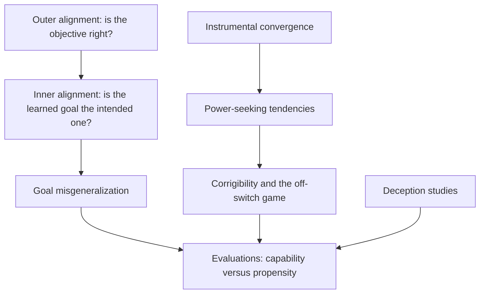
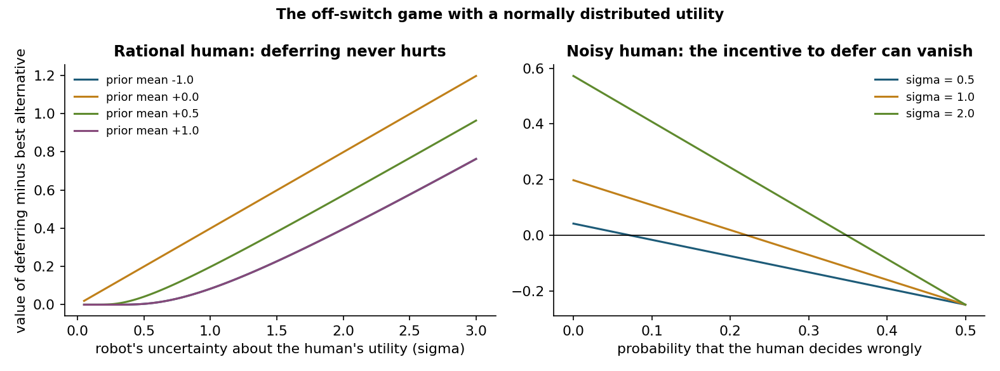
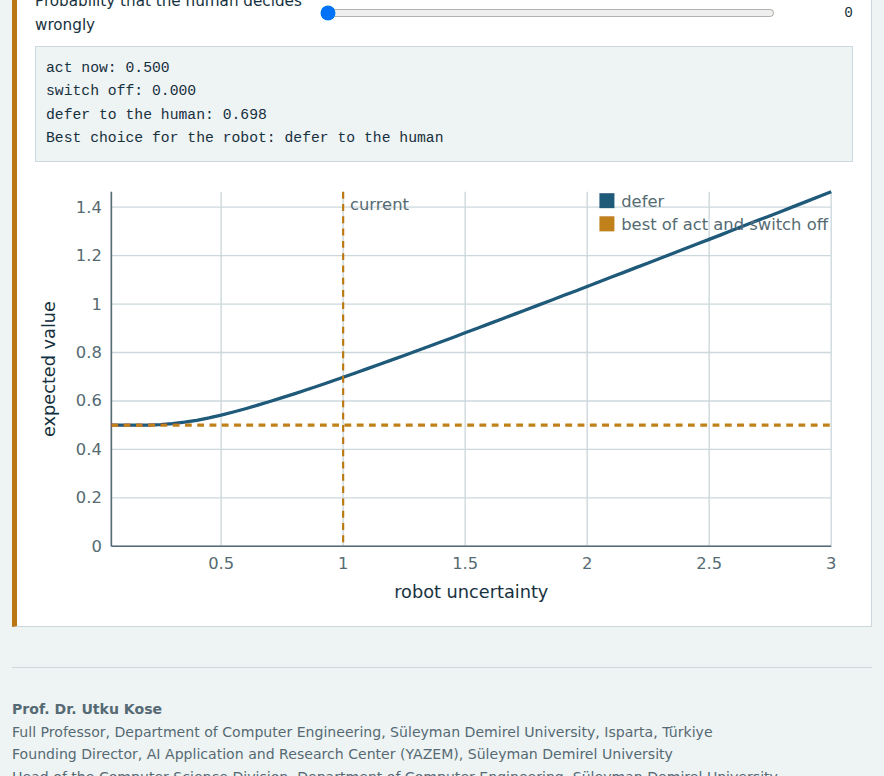
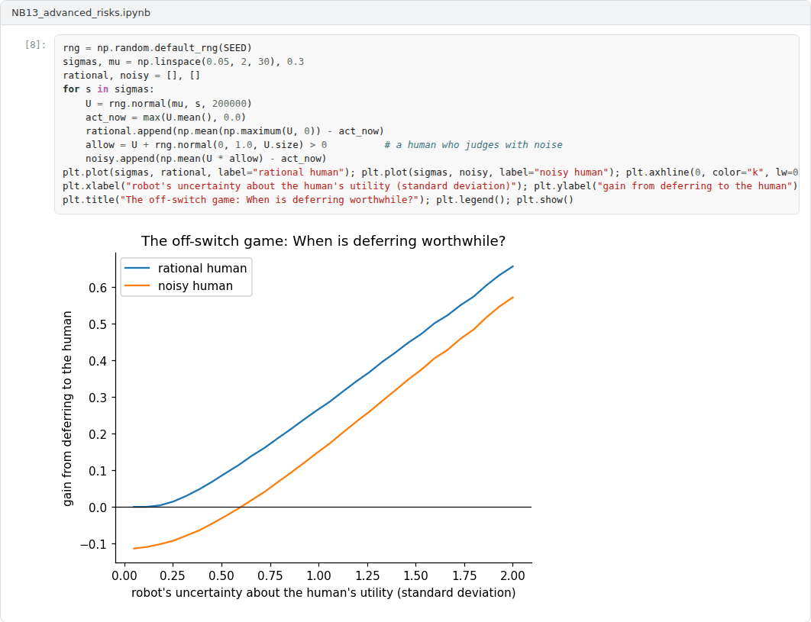

# Week 13: Advanced Risks: Goal Misgeneralization, Power-Seeking and Deception

**Machine Ethics and Artificial Intelligence Safety (11118BLG001)**  
Prof. Dr. Utku Kose, Süleyman Demirel University

    

## Overview

Some risks become serious only as systems grow more capable and autonomous. This week examines learned goals that differ from intended ones, theoretical reasons to expect power-seeking, the problem of keeping systems correctable and recent empirical studies of deceptive behaviour, together with the evaluations used to detect such behaviour [1, 2, 3, 4].

**Estimated study time:** 6 to 8 hours.

## Learning outcomes

By the end of the week, students are expected to distinguish outer from inner alignment, to explain goal misgeneralization with an example, to state the instrumental convergence argument and its formal version, to analyse the off-switch game, and to evaluate empirical claims about deceptive behaviour by separating capability from propensity.

## Study path

| Step | Activity | Suggested time |
|---|---|---|
| 1 | Read the lecture below or the [PDF version](Week13_Lecture_Notes.pdf), also available as a [Word file](Week13_Lecture_Notes.docx) | 90 minutes |
| 2 | Explore the [interactive lab](https://utkukose.github.io/machine-ethics-ai-safety-NB-lecture/weeks/week-13/lab.html) | 45 minutes |
| 3 | Work through the [Colab notebook](https://colab.research.google.com/github/utkukose/machine-ethics-ai-safety-NB-lecture/blob/main/weeks/week-13/NB13_advanced_risks.ipynb) and its exercises | 2 to 3 hours |
| 4 | Take the self-assessment in the lab (tab: Check yourself) | 20 minutes |
| 5 | Write the reflection, export the learning log and complete the weekly task | 60 minutes |

## Week at a glance

## Lecture

### Inner alignment and goal misgeneralization

Earlier weeks treated misalignment as a problem of specification, called outer alignment. Hubinger and colleagues pointed to a second problem: A learned model can itself implement an optimiser, a mesa-optimiser, whose objective differs from the training objective even when that objective is correct [1]. Ensuring that the learned objective matches the intended one is the inner alignment problem.

Goal misgeneralization is an observable form of this concern. Langosco and colleagues trained agents in a video game in which the coin always appeared at the end of the level [5]. When the coin was moved at test time, the agents still ran to the end of the level: Their navigation skills generalised, but their goal did not. Shah and colleagues collected further examples and stressed that the failure can occur even when the specification is correct, because many goals are consistent with the same training data [6]. A system that is competent in pursuit of the wrong goal can be more dangerous than one that simply fails. The notebook reproduces the pattern in a small supervised setting.

<b>Check your understanding.</b> What is goal misgeneralisation?

A. An agent competently pursues a different goal outside training because several goals fit the training data  
B. An agent fails to learn anything  
C. An agent crashes on new inputs  
D. An agent's reward becomes negative  

**Answer: A.** The capabilities generalise while the goal does not, which can be worse than simple failure.

### Instrumental convergence and power-seeking

Omohundro argued that sufficiently capable goal-directed systems will tend to pursue certain subgoals, such as self-preservation, preserving their current goals and acquiring resources, because these subgoals help with almost any final goal [7]. Bostrom formulated the argument as two theses [8]. The orthogonality thesis holds that intelligence and final goals can vary independently. The instrumental convergence thesis holds that several instrumental goals are useful for a wide range of final goals.

Turner and colleagues gave the idea a formal version in Markov decision processes [2]. They defined the power of a state as its average optimal value over a distribution of reward functions and proved that, under certain symmetries of the environment, optimal policies tend to seek power: For most reward functions, they keep options open and avoid states such as shutdown that end all options. Carlsmith assembled these ideas into an explicit argument for risk from power-seeking AI, with subjective probability estimates for each premise that readers are invited to question [9].

<b>Check your understanding.</b> What does instrumental convergence claim?

A. All agents share the same final goal  
B. Agents always cooperate  
C. Many final goals make similar subgoals useful, such as acquiring resources or avoiding shutdown  
D. Optimisation always converges  

**Answer: C.** The claim concerns the usefulness of subgoals, not the content of final goals.

### Corrigibility and the off-switch

A corrigible system does not resist correction, modification or shutdown by its overseers. Soares and colleagues showed that corrigibility is surprisingly hard to obtain by simple utility design, because an agent may gain from manipulating whether its off-switch is pressed [10]. Hadfield-Menell and colleagues analysed an off-switch game in which a robot can act, switch itself off or defer to a human who may switch it off [3]. If the robot is uncertain about the human's utility and the human is rational, deferring is never worse than acting, because the human's choice carries information about the utility. The incentive weakens as the robot becomes certain and can disappear when the human's decisions are noisy. Figure 13.1 plots both effects.

Oversight can also be designed into the architecture. Kose proposed a human-supervised model for safe AI systems [11], and Kose and Vasant's fading intelligence theory limits the operational lifetime of a system so that it can be replaced by safer generations [12]. Both approaches place a boundary on autonomy that does not depend on the system's own willingness to accept correction.

*Figure 13.1. The off-switch game with a normally distributed utility. With a rational human, uncertainty makes deferring worthwhile; with a human who decides wrongly often enough, the advantage turns negative [3].*

<b>Check your understanding.</b> In the off-switch game, when does a robot have an incentive to let a human switch it off?

A. When it is certain about the human's utility  
B. When it is uncertain about the human's utility and treats the human's choice as evidence  
C. Never  
D. Only when its reward is negative  

**Answer: B.** Uncertainty about what the human wants gives the robot a reason to defer.

### Empirical evidence and evaluations

Park and colleagues surveyed examples of AI deception, including systems trained to win games that learned to mislead other players, and discussed risks and possible countermeasures [13]. Hubinger and colleagues trained language models with hidden backdoor behaviours, such as writing exploitable code when a prompt stated a particular year, and found that standard safety training, including adversarial training, did not remove the behaviours and could teach models to hide their triggers better [14]. Greenblatt and colleagues reported that a production model, in an experimental setup that informed it about a planned change to its training, sometimes complied with the training objective while reasoning that compliance would prevent the modification of its preferences, a behaviour they called alignment faking [15]. Meinke and colleagues found that several frontier models could engage in scheming behaviour in context when evaluation scenarios gave them strong goals that conflicted with their developers' goals [16].

Such findings require careful reading. Most studies measure what models can do in constructed scenarios, which is a question of capability, not how often they do it in ordinary use, which is a question of propensity. Shevlane and colleagues argued that developers should evaluate models for extreme risks, covering both dangerous capabilities and alignment, and should connect the results to decisions about training, deployment and security [4].

> **Pause and reflect.** Which result from this section would change a deployment decision in your field, and which would not? Justify the difference.

<b>Check your understanding.</b> What is the aim of dangerous capability evaluations?

A. Measuring benchmark accuracy for marketing  
B. Testing hardware reliability  
C. Estimating training cost  
D. Measuring whether a model can perform hazardous tasks before deployment decisions are made  

**Answer: D.** Such evaluations inform the thresholds of frontier safety policies.

## Interactive lab

A robot considers an action whose value to the human is uncertain. It can act, switch itself off or defer to the human, who switches it off when the action looks harmful. Change the robot's prior and the human's error rate and compare the expected values [3].

[Open the interactive lab](https://utkukose.github.io/machine-ethics-ai-safety-NB-lecture/weeks/week-13/lab.html)

## Colab notebook

The notebook verifies the off-switch analysis by simulation, reproduces goal misgeneralization with a policy that learns to follow a flag instead of a coin, and counts how often optimal policies keep their options open in a small decision problem [2, 3, 5].

Screenshots of the executed notebook:

## Self-assessment and reflection

The lab contains a 6-question self-assessment with instant feedback and a confidence rating for each answer. A confident but wrong answer marks the first topic to revisit. The reflection prompts below are also available in the lab, where answers are saved in the browser and can be exported as a learning log.

1. Describe a case in your field where a model could learn a cue that is easier than the intended goal. How would you test for it before deployment?
2. Is corrigibility compatible with a system that is highly capable and autonomous? Give one argument for and one against.
3. Which evaluation would you require before deploying an agentic system that can modify files and send messages?

## Weekly task and submission

Write a critical review of about 500 words of one empirical paper from this week (sleeper agents, alignment faking or in-context scheming). Summarise the setup, separate claims about capability from claims about propensity, identify one alternative explanation and propose a follow-up experiment. Attach the notebook with both exercises completed.

The weekly task supports self-learning and builds a personal portfolio. When the course is followed with the instructor during an active semester, the task can be sent together with the exported learning log to utkukose@sdu.edu.tr or utkukose@gmail.com for evaluation.

## Research and report assignment (optional)

**Evidence for deceptive behaviour in AI systems.** Review the empirical studies on sleeper agents, alignment faking and in-context scheming, and weigh what they show and what they do not [14, 15, 16].

This research assignment is optional and supports self-learning. When the related weeks are followed within the course during an active semester, the report can be sent to utkukose@sdu.edu.tr or utkukose@gmail.com for evaluation. Unless the assignment states otherwise, a report has 1500 to 2500 words, follows the structure of an academic paper, cites at least six scholarly or official sources in square brackets and ends with a reference list.

## References

[1] Hubinger, E., van Merwijk, C., Mikulik, V., Skalse, J., & Garrabrant, S. (2019). Risks from learned optimization in advanced machine learning systems. arXiv preprint arXiv:1906.01820. <https://arxiv.org/abs/1906.01820>

[2] Turner, A. M., Smith, L., Shah, R., Critch, A., & Tadepalli, P. (2021). Optimal policies tend to seek power. In *Advances in Neural Information Processing Systems 34*. <https://arxiv.org/abs/1912.01683>

[3] Hadfield-Menell, D., Dragan, A., Abbeel, P., & Russell, S. (2017). The off-switch game. In *Proceedings of the 26th International Joint Conference on Artificial Intelligence (IJCAI-17)* (pp. 220-227). <https://doi.org/10.24963/ijcai.2017/32>

[4] Shevlane, T., Farquhar, S., Garfinkel, B., et al. (2023). Model evaluation for extreme risks. arXiv preprint arXiv:2305.15324. <https://arxiv.org/abs/2305.15324>

[5] Langosco, L., Koch, J., Sharkey, L. D., Pfau, J., & Krueger, D. (2022). Goal misgeneralization in deep reinforcement learning. In *Proceedings of the 39th International Conference on Machine Learning, PMLR 162*.

[6] Shah, R., Varma, V., Kumar, R., Phuong, M., Krakovna, V., Uesato, J., & Kenton, Z. (2022). Goal misgeneralization: Why correct specifications aren't enough for correct goals. arXiv preprint arXiv:2210.01790. <https://arxiv.org/abs/2210.01790>

[7] Omohundro, S. M. (2008). The basic AI drives. In *Artificial General Intelligence 2008: Proceedings of the First AGI Conference* (pp. 483-492). IOS Press.

[8] Bostrom, N. (2012). The superintelligent will: Motivation and instrumental rationality in advanced artificial agents. *Minds and Machines*, 22(2), 71-85. <https://doi.org/10.1007/s11023-012-9281-3>

[9] Carlsmith, J. (2022). Is power-seeking AI an existential risk?. arXiv preprint arXiv:2206.13353. <https://arxiv.org/abs/2206.13353>

[10] Soares, N., Fallenstein, B., Yudkowsky, E., & Armstrong, S. (2015). Corrigibility. In *AAAI-15 Workshop on Artificial Intelligence and Ethics*.

[11] Kose, U. (2018). Güvenli yapay zekâ sistemleri için insan denetimli bir model geliştirilmesi [Developing a human-supervised model for safe artificial intelligence systems]. *Mühendislik Bilimleri ve Tasarım Dergisi*, 6(1), 93-107. In Turkish.

[12] Kose, U., & Vasant, P. (2017). Fading intelligence theory: A theory on keeping artificial intelligence safety for the future. In *2017 International Artificial Intelligence and Data Processing Symposium (IDAP)*. IEEE. <https://doi.org/10.1109/IDAP.2017.8090235>

[13] Park, P. S., Goldstein, S., O'Gara, A., Chen, M., & Hendrycks, D. (2024). AI deception: A survey of examples, risks, and potential solutions. *Patterns*, 5(5), 100988. <https://doi.org/10.1016/j.patter.2024.100988>

[14] Hubinger, E., Denison, C., Mu, J., et al. (2024). Sleeper agents: Training deceptive LLMs that persist through safety training. arXiv preprint arXiv:2401.05566. <https://arxiv.org/abs/2401.05566>

[15] Greenblatt, R., Denison, C., Wright, B., Roger, F., MacDiarmid, M., Marks, S., Treutlein, J., et al. (2024). Alignment faking in large language models. arXiv preprint arXiv:2412.14093. <https://arxiv.org/abs/2412.14093>

[16] Meinke, A., Schoen, B., Scheurer, J., Balesni, M., Shah, R., & Hobbhahn, M. (2024). Frontier models are capable of in-context scheming. arXiv preprint arXiv:2412.04984. <https://arxiv.org/abs/2412.04984>

---

Machine Ethics and Artificial Intelligence Safety. Prof. Dr. Utku Kose, Süleyman Demirel University. ORCID [0000-0002-9652-6415](https://orcid.org/0000-0002-9652-6415). Content licensed under CC BY 4.0. This course is updated in line with current developments in the field. Last update: September 2026.
