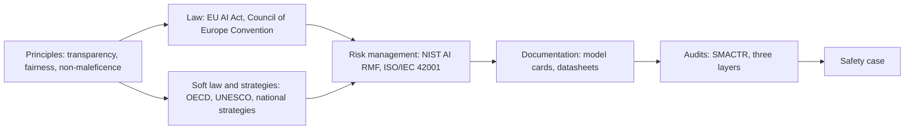
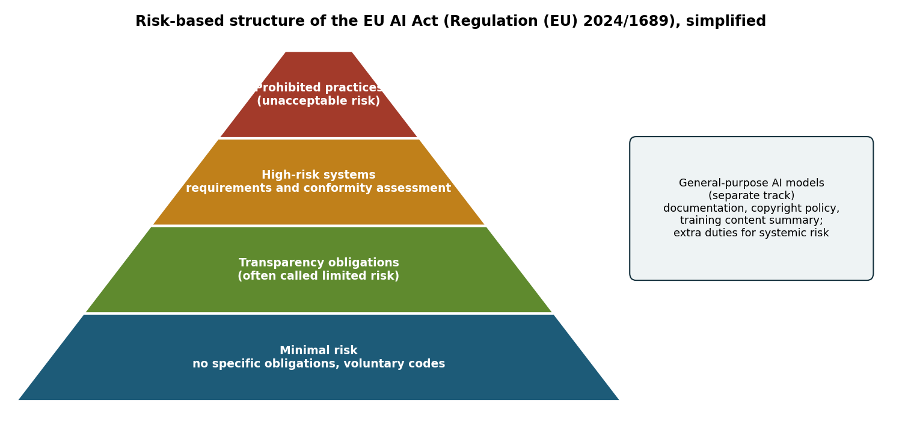
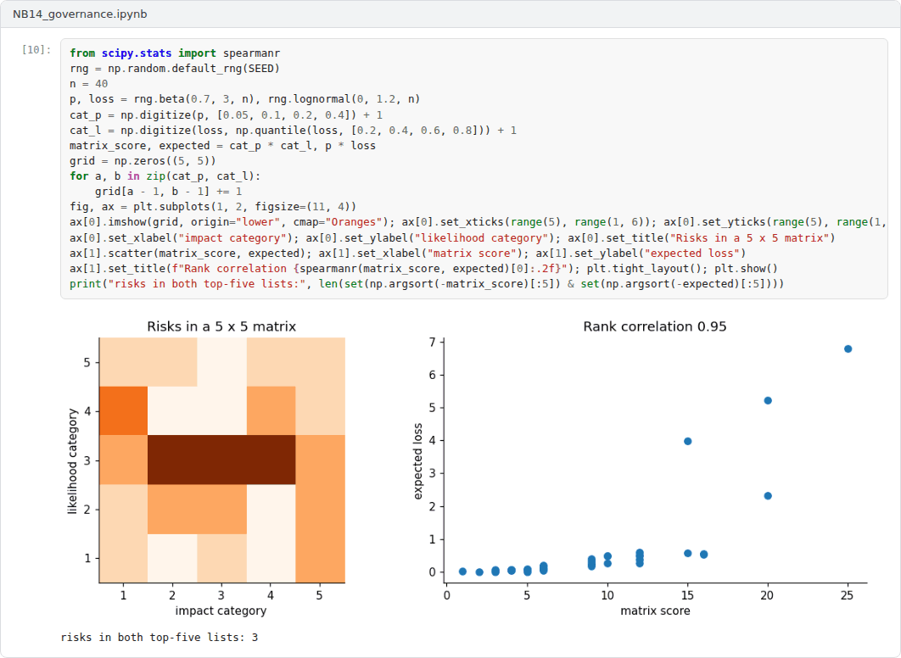

# Week 14: Governance, Standards and Auditing

**Machine Ethics and Artificial Intelligence Safety (11118BLG001)**  
Prof. Dr. Utku Kose, Süleyman Demirel University

   

## Overview

Technical safeguards need institutions around them. This final week moves from ethics principles to binding law, international instruments, risk management frameworks and management system standards, and it closes with documentation and auditing practices that make safety claims checkable [1, 2, 3, 4].

**Estimated study time:** 6 to 8 hours.

## Learning outcomes

By the end of the week, students are expected to explain why principles alone cannot guarantee ethical AI, to describe the risk-based structure of the EU AI Act and the role of international instruments including those relevant to Türkiye, to apply the functions of the NIST AI Risk Management Framework, and to produce a model card and an audit plan for a system.

## Study path

| Step | Activity | Suggested time |
|---|---|---|
| 1 | Read the lecture below or the [PDF version](Week14_Lecture_Notes.pdf) | 90 minutes |
| 2 | Explore the [interactive lab](https://utkukose.github.io/machine-ethics-ai-safety-NB-lecture/weeks/week-14/lab.html) | 45 minutes |
| 3 | Work through the [Colab notebook](https://colab.research.google.com/github/utkukose/machine-ethics-ai-safety-NB-lecture/blob/main/weeks/week-14/NB14_governance.ipynb) and its exercises | 2 to 3 hours |
| 4 | Take the self-assessment in the lab (tab: Check yourself) | 20 minutes |
| 5 | Write the reflection, export the learning log and complete the weekly task | 60 minutes |

## Week at a glance

## Lecture

### From principles to practice

Jobin, Ienca and Vayena analysed 84 documents containing AI ethics guidelines and found convergence around five principles: transparency, justice and fairness, non-maleficence, responsibility and privacy [1]. They also found substantial divergence in how the principles were interpreted and how they should be implemented. Floridi and Cowls proposed a unified framework of five principles for AI in society: beneficence, non-maleficence, autonomy, justice and explicability [5].

Mittelstadt argued that principles alone cannot guarantee ethical AI [6]. Compared with medicine, from which many principles were borrowed, AI development lacks common aims and fiduciary duties towards those affected, a professional history with established norms, proven methods to translate principles into practice and robust mechanisms of legal and professional accountability. The remaining sections of the week examine instruments that try to supply what principles lack.

<b>Check your understanding.</b> What is a common criticism of AI ethics principles?

A. They are too technical  
B. They are legally binding everywhere  
C. They are abstract and hard to translate into concrete practice and accountability  
D. They focus only on robustness  

**Answer: C.** Principles need operational requirements, processes and oversight to have effect.

### Law and international instruments

The EU AI Act, Regulation (EU) 2024/1689, follows a risk-based approach [2]. A list of practices is prohibited, including social scoring, manipulation that exploits vulnerabilities, untargeted scraping of facial images and emotion recognition in workplaces and educational institutions, with narrow exceptions. High-risk systems, which include safety components of regulated products and systems used in areas such as education, employment, access to essential services, law enforcement, migration and the administration of justice, must meet requirements on risk management, data governance, technical documentation, record-keeping, transparency to deployers, human oversight, accuracy, robustness and cybersecurity. Systems that interact with people or generate synthetic content carry transparency obligations, and general-purpose AI models have their own obligations, with additional duties for models with systemic risk. The regulation entered into force on 1 August 2024; its prohibitions applied from 2 February 2025 and the obligations for general-purpose models from 2 August 2025, while the remaining obligations are phased in later. Because the later timetable has been subject to amendment proposals, the current consolidated text should be checked before any practical use. Figure 14.1 summarises the structure.

Other instruments complement the regulation. The Council of Europe Framework Convention on Artificial Intelligence and Human Rights, Democracy and the Rule of Law, opened for signature on 5 September 2024, is the first legally binding international treaty on AI [7]. The OECD Recommendation on AI, adopted in 2019 and amended in 2024, and the UNESCO Recommendation on the Ethics of AI, adopted in 2021, provide widely endorsed soft law [8, 9]. In Türkiye, the National Artificial Intelligence Strategy 2021-2025 was prepared by the Digital Transformation Office of the Presidency and the Ministry of Industry and Technology, and its action plan was updated for 2024-2025 [10].

*Figure 14.1. Simplified risk-based structure of the EU AI Act, with the separate track for general-purpose AI models. The figure is a teaching aid, not a legal summary [2].*

<b>Check your understanding.</b> Which approach does the EU AI Act follow?

A. A risk-based approach in which obligations depend on the risk category of the use  
B. A single rule for all AI systems  
C. Voluntary codes only  
D. A ban on all machine learning  

**Answer: A.** Prohibited practices, high-risk systems and transparency obligations form the main tiers.

### Risk management and management systems

The NIST AI Risk Management Framework organises activities into four functions [3]. Govern establishes a culture, policies and accountability for AI risk. Map establishes the context and identifies risks. Measure analyses and tracks them with quantitative and qualitative methods. Manage prioritises risks and acts on them. The framework also describes characteristics of trustworthy AI, such as validity and reliability, safety, security and resilience, accountability and transparency, explainability and interpretability, privacy enhancement and fairness with harmful bias managed. Each earlier week of the course supplies methods for the Measure function.

ISO/IEC 42001 specifies requirements for an AI management system, with which an organisation establishes, implements, maintains and continually improves its governance of AI, and conformity can be certified [11]. At the level of global science policy, the International AI Safety Report synthesised the evidence on the capabilities and risks of general-purpose AI for policymakers [12].

<b>Check your understanding.</b> What does ISO/IEC 42001 specify?

A. A neural network architecture  
B. Requirements for an AI management system in an organisation  
C. A programming language  
D. A fairness metric  

**Answer: B.** Like other management system standards, it can be certified and audited.

### Documentation and auditing

Documentation makes claims checkable. Model cards report a model's intended use, the factors and metrics used for evaluation, performance across relevant groups and conditions, ethical considerations and caveats [13]. Datasheets for datasets document the motivation, composition, collection process, preprocessing, uses, distribution and maintenance of a data set [14]. Weidinger and colleagues provided a taxonomy of risks posed by language models, which helps auditors decide what to test [15].

Raji and colleagues proposed SMACTR, an end-to-end framework for internal algorithmic auditing with five stages: scoping, mapping, artifact collection, testing and reflection [4]. Mökander and colleagues proposed a three-layered approach for large language models: governance audits of the providers, model audits before release and application audits of the downstream uses [16]. A safety case, a structured argument supported by evidence that a system is acceptably safe for a specific use in a specific context, is a natural way to assemble the results of such audits. The final task of the course asks for one.

> **Pause and reflect.** Return to the question written down in Week 1. Has the course answered it, and which governance instrument from this week would matter most for the system it concerns?

<b>Check your understanding.</b> What does an internal algorithmic audit framework provide?

A. A guarantee of safety  
B. A replacement for regulation  
C. A ranking of vendors  
D. A structured review across the development life cycle, with documented artefacts at each stage  

**Answer: D.** Documented artefacts make decisions traceable for later scrutiny.

## Interactive lab

Part A walks through simplified questions about the EU AI Act and lists the obligations that may apply. It is a teaching aid, not legal advice. Part B drafts a model card in the structure of Mitchell and colleagues and exports it as a Markdown file [2, 13].

[Open the interactive lab](https://utkukose.github.io/machine-ethics-ai-safety-NB-lecture/weeks/week-14/lab.html)

## Colab notebook

The notebook runs a small audit of the lending model from Week 5: performance, group metrics and robustness to input noise. It then generates a model card from the results and builds a risk register mapped to the NIST AI RMF functions [3, 4, 13].

Screenshots of the executed notebook:

## Self-assessment and reflection

The lab contains a 6-question self-assessment with instant feedback and a confidence rating for each answer. A confident but wrong answer marks the first topic to revisit. The reflection prompts below are also available in the lab, where answers are saved in the browser and can be exported as a learning log.

1. Which obligations from Part A of the lab would apply to a system in your field, and who in your organisation would carry them?
2. Which of Mittelstadt's missing elements is most absent in your field, and what could replace it?
3. Revisit your question from Week 1. Write your answer as it stands now and note what remains open.

## Weekly task and submission

Final portfolio task: Write a safety case of 1500 to 2000 words for an AI system from your field. State the system, its intended use and its risk classification under the EU AI Act; present claims about fairness, robustness, uncertainty, interpretability and security, each supported by evidence produced with the methods of this course; include a model card and a risk register mapped to the NIST AI RMF; and close with the limitations of the evidence. Submit it together with the learning logs of all fourteen weeks.

The weekly task supports self-learning and builds a personal portfolio. When the course is followed with the instructor during an active semester, the task can be sent together with the exported learning log to utkukose@sdu.edu.tr or utkukose@gmail.com for evaluation.

## Research and report assignment (optional)

**Obligations for one high-risk system.** Take one high-risk use case and derive the obligations it would face under the EU AI Act, the NIST AI Risk Management Framework and ISO/IEC 42001 [2, 3, 11]. Identify overlaps and gaps between the three.

This research assignment is optional and supports self-learning. When the related weeks are followed within the course during an active semester, the report can be sent to utkukose@sdu.edu.tr or utkukose@gmail.com for evaluation. Unless the assignment states otherwise, a report has 1500 to 2500 words, follows the structure of an academic paper, cites at least six scholarly or official sources in square brackets and ends with a reference list.

## Final capstone

This week closes the course with the [Final Capstone: Building and Auditing a Safer AI System](../../exams/final/README.md).

This capstone also supports self-learning and can be completed at any pace. When the course is taught actively in a semester, the final capstone is sent by e-mail to utkukose@sdu.edu.tr or utkukose@gmail.com no later than 23:53 (Türkiye time) on the last Sunday of Week 14, with the report and all code files attached or linked.

## References

[1] Jobin, A., Ienca, M., & Vayena, E. (2019). The global landscape of AI ethics guidelines. *Nature Machine Intelligence*, 1(9), 389-399. <https://doi.org/10.1038/s42256-019-0088-2>

[2] European Parliament and Council of the European Union (2024). *Regulation (EU) 2024/1689 laying down harmonised rules on artificial intelligence (Artificial Intelligence Act)*. Official Journal of the European Union, L series, 12 July 2024. <https://eur-lex.europa.eu/eli/reg/2024/1689/oj>

[3] National Institute of Standards and Technology (2023). *Artificial Intelligence Risk Management Framework (AI RMF 1.0), NIST AI 100-1*. U.S. Department of Commerce. <https://doi.org/10.6028/NIST.AI.100-1>

[4] Raji, I. D., Smart, A., White, R. N., Mitchell, M., Gebru, T., Hutchinson, B., Smith-Loud, J., Theron, D., & Barnes, P. (2020). Closing the AI accountability gap: Defining an end-to-end framework for internal algorithmic auditing. In *Proceedings of the 2020 Conference on Fairness, Accountability, and Transparency (FAT* '20)* (pp. 33-44). ACM. <https://doi.org/10.1145/3351095.3372873>

[5] Floridi, L., & Cowls, J. (2019). A unified framework of five principles for AI in society. *Harvard Data Science Review*, 1(1). <https://doi.org/10.1162/99608f92.8cd550d1>

[6] Mittelstadt, B. (2019). Principles alone cannot guarantee ethical AI. *Nature Machine Intelligence*, 1(11), 501-507. <https://doi.org/10.1038/s42256-019-0114-4>

[7] Council of Europe (2024). *Council of Europe Framework Convention on Artificial Intelligence and Human Rights, Democracy and the Rule of Law (CETS No. 225)*. Council of Europe.

[8] OECD (2019). *Recommendation of the Council on Artificial Intelligence (OECD/LEGAL/0449)*. Organisation for Economic Co-operation and Development. Amended in 2024.

[9] UNESCO (2021). *Recommendation on the Ethics of Artificial Intelligence*. United Nations Educational, Scientific and Cultural Organization.

[10] Presidency of the Republic of Türkiye Digital Transformation Office, & Ministry of Industry and Technology (2021). *National Artificial Intelligence Strategy 2021-2025 (Ulusal Yapay Zekâ Stratejisi 2021-2025)*. Ankara. Action plan updated for 2024-2025. <https://www.cbddo.gov.tr/UYZS>

[11] International Organization for Standardization (2023). *ISO/IEC 42001:2023 Information technology, Artificial intelligence, Management system*. ISO.

[12] Bengio, Y., Mindermann, S., Privitera, D., et al. (2025). International AI safety report. arXiv preprint arXiv:2501.17805. <https://arxiv.org/abs/2501.17805>

[13] Mitchell, M., Wu, S., Zaldivar, A., Barnes, P., Vasserman, L., Hutchinson, B., Spitzer, E., Raji, I. D., & Gebru, T. (2019). Model cards for model reporting. In *Proceedings of the Conference on Fairness, Accountability, and Transparency (FAT* '19)* (pp. 220-229). ACM. <https://doi.org/10.1145/3287560.3287596>

[14] Gebru, T., Morgenstern, J., Vecchione, B., Wortman Vaughan, J., Wallach, H., Daumé III, H., & Crawford, K. (2021). Datasheets for datasets. *Communications of the ACM*, 64(12), 86-92. <https://doi.org/10.1145/3458723>

[15] Weidinger, L., Uesato, J., Rauh, M., et al. (2022). Taxonomy of risks posed by language models. In *Proceedings of the 2022 ACM Conference on Fairness, Accountability, and Transparency (FAccT '22)* (pp. 214-229). ACM. <https://doi.org/10.1145/3531146.3533088>

[16] Mökander, J., Schuett, J., Kirk, H. R., & Floridi, L. (2024). Auditing large language models: A three-layered approach. *AI and Ethics*, 4(4), 1085-1115. <https://doi.org/10.1007/s43681-023-00289-2>

---

Machine Ethics and Artificial Intelligence Safety. Prof. Dr. Utku Kose, Süleyman Demirel University. ORCID [0000-0002-9652-6415](https://orcid.org/0000-0002-9652-6415). Content licensed under CC BY 4.0. This course is updated in line with current developments in the field. Last update: September 2026.
